## TL;DR

> The AI SDK is your toolkit for AI applications. In this level you'll learn the fundamentals: generating text, streaming, structured output and system prompts. One API for all providers — Anthropic, OpenAI, Google and 20+ more.

## Skill Tree

```mermaid
graph LR
  subgraph HIER["Current Level"]
    L1["Level 1: AI SDK Basics"]
  end
  subgraph "Locked"
    L2["Level 2: LLM Fundamentals"]
    L3["Level 3: Agents & MCP"]
    L4["Level 4: Persistence"]
    L5["Level 5: Context Engineering"]
    L6["Level 6: Evals"]
    L7["Level 7: Streaming"]
    L8["Level 8: Workflows"]
    L9["Level 9: Advanced Patterns"]
  end
  L1 -.-> L2
  L2 -.-> L3
  L3 -.-> L4
  L4 -.-> L5
  L5 -.-> L6
  L6 -.-> L7
  L7 -.-> L8
  L8 -.-> L9
  style HIER fill:none,stroke:#E67E22,stroke-width:3px,color:#E67E22
  style L1 fill:#E67E22,color:#fff
  style L2 fill:#95a5a6,color:#fff
  style L3 fill:#95a5a6,color:#fff
  style L4 fill:#95a5a6,color:#fff
  style L5 fill:#95a5a6,color:#fff
  style L6 fill:#95a5a6,color:#fff
  style L7 fill:#95a5a6,color:#fff
  style L8 fill:#95a5a6,color:#fff
  style L9 fill:#95a5a6,color:#fff
```

## What you'll learn

- **What the AI SDK is and how it's structured** — three libraries, one unified interface
- **How to choose and configure an LLM model** — provider system, model instances, switching providers
- **Generating text with `generateText`** — the result object, usage tracking, finish reason
- **Streaming text with `streamText`** — real-time output, stream events, `textStream`
- **Structured output with `Output.object` and Zod** — typed JSON responses instead of free text
- **System prompts for role behavior** — giving the LLM an identity and rules

## Why this matters

Every AI application builds on these fundamentals. Without them, you're stuck copy-pasting from ChatGPT and can't programmatically integrate AI into your projects.

The concrete problem: You want to integrate AI into your code, but every provider has a different API, different types, different error handling. The AI SDK solves this — one unified API for all providers. You'll learn it here from the ground up.

## Prerequisites

- **Node.js 18+** and **npm** or **pnpm** installed
- **TypeScript basics** — types, interfaces, async/await
- **Experience with ChatGPT or similar** — you know what an LLM is and what it can do
- **An API key** for at least one provider (Anthropic, OpenAI or Google)

> **Skip hint:** You already use the AI SDK daily and know `generateText`, `streamText` and `Output.object`? Jump straight to the [Boss Fight](/en/level-1-ai-sdk-basics/08-boss-fight/) and test your knowledge.

## Challenges

| # | Challenge | Concept |
|---|-----------|---------|
| 1.1 | [What is the AI SDK?](/en/level-1-ai-sdk-basics/02-what-is-ai-sdk/) | SDK architecture, three libraries, first API call |
| 1.2 | [Your first model](/en/level-1-ai-sdk-basics/03-choosing-your-model/) | Provider system, model selection, switching providers |
| 1.3 | [Generating text](/en/level-1-ai-sdk-basics/04-generating-text/) | `generateText` API, result object, usage tracking |
| 1.4 | [Streaming text](/en/level-1-ai-sdk-basics/05-streaming-text/) | `streamText`, `textStream`, real-time output |
| 1.5 | [Structured output](/en/level-1-ai-sdk-basics/06-structured-output/) | `Output.object`, `Output.array`, Zod schemas |
| 1.6 | [System prompts](/en/level-1-ai-sdk-basics/07-system-prompts/) | `system` parameter, role behavior, tone setting |

## Boss Fight

Build a **CLI chat**: A terminal program that outputs text in real time with `streamText` and delivers structured JSON output with `Output.object` on request. You'll combine all six building blocks of this level into one project.

## Sources for this level

- [Vercel AI SDK: Introduction](https://ai-sdk.dev/docs/introduction)
- [Vercel AI SDK: Providers and Models](https://ai-sdk.dev/docs/foundations/providers-and-models)
- [Vercel Blog: AI SDK 6](https://vercel.com/blog/ai-sdk-6)
- [ai-hero-dev Exercises 01.01-01.13](https://github.com/ai-hero-dev/ai-sdk-v6-crash-course/tree/main/exercises/01-ai-sdk-basics)
