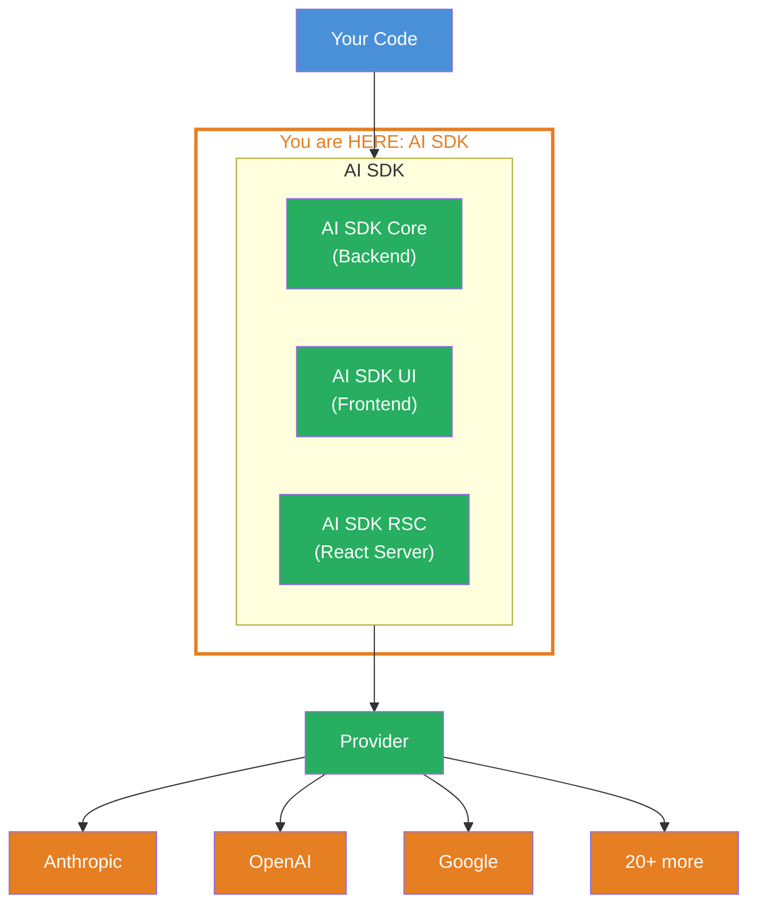
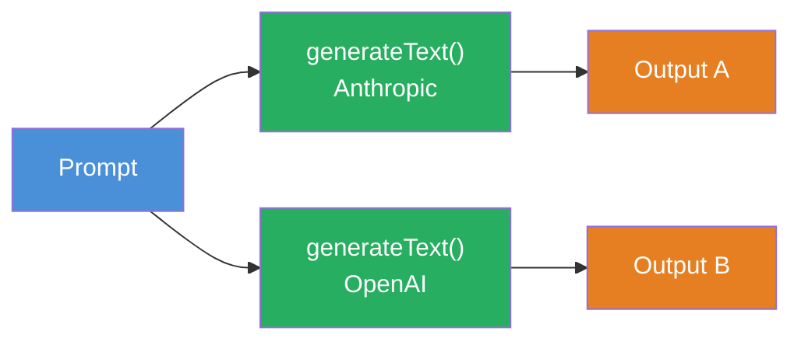

## THINK

If you want to work with Claude, GPT and Gemini — do you need a different library for each? Different types? Different error handling?

## OVERVIEW



The AI SDK sits between your code and the LLM providers. It offers a unified API — regardless of which provider you use. Three libraries, one interface.

## WHY

**Without AI SDK:** A different API, different types, different error handling for each provider. Switching providers means rewriting half your code. Each provider has its own SDKs with different interfaces.

**With AI SDK:** One API for all providers. You switch the provider by changing one import line and the model name. The rest of your code stays identical.

## WALKTHROUGH

### Layer 1: The three libraries

The AI SDK consists of three parts. In this level we work exclusively with **AI SDK Core**:

| Library | Package | Use case |
|---------|---------|----------|
| **AI SDK Core** | `ai` | Backend: generating text, tools, agents, structured output |
| **AI SDK UI** | `ai` (same import) | Frontend: framework-agnostic hooks for chat UIs |
| **AI SDK RSC** | `ai` (same import) | React Server Components: streaming React components |

AI SDK Core is the foundation. Everything else builds on top of it. When you use `generateText` or `streamText`, you're using AI SDK Core.

### Layer 2: Installation and setup

Two packages — the AI SDK itself and a provider package:

```bash
npm install ai @ai-sdk/anthropic
```

`ai` is the core package with all functions (`generateText`, `streamText`, `Output`, etc.). `@ai-sdk/anthropic` is the provider — it knows how to communicate with the Anthropic API.

Your API key is set as an environment variable:

```bash
export ANTHROPIC_API_KEY="sk-ant-..."
```

### Layer 3: Your first generateText call

The "Hello World" of the AI SDK — a single API call that generates text:

```typescript
import { generateText } from 'ai';
import { anthropic } from '@ai-sdk/anthropic';

const result = await generateText({
  model: anthropic('claude-sonnet-4-5-20250514'),  // ← Provider + model
  prompt: 'Was ist TypeScript in einem Satz?',
});

console.log(result.text);         // ← The generated text
console.log(result.usage);        // ← Token usage: { promptTokens, completionTokens, totalTokens }
console.log(result.finishReason); // ← Why it stopped: 'stop' | 'length' | 'tool-calls'
```

Three lines of code, three pieces of information back:
1. **`result.text`** — the generated text as a string
2. **`result.usage`** — how many tokens were consumed (important for costs)
3. **`result.finishReason`** — why the LLM stopped generating

The `model` argument is the only place where the provider appears. Everything else (`prompt`, `result.text`, `result.usage`) is provider-independent.

## TRY

**Task:** Install the AI SDK and the Anthropic provider. Execute a `generateText` call and log text, usage and finish reason.

```typescript
// TODO 1: Installiere die Packages
// npm install ai @ai-sdk/anthropic

// TODO 2: Importiere generateText und den Anthropic Provider
// import { ... } from 'ai';
// import { ... } from '@ai-sdk/anthropic';

// TODO 3: Setze den API-Key als Environment Variable
// export ANTHROPIC_API_KEY="sk-ant-..."

// TODO 4: Rufe generateText auf
// const result = await generateText({
//   model: ???,
//   prompt: ???,
// });

// TODO 5: Logge die drei Ergebnisse
// console.log(result.???);  // Text
// console.log(result.???);  // Token-Verbrauch
// console.log(result.???);  // Warum gestoppt
```

**Checklist:**
- [ ] `ai` and `@ai-sdk/anthropic` installed
- [ ] `generateText` imported and called
- [ ] `result.text`, `result.usage` and `result.finishReason` logged
- [ ] `ANTHROPIC_API_KEY` set as environment variable

<details>
<summary>Show solution</summary>

```typescript
import { generateText } from 'ai';
import { anthropic } from '@ai-sdk/anthropic';

const result = await generateText({
  model: anthropic('claude-sonnet-4-5-20250514'),
  prompt: 'Was ist TypeScript in einem Satz?',
});

console.log('Text:', result.text);
console.log('Usage:', result.usage);
console.log('Finish Reason:', result.finishReason);
```

**Explanation:** `generateText` is an async function that returns a result object. The `model` argument creates an Anthropic model instance with the model name `claude-sonnet-4-5-20250514`. The `prompt` is the user input. The three logged properties give you the generated text, the token usage and the reason for stopping.

</details>

## COMBINE



**Exercise:** Change the provider — replace `anthropic` with `openai`. What do you need to change?

1. Install the OpenAI provider: `npm install @ai-sdk/openai`
2. Change the import: `import { openai } from '@ai-sdk/openai'`
3. Change the model line: `model: openai('gpt-4o')`
4. Set `OPENAI_API_KEY` as environment variable

The rest of the code stays identical — `result.text`, `result.usage`, `result.finishReason` work the same way. That's the provider interchangeability of the AI SDK.

**Optional Stretch Goal:** Run both providers sequentially (Anthropic and OpenAI) with the same prompt and compare the outputs.

## Sources

- [Vercel AI SDK: Introduction](https://ai-sdk.dev/docs/introduction)
- [Vercel AI SDK: Providers and Models](https://ai-sdk.dev/docs/foundations/providers-and-models)
- [Vercel Blog: AI SDK 6](https://vercel.com/blog/ai-sdk-6)
- [ai-hero-dev Exercise 01.01](https://github.com/ai-hero-dev/ai-sdk-v6-crash-course/tree/main/exercises/01-ai-sdk-basics/01.01-intro-to-the-sdk)
