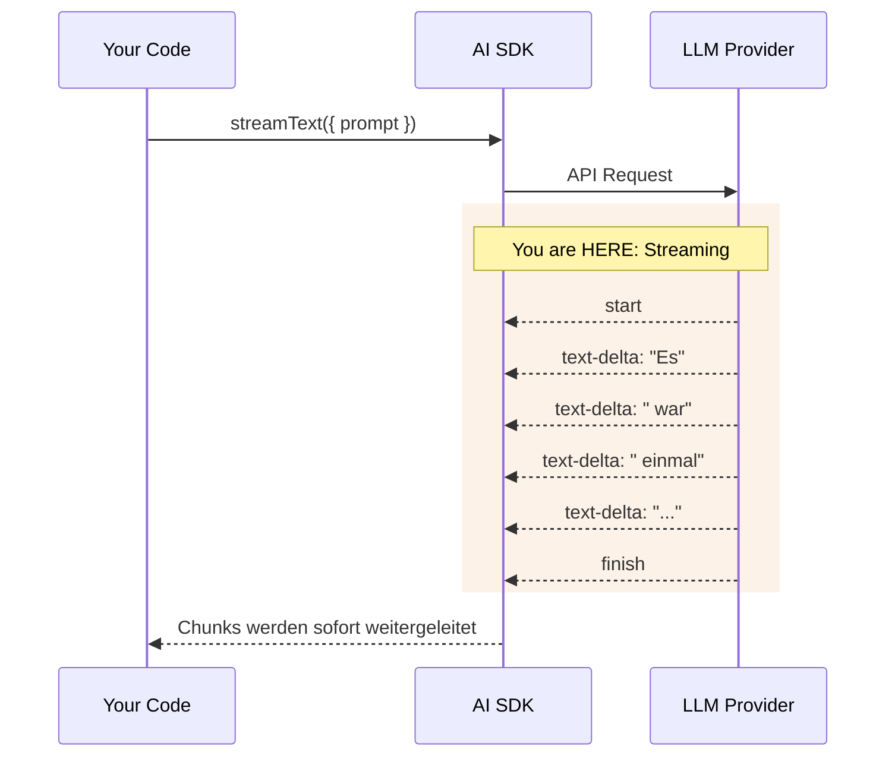
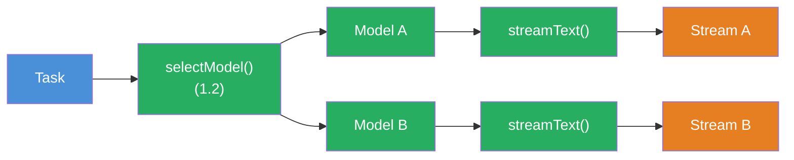

## THINK

Why do you see the response in ChatGPT word by word instead of all at once? And what happens under the hood to make that work?

## OVERVIEW



The LLM generates token by token. With `streamText` you receive each token immediately, instead of waiting for the complete response. The dashed arrows show: data flows back in pieces.

## WHY

**Without streaming:** The user waits 5-10 seconds staring at an empty page, thinking the app is frozen. Only when the LLM is completely done does the entire response appear at once. For long responses, this feels like a crash.

**With streaming:** Immediate feedback. The first token appears after just a few milliseconds. The user sees that something is happening and can already read while the LLM is still generating. Perceived speed increases massively.

## WALKTHROUGH

### Layer 1: streamText basics

`streamText` works like `generateText` — same parameters, same interface. The difference: It immediately returns a stream object instead of waiting for the complete response.

```typescript
import { streamText } from 'ai';
import { anthropic } from '@ai-sdk/anthropic';

const result = streamText({                          // ← Kein await noetig!
  model: anthropic('claude-sonnet-4-5-20250514'),
  prompt: 'Erzaehle eine kurze Geschichte.',
});
```

Important: `streamText` is **not** called with `await`. The function synchronously returns a result object that contains multiple streams. The actual waiting happens when consuming the streams.

### Layer 2: textStream — AsyncIterable for text chunks

`result.textStream` is an `AsyncIterable` that delivers each text chunk individually. You consume it with `for await...of`:

```typescript
for await (const chunk of result.textStream) {
  process.stdout.write(chunk);  // ← Schreibt jedes Wort sofort ins Terminal
}
```

Why `process.stdout.write` instead of `console.log`? Because `console.log` adds a line break after each call. `process.stdout.write` writes the text exactly as it arrives — word by word on the same line.

### Layer 3: fullStream — All events, not just text

`textStream` gives you only the text. `fullStream` gives you **all** events — including start, finish and token usage:

```typescript
for await (const part of result.fullStream) {
  switch (part.type) {
    case 'text-delta':                                // ← Ein Text-Chunk
      process.stdout.write(part.textDelta);
      break;
    case 'finish':                                    // ← Stream ist fertig
      console.log('\n\nTokens:', part.usage.totalTokens);
      console.log('Finish Reason:', part.finishReason);
      break;
    case 'error':                                     // ← Fehler im Stream
      console.error('Fehler:', part.error);
      break;
  }
}
```

The most important event types:

| Event | When | Data |
|-------|------|------|
| `text-delta` | On each text chunk | `part.textDelta` |
| `finish` | Stream is done | `part.usage`, `part.finishReason` |
| `error` | On an error | `part.error` |
| `tool-call` | LLM calls a tool | `part.toolName`, `part.args` (Level 3) |

### Layer 4: toUIMessageStreamResponse — Preview of later levels

For web APIs (e.g. Next.js) there's `toUIMessageStreamResponse()`. It converts the stream directly into an HTTP response:

```typescript
// In einer Next.js API Route (spaetere Levels):
export async function POST(req: Request) {
  const result = streamText({
    model: anthropic('claude-sonnet-4-5-20250514'),
    prompt: 'Hallo!',
  });
  return result.toUIMessageStreamResponse();  // ← Stream als HTTP Response
}
```

You don't need this yet — but it shows why streaming is so central: It works from the terminal to the web app with the same API.

## TRY

**Task:** Stream text to the terminal with `textStream`. Then switch to `fullStream` and additionally log the `finish` event.

```typescript
import { streamText } from 'ai';
import { anthropic } from '@ai-sdk/anthropic';

// TODO 1: Rufe streamText auf (ohne await!)
// const result = streamText({
//   model: ???,
//   prompt: 'Erklaere in 3 Saetzen, warum TypeScript besser als JavaScript ist.',
// });

// TODO 2: Konsumiere result.textStream mit for await...of
// for await (const chunk of result.textStream) {
//   // Schreibe jeden Chunk sofort ins Terminal
// }

// TODO 3 (Bonus): Ersetze textStream durch fullStream
// Logge text-delta UND das finish-Event mit Token-Verbrauch
```

**Checklist:**
- [ ] `streamText` imported and called (without `await`)
- [ ] `textStream` consumed with `for await...of`
- [ ] Text is written chunk by chunk to the terminal (with `process.stdout.write`)
- [ ] Bonus: `fullStream` events logged (text-delta + finish)

<details>
<summary>Show solution</summary>

**Variant 1: textStream**

```typescript
import { streamText } from 'ai';
import { anthropic } from '@ai-sdk/anthropic';

const result = streamText({
  model: anthropic('claude-sonnet-4-5-20250514'),
  prompt: 'Erklaere in 3 Saetzen, warum TypeScript besser als JavaScript ist.',
});

for await (const chunk of result.textStream) {
  process.stdout.write(chunk);
}
console.log(); // Zeilenumbruch am Ende
```

**Variant 2: fullStream with events**

```typescript
import { streamText } from 'ai';
import { anthropic } from '@ai-sdk/anthropic';

const result = streamText({
  model: anthropic('claude-sonnet-4-5-20250514'),
  prompt: 'Erklaere in 3 Saetzen, warum TypeScript besser als JavaScript ist.',
});

for await (const part of result.fullStream) {
  switch (part.type) {
    case 'text-delta':
      process.stdout.write(part.textDelta);
      break;
    case 'finish':
      console.log('\n\n--- Stream beendet ---');
      console.log('Tokens:', part.usage.totalTokens);
      console.log('Finish Reason:', part.finishReason);
      break;
  }
}
```

**Explanation:** `streamText` synchronously returns a result object. The actual API call only starts when you consume the stream (with `for await`). `textStream` delivers only text chunks, `fullStream` delivers all event types including metadata like token usage.

> **Tip:** As an alternative to `fullStream`, you can also use `await result.usage` after the stream — the result object has `usage` as a promise that resolves once the stream is finished.

**Run it:**

```bash
npx tsx challenge-1-4.ts
```

**Expected output (approximately):**

```
TypeScript is better than JavaScript because it has static types...
(text appears word by word in the terminal)

--- Stream finished ---
Tokens: 78
Finish Reason: stop
```

</details>

## COMBINE



**Exercise:** Combine `streamText` with the `selectModel` function from Challenge 1.2. Stream the same prompt with two different models sequentially and compare the perceived speed.

1. Use `selectModel` to choose a flash model and a pro model
2. Stream with the first model, then with the second
3. Measure the time with `performance.now()` or `Date.now()` — which model delivers the first token faster?
4. Use `fullStream` to compare the token usage of both models at the end

**Optional Stretch Goal:** Build a function `streamWithTimer(model, prompt)` that consumes the stream AND measures the "Time to First Token" (TTFT) — the time from the call to the first `text-delta` event.

## Sources

- [Vercel AI SDK: Generating Text — streamText](https://ai-sdk.dev/docs/ai-sdk-core/generating-text#streamtext)
- [Vercel AI SDK: streamText API Reference](https://ai-sdk.dev/docs/reference/ai-sdk-core/stream-text)
- [ai-hero-dev Exercises 01.06-01.08](https://github.com/ai-hero-dev/ai-sdk-v6-crash-course/tree/main/exercises/01-ai-sdk-basics)
