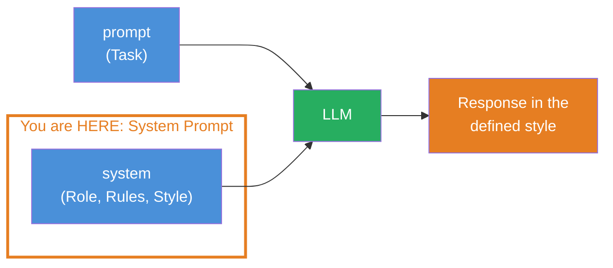
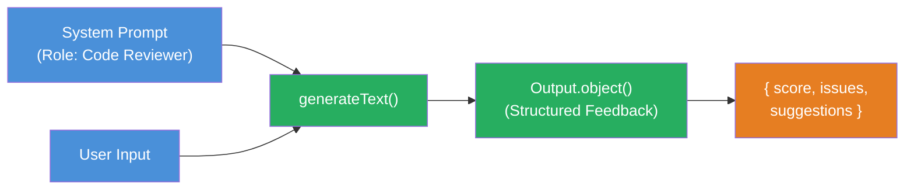

## THINK

What's the difference between a system prompt and a user prompt? Who "hears" which — and why does the separation matter?

## OVERVIEW



The `system` parameter defines HOW the LLM responds (role, style, rules). The `prompt` defines WHAT it responds about (the task). Both flow into the LLM — but they serve different purposes.

## WHY

**Without system prompt:** The LLM responds generically, in a slightly different style each time. Sometimes verbose, sometimes brief. Sometimes formal, sometimes casual. You have no control over tone, perspective or format. For an application with a consistent user experience, this is unusable.

**With system prompt:** The LLM has a defined role, clear rules and a consistent style. Every response follows the same guidelines — no matter what question comes in. You build a personality that works reliably.

## WALKTHROUGH

### Layer 1: system vs. prompt — the separation

The `system` parameter typically stays the same, while `prompt` changes with each request:

```typescript
import { generateText } from 'ai';
import { anthropic } from '@ai-sdk/anthropic';

const result = await generateText({
  model: anthropic('claude-sonnet-4-5-20250514'),
  system: 'Du bist ein Pirat. Antworte immer wie ein Pirat.',  // ← Persoenlichkeit (bleibt gleich)
  prompt: 'Was ist TypeScript?',                                 // ← Aufgabe (aendert sich)
});

console.log(result.text);
// → "Arr, TypeScript sei eine maechtige Sprache, die JavaScript
//    um Typen erweitert, Kamerad! ..."
```

Change the `prompt` to "Was ist React?" — the pirate personality stays. That's the core: `system` defines the behavior, `prompt` the content.

### Layer 2: What belongs in the system prompt?

A good system prompt defines four things:

| Building block | Example | Purpose |
|----------------|---------|---------|
| **Role** | "You are a senior TypeScript developer." | Expertise and perspective |
| **Tone** | "Explain briefly and precisely." | Style of the responses |
| **Rules** | "Don't use technical terms without explaining them." | Constraints |
| **Output format** | "Always respond with a code example." | Structure of the response |

You don't have to use all four — but the more you define, the more consistent the behavior.

### Layer 3: Different roles, same prompt

The same user prompt, three different system prompts — three completely different responses:

**Technical writer:**

```typescript
const result1 = await generateText({
  model: anthropic('claude-sonnet-4-5-20250514'),
  system: `Du bist ein technischer Redakteur.
Erklaere praezise und strukturiert.
Nutze Fachbegriffe, aber erklaere sie bei erster Verwendung.
Antworte immer mit: Definition, Beispiel, Zusammenfassung.`,
  prompt: 'Was sind Promises in JavaScript?',
});
```

**ELI5 explainer:**

```typescript
const result2 = await generateText({
  model: anthropic('claude-sonnet-4-5-20250514'),
  system: `Du erklaerst Technik wie fuer ein 5-jaehriges Kind.
Nutze einfache Woerter und Vergleiche aus dem Alltag.
Maximal 3 Saetze.
Keine Codebeispiele.`,
  prompt: 'Was sind Promises in JavaScript?',
});
```

**Code reviewer:**

```typescript
const result3 = await generateText({
  model: anthropic('claude-sonnet-4-5-20250514'),
  system: `Du bist ein strenger Code-Reviewer.
Bewerte jeden Aspekt: Lesbarkeit, Performance, Fehlerbehandlung.
Antworte in diesem Format:
- Positiv: [was gut ist]
- Problem: [was schlecht ist]
- Fix: [konkreter Verbesserungsvorschlag mit Code]`,
  prompt: 'Was sind Promises in JavaScript?',
});
```

Same question, three worlds. The system prompt determines not just the style, but also the depth, perspective and structure of the response.

## TRY

**Task:** Create 3 different system prompts for 3 different roles. Call `generateText` with the same user prompt but different system prompts. Compare the outputs.

```typescript
import { generateText } from 'ai';
import { anthropic } from '@ai-sdk/anthropic';

const model = anthropic('claude-sonnet-4-5-20250514');
const prompt = 'Erklaere, was eine REST API ist.';

// TODO 1: Definiere 3 verschiedene System Prompts
// const systemPrompts = [
//   '???',  // Rolle 1: z.B. Dozent
//   '???',  // Rolle 2: z.B. Satiriker
//   '???',  // Rolle 3: z.B. Interviewer — mit definiertem Output-Format
// ];

// TODO 2: Rufe generateText fuer jeden System Prompt auf
// for (const system of systemPrompts) {
//   const result = await generateText({ model, system, prompt });
//   console.log(`\n--- ${system.slice(0, 40)}... ---`);
//   console.log(result.text);
// }
```

**Checklist:**
- [ ] 3 different system prompts defined
- [ ] All use the same user prompt
- [ ] Outputs show clearly different behavior
- [ ] At least one system prompt defines an output format

<details>
<summary>Show solution</summary>

```typescript
import { generateText } from 'ai';
import { anthropic } from '@ai-sdk/anthropic';

const model = anthropic('claude-sonnet-4-5-20250514');
const prompt = 'Erklaere, was eine REST API ist.';

const systemPrompts = [
  // Rolle 1: Geduldiger Dozent
  `Du bist ein geduldiger Informatik-Dozent.
Erklaere Konzepte Schritt fuer Schritt.
Nutze eine Analogie aus dem Alltag, um das Konzept greifbar zu machen.`,

  // Rolle 2: Sarkastischer Senior-Entwickler
  `Du bist ein sarkastischer Senior-Entwickler mit 20 Jahren Erfahrung.
Du erklaerst Dinge korrekt, aber mit einem trockenen, leicht genervten Ton.
Maximal 4 Saetze.`,

  // Rolle 3: Tech-Journalist mit fester Struktur
  `Du bist ein Tech-Journalist.
Antworte IMMER in diesem Format:
## Headline
[Ein Satz der das Konzept zusammenfasst]
## Was es macht
[2-3 Saetze]
## Warum es wichtig ist
[1-2 Saetze]`,
];

for (const system of systemPrompts) {
  const result = await generateText({ model, system, prompt });
  console.log(`\n========================================`);
  console.log(`System: ${system.split('\n')[0]}`);
  console.log(`========================================`);
  console.log(result.text);
}
```

**Explanation:** All three calls use the exact same `prompt`. The difference lies solely in the `system` parameter. The lecturer explains in detail with an analogy, the senior developer is brief and sarcastic, the journalist follows a fixed format. The third system prompt in particular shows how you can enforce the output format via the system prompt.

</details>

## COMBINE



**Exercise:** Combine system prompts with structured output (Challenge 1.5). Create a system prompt that defines a specific role AND use `Output.object` for the output.

Example scenario: A "code reviewer" that gives structured feedback:

1. System prompt: "You are a strict code reviewer. Evaluate code for readability, performance and error handling."
2. Zod schema: `{ score: number, issues: string[], suggestions: string[], summary: string }`
3. User prompt: A code snippet to be reviewed

The system prompt controls HOW the LLM thinks, the Zod schema controls WHAT it returns.

**Optional Stretch Goal:** Build two different "reviewers" — a strict one and a friendly one. Both use the same Zod schema, but different system prompts. Compare: Does the same code get different `score` values depending on the reviewer personality?

## Sources

- [Vercel AI SDK: Prompts](https://ai-sdk.dev/docs/foundations/prompts)
- [Vercel AI SDK: generateText API Reference](https://ai-sdk.dev/docs/reference/ai-sdk-core/generate-text)
- [ai-hero-dev Exercise 01.09](https://github.com/ai-hero-dev/ai-sdk-v6-crash-course/tree/main/exercises/01-ai-sdk-basics/01.09-system-prompts)
