## What you've learned

- **AI SDK:** TypeScript toolkit with a unified API for all LLM providers — three libraries (Core, UI, RSC), one interface
- **Provider system:** One import, one model name — switch providers without code changes. `selectModel` for task-based model selection
- **generateText:** Generate text with a full result object — `result.text`, `result.usage`, `result.finishReason` and callbacks for monitoring
- **streamText:** Real-time feedback through token-by-token streaming — `textStream` for text, `fullStream` for all events
- **Structured output:** Typed JSON objects instead of free text — Zod schemas with `Output.object`, `Output.array` and `Output.choice`
- **System prompts:** Consistent LLM behavior through role definition — `system` for personality, `prompt` for the task

## Updated Skill Tree

```mermaid
graph LR
  subgraph "Unlocked"
    L1["Level 1: AI SDK Basics"]
  end
  subgraph NEXT["Next Level"]
    L2["Level 2: LLM Fundamentals"]
  end
  subgraph "Locked"
    L3["Level 3: Agents & MCP"]
    L4["Level 4: Persistence"]
    L5["Level 5: Context Engineering"]
    L6["Level 6: Evals"]
    L7["Level 7: Streaming"]
    L8["Level 8: Workflows"]
    L9["Level 9: Advanced Patterns"]
  end
  L1 --> L2
  L2 -.-> L3
  L3 -.-> L4
  L4 -.-> L5
  L5 -.-> L6
  L6 -.-> L7
  L7 -.-> L8
  L8 -.-> L9
  style L1 fill:#27AE60,color:#fff
  style NEXT fill:none,stroke:#E67E22,stroke-width:3px,color:#E67E22
  style L2 fill:#E67E22,color:#fff
  style L3 fill:#95a5a6,color:#fff
  style L4 fill:#95a5a6,color:#fff
  style L5 fill:#95a5a6,color:#fff
  style L6 fill:#95a5a6,color:#fff
  style L7 fill:#95a5a6,color:#fff
  style L8 fill:#95a5a6,color:#fff
  style L9 fill:#95a5a6,color:#fff
```

## Next Level

**Level 2: LLM Fundamentals** — What actually happens INSIDE the LLM? Tokens, context windows and why your costs can explode. You'll learn the technical foundations you need to build AI applications efficiently and cost-effectively.
