## TL;DR

> Tokens, Context Windows, and Caching — understand what happens inside the LLM and why your costs are what they are. In this level you'll learn how LLMs break text into tokens, how to track token usage and calculate costs, why Context Windows are limited, and how Prompt Caching can reduce your costs by up to 90%.

## Skill Tree

```mermaid
graph LR
  subgraph "Unlocked"
    L1["Level 1: AI SDK Basics"]
  end
  subgraph HERE["Current Level"]
    L2["Level 2: LLM Fundamentals"]
  end
  subgraph "Locked"
    L3["Level 3: Agents & MCP"]
    L4["Level 4: Persistence"]
    L5["Level 5: Context Engineering"]
    L6["Level 6: Evals"]
    L7["Level 7: Streaming"]
    L8["Level 8: Workflows"]
    L9["Level 9: Advanced Patterns"]
  end
  L1 --> L2
  L2 -.-> L3
  L3 -.-> L4
  L4 -.-> L5
  L5 -.-> L6
  L6 -.-> L7
  L7 -.-> L8
  L8 -.-> L9
  style L1 fill:#27AE60,color:#fff
  style HERE fill:none,stroke:#E67E22,stroke-width:3px,stroke-dasharray:5 5
  style L2 fill:#E67E22,color:#fff
  style L3 fill:#95a5a6,color:#fff
  style L4 fill:#95a5a6,color:#fff
  style L5 fill:#95a5a6,color:#fff
  style L6 fill:#95a5a6,color:#fff
  style L7 fill:#95a5a6,color:#fff
  style L8 fill:#95a5a6,color:#fff
  style L9 fill:#95a5a6,color:#fff
```

## What you'll learn

- **What tokens are and how tokenization works** — Subword Units, Token IDs, why German requires more tokens than English
- **How to track token usage and calculate costs** — `result.usage`, price per 1M tokens, cost formulas
- **Why Context Windows are limited** — what counts toward it, what happens when exceeded, strategies for a full window
- **How Prompt Caching can drastically reduce costs** — Prefix Matching, Cache Tokens, provider support

## Why this matters

In Level 1 you learned how to generate text with the AI SDK. But you only saw `result.usage` as a number — without understanding what a token is, why the numbers are what they are, and how to control them.

The concrete problem: Without understanding tokens you can't predict costs. Without Context Window knowledge you'll get kicked out mid-conversation. Without caching you pay full price for the same System Prompt every time. This level gives you the technical foundations you need for cost-efficient AI applications.

## Prerequisites

- **Level 1 completed** — `generateText`, `streamText`, `result.usage` must be solid
- **Basic understanding of API costs** — You know that LLM calls cost money

> **Skip hint:** You already know what Subword Tokenization is, understand the difference between input and output tokens, and have worked with Prompt Caching? Jump straight to the [Boss Fight](/en/level-2-llm-fundamentals/06-boss-fight/) and test your knowledge.

## Challenges

| # | Challenge | Concept |
|---|-----------|---------|
| 2.1 | [Tokens](/en/level-2-llm-fundamentals/02-tokens/) | What tokens are, how tokenization works, token counting |
| 2.2 | [Usage Tracking](/en/level-2-llm-fundamentals/03-usage-tracking/) | `result.usage`, cost calculation, Extended Usage Details |
| 2.3 | [Context Window](/en/level-2-llm-fundamentals/04-context-window/) | Context window sizes, what counts toward it, strategies for a full window |
| 2.4 | [Prompt Caching](/en/level-2-llm-fundamentals/05-prompt-caching/) | Cache mechanics, `cacheReadTokens`, cost reduction |

## Boss Fight

Build a **Token Budget Calculator**: A tool that counts tokens in the System Prompt, User Message, and expected output, checks whether everything fits into the Context Window, calculates the expected costs, and tracks the cache hit rate across multiple calls. All four building blocks from this level in one project.

## Sources for this level

- [Vercel AI SDK: Generating Text](https://ai-sdk.dev/docs/ai-sdk-core/generating-text)
- [Anthropic: Token Counting](https://docs.anthropic.com/en/docs/build-with-claude/token-counting)
- [Anthropic: Prompt Caching](https://docs.anthropic.com/en/docs/build-with-claude/prompt-caching)
- [Vercel AI SDK: Provider Management](https://ai-sdk.dev/docs/foundations/providers-and-models)
