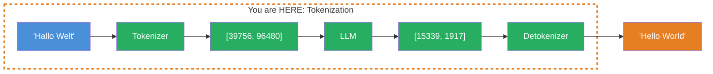
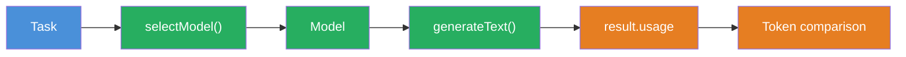

## THINK

Does an LLM read words the way you do — or does it see something entirely different?

## OVERVIEW



An LLM doesn't read text. It works with Token IDs — numbers that represent text fragments (Subword Units). The tokenizer breaks your input into these fragments, the LLM processes the IDs, and the detokenizer reassembles the output IDs into readable text.

## WHY

**Without token understanding:** Your costs are unpredictable. You wonder why a German prompt costs 40% more than an English one. You exceed the Context Window and get cryptic errors. You can't estimate whether your prompt still fits within budget.

**With token understanding:** You can predict costs before making the API call. You understand why different languages require different numbers of tokens. You can optimize your prompts and know exactly how much space is left in the Context Window.

## WALKTHROUGH

### Layer 1: What are tokens?

Tokens are neither words nor characters — they are **Subword Units**. The tokenizer breaks text into the most frequent character combinations from its training data:

```
Input:    "JavaScript ist fantastisch"
Tokens:   ["Java", "Script", " ist", " fant", "astisch"]
Count:    5 Tokens
```

Common words like "the" or "ist" are often a single token. Rare words are split into multiple parts. This is why an LLM doesn't have a dictionary — it has a tokenizer.

### Layer 2: The rule of thumb — 1 token in numbers

For quick estimates:

| Language | Rule of thumb | Example |
|----------|--------------|---------|
| English | 1 Token ≈ 4 characters | "Hello World" ≈ 3 Tokens |
| German | 1 Token ≈ 3 characters | "Hallo Welt" ≈ 4 Tokens |
| Code | variable | Brackets, operators often get their own tokens |

Why does German require more tokens? German words are longer on average (compounds like "Datenbankverbindung") and appear less frequently in the English-heavy training data. The tokenizer has to split them into more Subword Units.

### Layer 3: Token counting with the AI SDK

The AI SDK returns token counts via `result.usage` — automatically with every call:

```typescript
import { generateText } from 'ai';
import { anthropic } from '@ai-sdk/anthropic';

const result = await generateText({
  model: anthropic('claude-sonnet-4-5-20250514'),
  prompt: 'Erklaere was Tokens sind — in einem Satz.',
});

console.log(result.usage);
// → {
//     promptTokens: 18,       ← Tokens in the input (system + prompt)
//     completionTokens: 42,   ← Tokens in the output (generated text)
//     totalTokens: 60          ← Sum
//   }
```

`promptTokens` are the tokens you send to the LLM. `completionTokens` are the tokens the LLM generates. Together they make up `totalTokens` — and both cost money, but at different prices.

### Layer 4: Input vs. output tokens — different prices

Most providers charge differently for input and output:

| Model | Input (per 1M Tokens) | Output (per 1M Tokens) |
|-------|----------------------|------------------------|
| Claude Sonnet 4 | $3.00 | $15.00 |
| GPT-4o | $2.50 | $10.00 |
| Gemini 2.5 Flash | $0.15 | $0.60 |

Output tokens are 3-5x more expensive than input tokens. This means: A prompt that encourages the LLM to give long answers costs disproportionately more. Short, precise instructions ("Answer in at most 3 sentences") save real money.

## TRY

**Task:** Count tokens for different texts and compare German vs. English.

```typescript
import { generateText } from 'ai';
import { anthropic } from '@ai-sdk/anthropic';

// TODO 1: Generate a short response to a German prompt
// const resultDE = await generateText({
//   model: anthropic('claude-sonnet-4-5-20250514'),
//   prompt: 'Erklaere in 2 Saetzen, was eine Datenbank ist.',
// });

// TODO 2: Generate a short response to the same prompt in English
// const resultEN = await generateText({
//   model: anthropic('claude-sonnet-4-5-20250514'),
//   prompt: 'Explain in 2 sentences what a database is.',
// });

// TODO 3: Compare the token counts
// console.log('--- Deutsch ---');
// console.log('Prompt Tokens:', resultDE.usage.promptTokens);
// console.log('Completion Tokens:', resultDE.usage.completionTokens);
// console.log('Total Tokens:', resultDE.usage.totalTokens);

// console.log('--- English ---');
// console.log('Prompt Tokens:', resultEN.usage.promptTokens);
// console.log('Completion Tokens:', resultEN.usage.completionTokens);
// console.log('Total Tokens:', resultEN.usage.totalTokens);

// TODO 4: Calculate the difference in percent
// const diff = ((resultDE.usage.totalTokens - resultEN.usage.totalTokens) / resultEN.usage.totalTokens * 100).toFixed(1);
// console.log(`\nGerman requires ${diff}% more/fewer tokens than English`);
```

**Checklist:**
- [ ] German and English prompt with the same content
- [ ] `result.usage` logged for both
- [ ] Token counts compared (promptTokens and completionTokens)
- [ ] Percentage difference calculated

<details>
<summary>Show solution</summary>

```typescript
import { generateText } from 'ai';
import { anthropic } from '@ai-sdk/anthropic';

const resultDE = await generateText({
  model: anthropic('claude-sonnet-4-5-20250514'),
  prompt: 'Erklaere in 2 Saetzen, was eine Datenbank ist.',
});

const resultEN = await generateText({
  model: anthropic('claude-sonnet-4-5-20250514'),
  prompt: 'Explain in 2 sentences what a database is.',
});

console.log('--- Deutsch ---');
console.log('Prompt Tokens:', resultDE.usage.promptTokens);
console.log('Completion Tokens:', resultDE.usage.completionTokens);
console.log('Total Tokens:', resultDE.usage.totalTokens);

console.log('\n--- English ---');
console.log('Prompt Tokens:', resultEN.usage.promptTokens);
console.log('Completion Tokens:', resultEN.usage.completionTokens);
console.log('Total Tokens:', resultEN.usage.totalTokens);

const diff = ((resultDE.usage.totalTokens - resultEN.usage.totalTokens) / resultEN.usage.totalTokens * 100).toFixed(1);
console.log(`\nGerman requires ${diff}% more tokens than English`);
```

**Explanation:** You'll see that the German prompt and response typically consume 20-40% more tokens than the English version. This is due to the tokenizer distribution — English words appear more frequently in the training data and are encoded more efficiently.

</details>

## COMBINE



**Exercise:** Combine token counting with model selection from Level 1. Send the same prompt to two different models and compare token usage.

1. Use `selectModel('summarize')` for a Flash model (e.g. Gemini Flash)
2. Use `selectModel('analyze')` for a Pro model (e.g. Claude Sonnet)
3. Send the same prompt to both models
4. Compare `promptTokens` and `completionTokens` — different tokenizers yield different numbers

**Optional Stretch Goal:** Calculate the estimated costs for both models based on the pricing table from Layer 4. Which model is cheaper — and by how much?

## Sources

- [Anthropic: Token Counting](https://docs.anthropic.com/en/docs/build-with-claude/token-counting)
- [Vercel AI SDK: Generating Text — Usage](https://ai-sdk.dev/docs/ai-sdk-core/generating-text)
- [OpenAI: Tokenizer](https://platform.openai.com/tokenizer)
