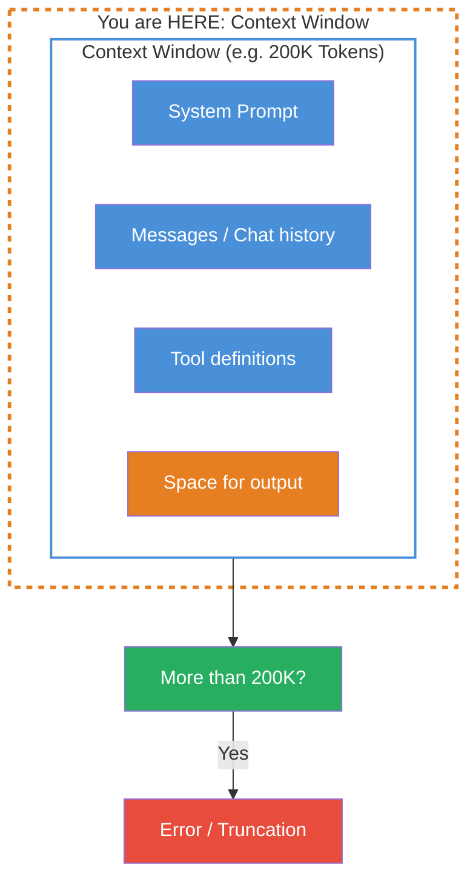
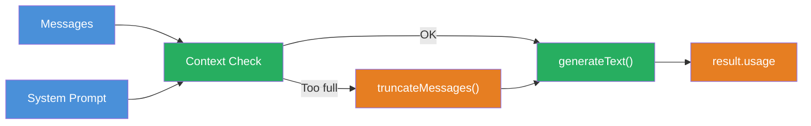

## THINK

What happens when you send a novel to an LLM — can it read the whole thing?

## OVERVIEW



The Context Window is a fixed frame — everything the LLM can "see" at once. System Prompt, chat history, tool definitions AND the space for the response must all fit inside it. If they don't, you get errors or information loss.

## WHY

**Without Context Window understanding:** Your chat works for 10 messages, at message 30 you suddenly get errors. You include a long document and the response only references the last paragraphs. You don't understand why the LLM "forgets" context.

**With Context Window understanding:** You strategically plan what goes into the window and what doesn't. You implement truncation or summarization before errors occur. You reserve space for output and have full control over the information flow.

## WALKTHROUGH

### Layer 1: Context Window sizes at a glance

Different models have different limits:

| Model | Context Window | Approx. in text |
|-------|---------------|-----------------|
| Claude Sonnet 4 | 200,000 Tokens | ~150,000 words / ~500 pages |
| GPT-4o | 128,000 Tokens | ~96,000 words / ~320 pages |
| Gemini 2.5 Flash | 1,048,576 Tokens | ~780,000 words / ~2,600 pages |
| Claude Haiku | 200,000 Tokens | ~150,000 words / ~500 pages |

200,000 tokens sounds like a lot, but in a chat application every message adds up. A System Prompt with tool definitions can easily consume 2,000-5,000 tokens — on every single call.

### Layer 2: What counts toward it?

Everything sent to the LLM consumes Context Window space:

```typescript
import { generateText } from 'ai';
import { anthropic } from '@ai-sdk/anthropic';

const result = await generateText({
  model: anthropic('claude-sonnet-4-5-20250514'),

  // 1. System Prompt — ALWAYS counts
  system: `Du bist ein Code-Review-Assistent.
    Pruefe Code auf Best Practices, Sicherheit und Performance.
    Antworte strukturiert mit Kategorien.`,              // ← ~40 Tokens

  // 2. Messages — every message counts
  messages: [
    { role: 'user', content: 'Review diesen Code: ...' },    // ← Tokens per message
    { role: 'assistant', content: 'Hier mein Review: ...' },  // ← Old responses too!
    { role: 'user', content: 'Und dieser Code?' },            // ← Current message
  ],

  // 3. Space for output — must also fit!
  maxTokens: 4096,                                             // ← Reserved for response
});
```

The math: `system` + all `messages` + tool definitions + `maxTokens` must be less than the Context Window. If you don't set `maxTokens`, the model reserves a default value.

### Layer 3: What happens when you exceed it?

When the input exceeds the Context Window, providers react differently:

```typescript
// Scenario: You send 210,000 tokens to a 200K model

// Anthropic: Clear error
// → Error: "prompt is too long: 210432 tokens > 200000 token limit"

// Some providers: Silent truncation
// → The oldest messages get cut off — WITHOUT warning!
```

Silent truncation is more dangerous than an error. The LLM responds normally, but has lost important context. The response looks correct but is incomplete or wrong — because the LLM no longer has all the information.

### Layer 4: Strategies for a full Context Window

Three strategies for long conversations:

**Strategy 1: Truncation (remove oldest messages)**

```typescript
function truncateMessages(
  messages: Array<{ role: string; content: string }>,
  maxMessages: number,
): Array<{ role: string; content: string }> {
  if (messages.length <= maxMessages) return messages;

  // Keep the first message (often important context) + the most recent
  const first = messages[0];
  const recent = messages.slice(-(maxMessages - 1));          // ← Keep newest
  return [first, ...recent];
}

const allMessages = [/* 50 messages from the chat */];
const trimmed = truncateMessages(allMessages, 20);            // ← Keep only 20
```

**Strategy 2: Token-based truncation (more precise)**

```typescript
function estimateTokens(text: string): number {
  // Rule of thumb: 1 token ≈ 4 characters (English) / 3 characters (German)
  return Math.ceil(text.length / 3.5);                        // ← Rough average
}

function truncateByTokenBudget(
  messages: Array<{ role: string; content: string }>,
  tokenBudget: number,
): Array<{ role: string; content: string }> {
  const result: Array<{ role: string; content: string }> = [];
  let currentTokens = 0;

  // Fill from the end (newest first)
  for (let i = messages.length - 1; i >= 0; i--) {
    const msgTokens = estimateTokens(messages[i].content);
    if (currentTokens + msgTokens > tokenBudget) break;      // ← Budget exhausted
    result.unshift(messages[i]);
    currentTokens += msgTokens;
  }

  return result;
}
```

**Strategy 3: Summarization**

```typescript
import { generateText } from 'ai';
import { anthropic } from '@ai-sdk/anthropic';

async function summarizeOldMessages(
  messages: Array<{ role: string; content: string }>,
): Promise<string> {
  const oldMessages = messages.slice(0, -5);                  // ← Old messages
  const text = oldMessages.map(m => `${m.role}: ${m.content}`).join('\n');

  const result = await generateText({
    model: anthropic('claude-sonnet-4-5-20250514'),
    prompt: `Summarize this conversation in 3-5 sentences:\n\n${text}`,
  });

  return result.text;                                          // ← Summary as context
}
```

## TRY

**Task:** Simulate a conversation approaching the Context Limit. Calculate the token count and check whether it fits in the window.

Create a file `challenge-2-3.ts`:

```typescript
import { generateText } from 'ai';
import { anthropic } from '@ai-sdk/anthropic';

const MODEL_CONTEXT_WINDOW = 200_000; // Claude Sonnet: 200K Tokens

// TODO 1: Define a System Prompt (~50 tokens)
// const systemPrompt = '...';

// TODO 2: Create an array of simulated chat messages
// Tip: Create 10+ messages with varying lengths
// const messages = [
//   { role: 'user' as const, content: 'First message...' },
//   { role: 'assistant' as const, content: 'Response...' },
//   ...
// ];

// TODO 3: Implement estimateTokens(text)
// function estimateTokens(text: string): number { ... }

// TODO 4: Calculate the total consumption
// const systemTokens = estimateTokens(systemPrompt);
// const messageTokens = messages.reduce((sum, m) => sum + estimateTokens(m.content), 0);
// const outputReserve = 4096;
// const total = systemTokens + messageTokens + outputReserve;

// TODO 5: Check against the Context Window
// const remainingTokens = MODEL_CONTEXT_WINDOW - total;
// console.log(`System: ${systemTokens} tokens`);
// console.log(`Messages: ${messageTokens} tokens`);
// console.log(`Output reserve: ${outputReserve} tokens`);
// console.log(`Total: ${total} tokens`);
// console.log(`Remaining: ${remainingTokens} tokens`);
// console.log(`Utilization: ${(total / MODEL_CONTEXT_WINDOW * 100).toFixed(1)}%`);

// TODO 6: Warn at >80% utilization
// if (total / MODEL_CONTEXT_WINDOW > 0.8) {
//   console.warn('WARNING: Context Window over 80% utilized!');
// }
```

**Checklist:**
- [ ] System Prompt and messages defined
- [ ] `estimateTokens` implemented
- [ ] Token consumption calculated for system, messages, and output reserve
- [ ] Checked against Context Window limit
- [ ] Warning at >80% utilization

<details>
<summary>Show solution</summary>

```typescript
const MODEL_CONTEXT_WINDOW = 200_000;

const systemPrompt = `Du bist ein Code-Review-Assistent. Pruefe Code auf Best Practices,
Sicherheit und Performance. Antworte strukturiert mit Kategorien und Prioritaeten.`;

const messages: Array<{ role: 'user' | 'assistant'; content: string }> = [
  { role: 'user', content: 'Review diesen Express-Server:\n```\nconst app = express();\napp.get("/users", async (req, res) => {\n  const users = await db.query("SELECT * FROM users WHERE id = " + req.query.id);\n  res.json(users);\n});\n```' },
  { role: 'assistant', content: 'Kritisch: SQL Injection in der Query. Nutze parametrisierte Queries: db.query("SELECT * FROM users WHERE id = $1", [req.query.id]). Ausserdem fehlt Error Handling und Input-Validierung.' },
  { role: 'user', content: 'Danke! Und wie sieht es mit dem Error Handling aus?' },
  { role: 'assistant', content: 'Wrape den async Handler in einen try/catch Block. Express faengt keine unbehandelten Promise-Rejections ab. Alternativ: ein Error-Handling-Middleware mit app.use((err, req, res, next) => {...}).' },
  { role: 'user', content: 'Kannst Du mir den ganzen Server refactored zeigen?' },
  { role: 'assistant', content: 'Hier der refactored Server mit parametrisierter Query, Error Handling, Input-Validierung mit zod und einem Health-Check Endpoint...' + 'x'.repeat(2000) },
  { role: 'user', content: 'Review jetzt auch mein Authentication-Modul:\n```\n' + 'x'.repeat(5000) + '\n```' },
  { role: 'assistant', content: 'Analyse des Auth-Moduls: 1) JWT-Secret ist hardcoded — nutze Environment Variables. 2) Kein Token-Expiry gesetzt. 3) Password-Hashing fehlt — nutze bcrypt...' + 'x'.repeat(3000) },
  { role: 'user', content: 'Und hier ist mein Database-Layer:\n```\n' + 'x'.repeat(8000) + '\n```' },
  { role: 'assistant', content: 'Database-Layer Review: Connection Pooling fehlt, keine Retry-Logik, Migrations nicht versioniert...' + 'x'.repeat(4000) },
];

function estimateTokens(text: string): number {
  return Math.ceil(text.length / 3.5);
}

const systemTokens = estimateTokens(systemPrompt);
const messageTokens = messages.reduce((sum, m) => sum + estimateTokens(m.content), 0);
const outputReserve = 4096;
const total = systemTokens + messageTokens + outputReserve;

const remainingTokens = MODEL_CONTEXT_WINDOW - total;
const utilization = (total / MODEL_CONTEXT_WINDOW) * 100;

console.log(`System: ${systemTokens} tokens`);
console.log(`Messages: ${messageTokens} tokens (${messages.length} messages)`);
console.log(`Output reserve: ${outputReserve} tokens`);
console.log(`Total: ${total} tokens`);
console.log(`Remaining: ${remainingTokens} tokens`);
console.log(`Utilization: ${utilization.toFixed(1)}%`);

if (utilization > 80) {
  console.warn('\nWARNING: Context Window over 80% utilized!');
  console.warn('Recommendation: Summarize or remove old messages.');
}
```

Run with:

```bash
npx tsx challenge-2-3.ts
```

**Expected output (approximate):**
```
System: 45 tokens
Messages: 6871 tokens (10 messages)
Output reserve: 4096 tokens
Total: 11012 tokens
Remaining: 188988 tokens
Utilization: 5.5%
```

This example stays well below the limit. In a real chat application with lengthy code reviews and many messages, utilization will climb quickly.

**Explanation:** The `estimateTokens` function uses the rule of thumb of 1 token ≈ 3.5 characters as an average between German and English. In a production application you'd use the provider's tokenizer for exact numbers. The 80% warning gives you a safety buffer before errors occur.

</details>

## COMBINE



**Exercise:** Build a Context Manager that checks before each call whether the input fits into the Context Window, and automatically removes old messages when it doesn't.

1. Implement `estimateTokens(text)` with the rule of thumb
2. Calculate the token consumption of System Prompt + messages + output reserve
3. If >80% of the Context Window is used: remove the oldest messages (keep the first and the newest 5)
4. Log a warning when messages are removed
5. Only then execute the `generateText` call

**Optional Stretch Goal:** Instead of simply removing messages, summarize the old messages with a `generateText` call and insert the summary as the first "system message."

## Sources

- [Anthropic: Models Overview](https://docs.anthropic.com/en/docs/about-claude/models)
- [Vercel AI SDK: Prompts](https://ai-sdk.dev/docs/foundations/prompts)
- [Anthropic: Long Context Window Tips](https://docs.anthropic.com/en/docs/build-with-claude/prompt-engineering/long-context-tips)
