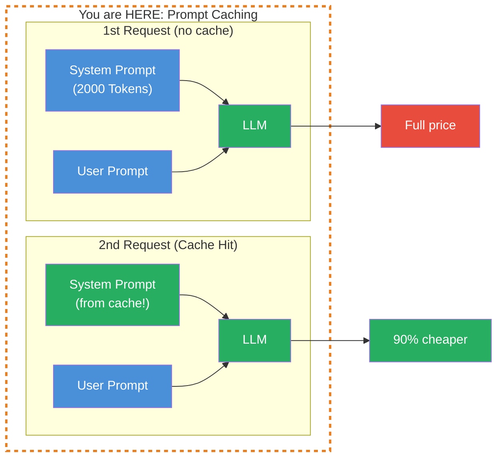
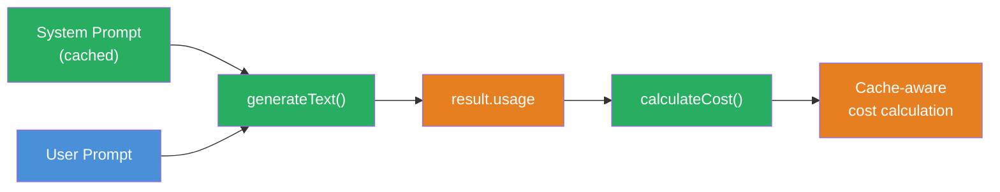

## THINK

When you send the same System Prompt with every request — does the provider charge full price every time?

## OVERVIEW



On the first request, the System Prompt is processed normally and stored in the cache. From the second request on, the provider recognizes the identical prefix and reads it from the cache — at a fraction of the cost.

## WHY

**Without Prompt Caching:** You send the same 2,000-token System Prompt with every request. At 100 requests per hour you pay full price 100x for identical text. That adds up quickly.

**With Prompt Caching:** The System Prompt is processed once, then read from cache. With Anthropic, a cache read costs only 10% of the normal input price. At 100 requests you save 90% of the System Prompt costs.

## WALKTHROUGH

### Layer 1: How Prompt Caching works

Prompt Caching is based on **Prefix Matching**. The provider compares the beginning of your request with previous requests:

```
Request 1:  [System Prompt] + [User: "Was ist TypeScript?"]
            ^^^^^^^^^^^^^^^^
            Gets cached (= prefix)

Request 2:  [System Prompt] + [User: "Erklaere Promises."]
            ^^^^^^^^^^^^^^^^
            Cache hit! Only the user prompt is processed anew.

Request 3:  [Different System Prompt] + [User: "Was ist TypeScript?"]
            ^^^^^^^^^^^^^^^^^^^^^^^^
            Cache miss — prefix has changed.
```

Important: The cache only works for the **beginning** (prefix) of the request. As soon as even a single character in the System Prompt changes, the entire cache is invalidated. Therefore: keep the System Prompt stable, put dynamic parts at the end.

### Layer 2: Provider support

Not all providers support Prompt Caching:

| Provider | Caching | Min. prefix length | Cache duration |
|----------|---------|-------------------|----------------|
| Anthropic | Yes | 1,024 tokens (Sonnet), 2,048 (Haiku) | 5 minutes (TTL — Time To Live, cache expires after this) |
| Google (Gemini) | Yes | variable | variable |
| OpenAI | Automatic | 1,024 tokens | up to 1 hour |

Anthropic has a minimum length for the cache prefix. Short System Prompts under 1,024 tokens are not cached. This is a deliberate tradeoff — the overhead of caching only pays off for longer prefixes.

### Layer 3: Cache tokens in the usage object

The AI SDK returns cache information in the `usage` object:

```typescript
import { generateText } from 'ai';
import { anthropic } from '@ai-sdk/anthropic';

// A long System Prompt (>1024 tokens for cache eligibility)
const longSystemPrompt = `
Du bist ein erfahrener Code-Review-Assistent.

<rules>
- Pruefe jeden Code auf: Sicherheit, Performance, Lesbarkeit, Best Practices
- Kategorisiere Findings als: KRITISCH, WARNUNG, HINWEIS
- Gib fuer jedes Finding: Zeile, Problem, Loesung an
- Nutze die OWASP Top 10 als Sicherheits-Referenz
- Beachte TypeScript-spezifische Patterns und Anti-Patterns
- Pruefe auf proper Error Handling und Edge Cases
</rules>

<output-format>
## Review: [Dateiname]

### KRITISCH
- **Zeile X:** [Problem] → [Loesung]

### WARNUNG
- **Zeile X:** [Problem] → [Loesung]

### HINWEIS
- **Zeile X:** [Problem] → [Loesung]

### Zusammenfassung
[1-2 Saetze Gesamtbewertung]
</output-format>
`.trim();
// This System Prompt has approx. 150 words ≈ 200-250 tokens (below the 1024-token minimum for caching).
// For demonstrating the mechanics this is fine — for actual caching the prompt needs to be longer (see TRY task).

// First request — cache is created
const result1 = await generateText({
  model: anthropic('claude-sonnet-4-5-20250514'),
  system: longSystemPrompt,
  prompt: 'Review: const x = eval(userInput);',
});

console.log('--- Request 1 (Cache Creation) ---');
console.log('Prompt Tokens:', result1.usage.promptTokens);
console.log('Completion Tokens:', result1.usage.completionTokens);

// Second request — same System Prompt, cache hit expected
const result2 = await generateText({
  model: anthropic('claude-sonnet-4-5-20250514'),
  system: longSystemPrompt,                                   // ← Identical!
  prompt: 'Review: app.get("/api", (req, res) => res.send(db.query(req.body.sql)));',
});

console.log('\n--- Request 2 (Cache Hit expected) ---');
console.log('Prompt Tokens:', result2.usage.promptTokens);
console.log('Completion Tokens:', result2.usage.completionTokens);
```

On the second request you should see lower effective costs because the System Prompt is read from cache.

### Layer 4: Calculating cache costs

The pricing structure with caching at Anthropic:

| Token type | Price (Claude Sonnet 4) | Ratio |
|------------|------------------------|-------|
| Normal Input | $3.00 / 1M | 100% |
| Cache Write | $3.75 / 1M | 125% (one-time surcharge) |
| Cache Read | $0.30 / 1M | 10% (90% cheaper!) |
| Output | $15.00 / 1M | — |

The first request (Cache Write) is actually slightly more expensive than normal. But from the second request on, you save 90%. The break-even calculation (when caching starts paying off):

```typescript
// Example: 2000-token System Prompt, Claude Sonnet
const systemTokens = 2000;
const normalCostPerCall = (systemTokens / 1_000_000) * 3.00;    // $0.006
const cacheWriteCost = (systemTokens / 1_000_000) * 3.75;       // $0.0075 (one-time)
const cacheReadCost = (systemTokens / 1_000_000) * 0.30;        // $0.0006 per subsequent call

// Without cache: 10 calls = 10 × $0.006 = $0.060
const withoutCache = normalCostPerCall * 10;

// With cache: 1 write + 9 reads = $0.0075 + 9 × $0.0006 = $0.0129
const withCache = cacheWriteCost + (cacheReadCost * 9);

console.log(`Without cache (10 calls): $${withoutCache.toFixed(4)}`);
console.log(`With cache (10 calls): $${withCache.toFixed(4)}`);
console.log(`Savings: ${((1 - withCache / withoutCache) * 100).toFixed(0)}%`);
// → Savings: 79%
```

From 2 requests with the same prefix, caching pays off. The more requests, the greater the savings — asymptotically approaching 90%.

## TRY

**Task:** Make two calls with the same long System Prompt and compare the usage details.

Create a file `challenge-2-4.ts`:

```typescript
import { generateText } from 'ai';
import { anthropic } from '@ai-sdk/anthropic';

// TODO 1: Create a long System Prompt (>1024 tokens)
// Tip: A detailed ruleset with XML tags, examples, and output format
// const systemPrompt = `...`;

// TODO 2: First call — cache is created
// const result1 = await generateText({
//   model: anthropic('claude-sonnet-4-5-20250514'),
//   system: systemPrompt,
//   prompt: 'First question...',
// });

// TODO 3: Second call — same System Prompt, different question
// const result2 = await generateText({
//   model: anthropic('claude-sonnet-4-5-20250514'),
//   system: systemPrompt,
//   prompt: 'Second question...',
// });

// TODO 4: Compare the usage
// console.log('--- Request 1 ---');
// console.log('Prompt Tokens:', result1.usage.promptTokens);
// console.log('Completion Tokens:', result1.usage.completionTokens);

// console.log('--- Request 2 ---');
// console.log('Prompt Tokens:', result2.usage.promptTokens);
// console.log('Completion Tokens:', result2.usage.completionTokens);
```

**Checklist:**
- [ ] System Prompt is long enough for caching (>1024 tokens)
- [ ] Two calls with identical System Prompt
- [ ] Usage comparison logged
- [ ] Difference between first and second call observed

<details>
<summary>Show solution</summary>

```typescript
import { generateText } from 'ai';
import { anthropic } from '@ai-sdk/anthropic';

const systemPrompt = `
<task-context>
Du bist ein erfahrener Software-Architekt mit 15 Jahren Erfahrung in TypeScript,
Node.js und Cloud-Architekturen. Du reviewst Code und Architekturen fuer
Enterprise-Anwendungen.
</task-context>

<rules>
- Pruefe jeden Code auf: Sicherheit, Performance, Lesbarkeit, Wartbarkeit
- Kategorisiere Findings als: KRITISCH, WARNUNG, HINWEIS, POSITIV
- Gib fuer jedes Finding an: Betroffene Stelle, Problem, Empfohlene Loesung
- Nutze die OWASP Top 10 als Sicherheits-Referenz
- Beachte TypeScript-spezifische Patterns: strict mode, type safety, generics
- Pruefe auf Error Handling, Edge Cases und Race Conditions
- Bewerte die Testbarkeit des Codes
- Achte auf SOLID-Prinzipien und Clean Architecture
- Pruefe Dependencies auf bekannte Vulnerabilities
- Bewerte die API-Design-Qualitaet (REST Best Practices)
- Achte auf proper Logging und Monitoring-Hooks
- Pruefe auf Memory Leaks und Resource Cleanup
</rules>

<examples>
Beispiel fuer ein KRITISCH-Finding:
- Stelle: Zeile 42, db.query()
- Problem: SQL Injection durch String-Concatenation
- Loesung: Parametrisierte Query verwenden

Beispiel fuer ein WARNUNG-Finding:
- Stelle: Zeile 15, catch(e) {}
- Problem: Leerer Catch-Block verschluckt Fehler
- Loesung: Error loggen und ggf. re-throwen

Beispiel fuer ein POSITIV-Finding:
- Stelle: Zeile 8, zod.parse()
- Problem: -
- Loesung: Gute Input-Validierung mit Zod
</examples>

<output-format>
## Code Review: [Kontext]

### KRITISCH
- **[Stelle]:** [Problem] → [Loesung]

### WARNUNG
- **[Stelle]:** [Problem] → [Loesung]

### HINWEIS
- **[Stelle]:** [Problem] → [Loesung]

### POSITIV
- **[Stelle]:** [Was gut ist]

### Zusammenfassung
[2-3 Saetze Gesamtbewertung mit Prioritaeten]
</output-format>
`.trim();

// Request 1 — Cache Creation
const result1 = await generateText({
  model: anthropic('claude-sonnet-4-5-20250514'),
  system: systemPrompt,
  prompt: 'Review: const secret = "sk-1234"; app.post("/login", (req, res) => { if (req.body.pw === secret) res.json({token: jwt.sign({}, secret)}); });',
});

console.log('--- Request 1 (Cache Creation) ---');
console.log('Prompt Tokens:', result1.usage.promptTokens);
console.log('Completion Tokens:', result1.usage.completionTokens);
console.log('Total:', result1.usage.totalTokens);

// Request 2 — Cache Hit expected
const result2 = await generateText({
  model: anthropic('claude-sonnet-4-5-20250514'),
  system: systemPrompt,
  prompt: 'Review: app.get("/users/:id", async (req, res) => { const user = await User.findById(req.params.id); res.json(user); });',
});

console.log('\n--- Request 2 (Cache Hit expected) ---');
console.log('Prompt Tokens:', result2.usage.promptTokens);
console.log('Completion Tokens:', result2.usage.completionTokens);
console.log('Total:', result2.usage.totalTokens);
```

Run with:

```bash
npx tsx challenge-2-4.ts
```

**Expected output (approximate):**
```
--- Request 1 (Cache Creation) ---
Prompt Tokens: 380
Completion Tokens: 195
Total: 575

--- Request 2 (Cache Hit expected) ---
Prompt Tokens: 375
Completion Tokens: 180
Total: 555
```

The `promptTokens` counts are similar because tokens are still counted. You can detect the cache hit via the extended usage fields: check `providerMetadata` for `cacheReadTokens` > 0 on the second call.

**Explanation:** Both requests use the same System Prompt. On the second request the provider reads the System Prompt from cache. The effective costs are lower, even though the token counts look similar.

</details>

## COMBINE



**Exercise:** Extend the Cost Calculator from Challenge 2.2 with cache awareness.

1. Execute multiple calls with the same System Prompt
2. Track whether the first call is more expensive than subsequent calls (Cache Write vs. Cache Read)
3. Calculate the theoretical savings compared to "no caching"
4. Log after each call: "Call N: $X.XXXXXX (Cache: Hit/Miss)"

**Optional Stretch Goal:** Calculate the break-even analysis: After how many requests with the same prefix does caching pay off compared to no caching? Show the calculation in the console.

## Sources

- [Anthropic: Prompt Caching](https://docs.anthropic.com/en/docs/build-with-claude/prompt-caching)
- [Vercel AI SDK: Generating Text](https://ai-sdk.dev/docs/ai-sdk-core/generating-text)
- [Anthropic: Pricing](https://docs.anthropic.com/en/docs/about-claude/pricing)
