Level 2 complete! You now understand the mechanics behind LLM costs and know how to control them. In the Boss Fight you combined all four building blocks into a Token Budget Calculator — that's real production knowledge.

## What you've learned

- **Tokens:** LLMs don't read text — they work with Subword Units (Token IDs). 1 token ≈ 4 characters (EN) / 3 characters (DE). Different languages and text types consume different amounts of tokens.
- **Usage Tracking:** Every `generateText` call returns `result.usage` with `promptTokens`, `completionTokens`, and `totalTokens`. Cost calculation: tokens / 1M * price. Output tokens are 3-5x more expensive than input tokens.
- **Context Window:** Everything sent to the LLM — System Prompt, messages, tool definitions AND space for output — must fit into the Context Window. When exceeded: error or silent truncation. Strategies: message truncation, token budget, summarization.
- **Prompt Caching:** Identical prompt prefixes are read from cache after the first request — at Anthropic for 10% of the normal input cost. Track the cache hit rate for cost optimization.

## Updated Skill Tree

```mermaid
graph LR
  subgraph "Unlocked"
    L1["Level 1: AI SDK Basics"]
    L2["Level 2: LLM Fundamentals"]
  end
  subgraph NEXT["Next Level"]
    L3["Level 3: Agents & MCP"]
  end
  subgraph "Locked"
    L4["Level 4: Persistence"]
    L5["Level 5: Context Engineering"]
    L6["Level 6: Evals"]
    L7["Level 7: Streaming"]
    L8["Level 8: Workflows"]
    L9["Level 9: Advanced Patterns"]
  end
  L1 --> L2
  L2 --> L3
  L3 -.-> L4
  L4 -.-> L5
  L5 -.-> L6
  L6 -.-> L7
  L7 -.-> L8
  L8 -.-> L9
  style L1 fill:#27AE60,color:#fff
  style L2 fill:#27AE60,color:#fff
  style NEXT fill:none,stroke:#E67E22,stroke-width:3px,stroke-dasharray:5 5
  style L3 fill:#E67E22,color:#fff
  style L4 fill:#95a5a6,color:#fff
  style L5 fill:#95a5a6,color:#fff
  style L6 fill:#95a5a6,color:#fff
  style L7 fill:#95a5a6,color:#fff
  style L8 fill:#95a5a6,color:#fff
  style L9 fill:#95a5a6,color:#fff
```

## Next Level

**Level 3: Agents & MCP** — From passive text generator to active agent. You'll learn how LLMs call tools, how the tool call loop works, and how to connect external services with the Model Context Protocol (MCP). Your LLM will then be able to not only respond, but act.
