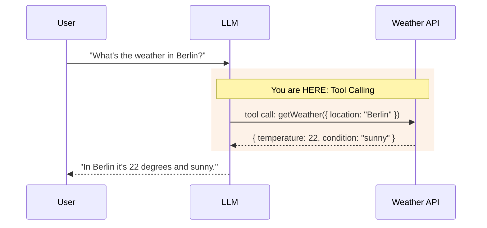
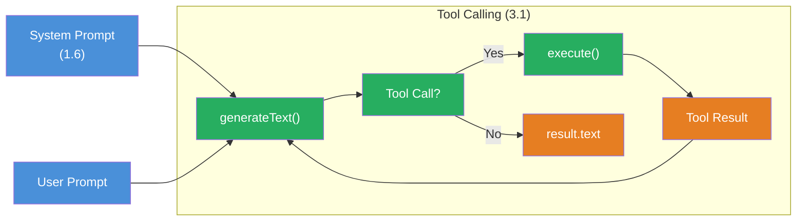

## THINK

What if an LLM could not only generate text, but also perform actions — e.g. check the weather, run a calculation, or query a database?

## OVERVIEW



The LLM recognizes that it can't answer the weather question from its own knowledge. It generates a **tool call** — a structured request to a function. The function is executed, the result goes back to the LLM, and the LLM formulates a natural response from it.

## WHY

**Without tools:** The LLM can only talk, not act. It has no current knowledge, can't compute, can't access databases. Every question about current data gets answered with a hallucination or "I don't know."

**With tools:** The LLM becomes an agent. It recognizes which function it needs, calls it with the right parameters, and processes the result. It can now check weather, compute, read files — anything you define a tool for.

## WALKTHROUGH

### Layer 1: Defining a tool with `tool()`

A tool has three parts: a description (so the LLM knows when to use the tool), an input schema (so the LLM knows which parameters to send), and an execute function (which does the actual work):

```typescript
import { tool } from 'ai';
import { z } from 'zod';

const weatherTool = tool({
  description: 'Get the weather in a location',          // ← When should the LLM use this tool?
  inputSchema: z.object({                                 // ← What parameters does it need?
    location: z.string().describe('The city name'),       // ← .describe() helps the LLM
  }),
  execute: async ({ location }) => ({                     // ← What happens on invocation?
    location,
    temperature: 22,
    condition: 'sunny',
  }),
});
```

Three critical details:
- **`description`** influences whether the LLM picks the tool. The more precise, the better.
- **`.describe()`** on Zod fields explains to the LLM what the parameter means.
- **`execute`** is async — you can run real API calls, database queries, or any code.

### Layer 2: Using a tool with generateText

Tools are passed as an object to `generateText`. The keys are the tool names the LLM sees:

```typescript
import { generateText } from 'ai';
import { anthropic } from '@ai-sdk/anthropic';

const result = await generateText({
  model: anthropic('claude-sonnet-4-5-20250514'),
  tools: {                                                // ← Tools as an object
    weather: weatherTool,                                 // ← Key = tool name for the LLM
  },
  prompt: 'What is the weather in Berlin?',
});

console.log(result.text);
// → "It's currently 22 degrees and sunny in Berlin."
```

The LLM decides on its own whether to use a tool. For the question "What's the weather?" it recognizes that it needs to call `weather`. For "What is TypeScript?" it would answer directly.

### Layer 3: Tool Choice — controlling tool usage

With `toolChoice` you control how the LLM handles tools:

```typescript
const result = await generateText({
  model: anthropic('claude-sonnet-4-5-20250514'),
  tools: { weather: weatherTool },
  toolChoice: 'auto',                                    // ← LLM decides (default)
  prompt: 'What is the weather in Berlin?',
});
```

| toolChoice | Behavior |
|------------|----------|
| `'auto'` | LLM decides on its own whether a tool is needed (default) |
| `'required'` | LLM MUST use at least one tool |
| `'none'` | No tools — LLM responds with text only |
| `{ type: 'tool', toolName: 'weather' }` | Forces a specific tool |

### Layer 4: Tool calls and tool results in the result

After execution you'll find all tool calls and their results in the result object:

```typescript
const result = await generateText({
  model: anthropic('claude-sonnet-4-5-20250514'),
  tools: { weather: weatherTool },
  prompt: 'What is the weather in Berlin?',
});

// Tool calls from the last step
for (const toolCall of result.toolCalls) {
  console.log('Tool:', toolCall.toolName);                // → "weather"
  console.log('Args:', toolCall.args);                    // → { location: "Berlin" }
}

// Tool results from the last step
for (const toolResult of result.toolResults) {
  console.log('Result:', toolResult.result);              // → { location: "Berlin", temperature: 22, ... }
}
```

`result.toolCalls` and `result.toolResults` contain the data from the last step. For multi-step scenarios (coming in Challenge 3.3) you'll use `result.steps`.

## TRY

**File:** `challenge-3-1.ts`

**Task:** Build a calculator tool with three operations (add, subtract, multiply) and use it with `generateText`.

```typescript
import { generateText, tool } from 'ai';
import { anthropic } from '@ai-sdk/anthropic';
import { z } from 'zod';

// TODO 1: Define a calculator tool
// - description: A description telling the LLM when to use the calculator
// - inputSchema with:
//   - operation: z.enum(['add', 'subtract', 'multiply']).describe(...)
//   - a: z.number().describe('First number')
//   - b: z.number().describe('Second number')
// - execute: Performs the calculation and returns the result

// TODO 2: Use the tool with generateText
// - model: anthropic('claude-sonnet-4-5-20250514')
// - tools: { calculator: calculatorTool }
// - prompt: 'What is 42 times 17?'

// TODO 3: Log result.text, result.toolCalls and result.toolResults
```

**Checklist:**
- [ ] Calculator tool defined with `tool()`
- [ ] Zod schema with `operation`, `a` and `b` — all with `.describe()`
- [ ] `execute` performs the correct operation (switch/case or if/else)
- [ ] Tool integrated with `generateText`
- [ ] `result.text` shows the LLM's natural response
- [ ] `result.toolCalls` shows the tool invocation

<details>
<summary>Show solution</summary>

```typescript
import { generateText, tool } from 'ai';
import { anthropic } from '@ai-sdk/anthropic';
import { z } from 'zod';

const calculatorTool = tool({
  description: 'Perform a math calculation with two numbers',
  inputSchema: z.object({
    operation: z.enum(['add', 'subtract', 'multiply']).describe('The math operation to perform'),
    a: z.number().describe('The first number'),
    b: z.number().describe('The second number'),
  }),
  execute: async ({ operation, a, b }) => {
    switch (operation) {
      case 'add':
        return { operation, a, b, result: a + b };
      case 'subtract':
        return { operation, a, b, result: a - b };
      case 'multiply':
        return { operation, a, b, result: a * b };
    }
  },
});

const result = await generateText({
  model: anthropic('claude-sonnet-4-5-20250514'),
  tools: { calculator: calculatorTool },
  prompt: 'What is 42 times 17?',
});

console.log('Answer:', result.text);
console.log('Tool Calls:', result.toolCalls);
console.log('Tool Results:', result.toolResults);
```

**Explanation:** The LLM recognizes the math problem, calls `calculator` with `{ operation: 'multiply', a: 42, b: 17 }`, gets back `{ result: 714 }`, and formulates a natural response like "42 times 17 is 714."

**Run:** `npx tsx challenge-3-1.ts`

**Expected output (approximate):**
```
Answer: 42 times 17 is 714.
Tool Calls: [{ toolName: 'calculator', args: { operation: 'multiply', a: 42, b: 17 } }]
Tool Results: [{ result: { operation: 'multiply', a: 42, b: 17, result: 714 } }]
```

</details>

## COMBINE



**Exercise:** Combine a tool with a system prompt from Challenge 1.6. Give the LLM a role and a tool at the same time.

1. Define a system prompt: "You are a friendly math tutor. Explain every calculation step by step."
2. Use the calculator tool from the TRY exercise
3. Ask a math question — the LLM should use the tool AND explain the approach
4. Compare: How does the response change with vs. without a system prompt?

**Optional Stretch Goal:** Define a second tool (`unitConverter`) that converts units (e.g. km to miles). Give the LLM both tools and ask a question that requires both: "I'm driving 100 km — how many miles is that and how long does it take at 60 km/h?"

## Sources

- [Vercel AI SDK: Tools and Tool Calling](https://ai-sdk.dev/docs/ai-sdk-core/tools-and-tool-calling)
- [Vercel AI SDK: tool() API Reference](https://ai-sdk.dev/docs/reference/ai-sdk-core/tool)
- [ai-hero-dev Exercise 03.01](https://github.com/ai-hero-dev/ai-sdk-v6-crash-course/tree/main/exercises/03-agents-and-tools/03.01-tool-calling)
