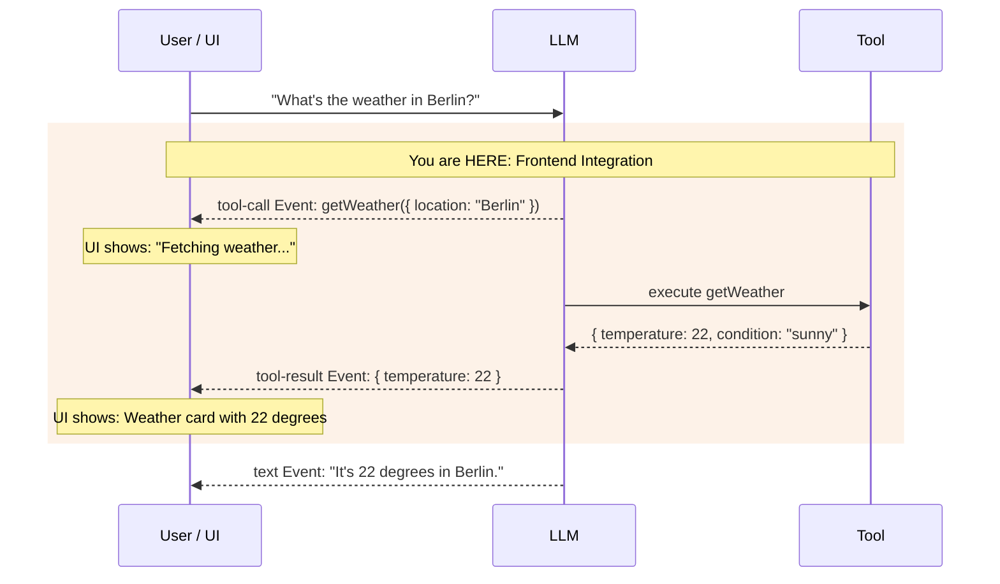

import { Image } from 'astro:assets';
import combineDiagram from '../../../../assets/diagrams/l3-c2-combine.svg';

## THINK

When an LLM calls a tool — how do you show that to the user in the UI? Does the user only see the final answer, or also what's happening in between?

## OVERVIEW



When streaming, you don't just get text events — you also get `tool-call` and `tool-result` events. You can use these in the frontend to display loading states, tool-specific UIs, and transparent intermediate steps.

## WHY

**Without frontend integration:** The user sees a long pause, then the final answer. They don't know what the LLM is doing. No feedback, no transparency, no trust.

**With frontend integration:** The user sees in real time: "Fetching weather...", then a weather card, then the final answer. Transparency builds trust. Loading states bridge wait times. Tool-specific UIs (cards, charts, tables) make results tangible.

## WALKTHROUGH

### Layer 1: Message Parts — the building blocks of a message

An LLM response doesn't always consist of just text. When tools are involved, a message consists of multiple **parts**:

```typescript
// A message can have multiple parts:
const messageParts = [
  { type: 'text', text: 'Let me check the weather...' },              // ← Text part
  { type: 'tool-call', toolCallId: 'tc_1', toolName: 'weather',       // ← Tool call part
    args: { location: 'Berlin' } },
  { type: 'tool-result', toolCallId: 'tc_1', toolName: 'weather',     // ← Tool result part
    result: { temperature: 22, condition: 'sunny' } },
  { type: 'text', text: 'In Berlin it\'s 22 degrees and sunny.' },    // ← Final text
];
```

Each message is an array of parts. The LLM can mix text and tool calls in any order. The `toolCallId` connects a `tool-call` with its `tool-result`.

### Layer 2: Tool events in the stream

When you use `streamText` with tools, you get specific events via `fullStream`:

```typescript
import { streamText, tool } from 'ai';
import { anthropic } from '@ai-sdk/anthropic';
import { z } from 'zod';

const weatherTool = tool({
  description: 'Get the weather in a location',
  inputSchema: z.object({
    location: z.string().describe('The city name'),
  }),
  execute: async ({ location }) => ({
    location, temperature: 22, condition: 'sunny',
  }),
});

const result = streamText({
  model: anthropic('claude-sonnet-4-5-20250514'),
  tools: { weather: weatherTool },
  prompt: 'What is the weather in Berlin?',
});

for await (const part of result.fullStream) {
  switch (part.type) {
    case 'text-delta':                                   // ← Text chunk
      process.stdout.write(part.textDelta);
      break;
    case 'tool-call':                                    // ← LLM wants to call a tool
      console.log(`\n[Tool Call] ${part.toolName}(${JSON.stringify(part.args)})`);
      break;
    case 'tool-result':                                  // ← Tool result is available
      console.log(`[Tool Result] ${JSON.stringify(part.result)}`);
      break;
    case 'finish':
      console.log(`\n[Done] Tokens: ${part.usage.totalTokens}`);
      break;
  }
}
```

The event order is always: `tool-call` → (tool is executed) → `tool-result` → then more text or further tool calls.

### Layer 3: Tool-call vs. tool-result state

Between `tool-call` and `tool-result` lies the execution time of the tool. During this phase you can show a loading state:

```typescript
// Pseudo-code for UI rendering:
for await (const part of result.fullStream) {
  switch (part.type) {
    case 'tool-call':
      // Show loading state
      console.log(`⏳ ${part.toolName} is executing...`);
      console.log(`   Parameters: ${JSON.stringify(part.args)}`);
      break;
    case 'tool-result':
      // Replace loading state with result
      console.log(`✓ ${part.toolName} completed`);
      console.log(`   Result: ${JSON.stringify(part.result)}`);
      break;
  }
}
```

In a real frontend (React, Next.js) you'd trigger a state change here: A spinner gets replaced by a result component. In the terminal we show this with formatted output.

### Layer 4: Rendering multiple parts

A complete rendering logic must handle all part types. Here's an example that formats text, tool calls and tool results:

```typescript
import { streamText, tool } from 'ai';
import { anthropic } from '@ai-sdk/anthropic';
import { z } from 'zod';

const weatherTool = tool({
  description: 'Get the weather in a location',
  inputSchema: z.object({
    location: z.string().describe('The city name'),
  }),
  execute: async ({ location }) => ({
    location, temperature: 22, condition: 'sunny',
  }),
});

const result = streamText({
  model: anthropic('claude-sonnet-4-5-20250514'),
  tools: { weather: weatherTool },
  prompt: 'What is the weather in Berlin and Munich?',
});

const toolStates = new Map<string, string>();             // ← Tracks tool status

for await (const part of result.fullStream) {
  switch (part.type) {
    case 'text-delta':
      process.stdout.write(part.textDelta);
      break;
    case 'tool-call':
      toolStates.set(part.toolCallId, 'running');
      console.log(`\n┌─ Tool: ${part.toolName}`);
      console.log(`│  Args: ${JSON.stringify(part.args)}`);
      console.log(`│  Status: executing...`);
      break;
    case 'tool-result':
      toolStates.set(part.toolCallId, 'done');
      console.log(`│  Result: ${JSON.stringify(part.result)}`);
      console.log(`└─ Completed`);
      break;
    case 'finish':
      console.log(`\n--- ${toolStates.size} tool(s) executed ---`);
      console.log(`Tokens: ${part.usage.totalTokens}`);
      break;
  }
}
```

The `Map` tracks the status of each tool call via its `toolCallId`. In a real frontend this would be a React state that updates the UI.

## TRY

**File:** `challenge-3-2.ts`

**Task:** Use `fullStream` with a tool and format all events in the terminal — text, tool calls, and tool results separately.

```typescript
import { streamText, tool } from 'ai';
import { anthropic } from '@ai-sdk/anthropic';
import { z } from 'zod';

// Tool is provided:
const weatherTool = tool({
  description: 'Get the weather in a location',
  inputSchema: z.object({
    location: z.string().describe('The city name'),
  }),
  execute: async ({ location }) => ({
    location,
    temperature: Math.floor(Math.random() * 30),
    condition: ['sunny', 'cloudy', 'rainy'][Math.floor(Math.random() * 3)],
  }),
});

// TODO 1: Call streamText with the weatherTool
// TODO 2: Iterate over result.fullStream
// TODO 3: Handle these event types:
//   - 'text-delta': Write text to the terminal
//   - 'tool-call': Display tool name and parameters
//   - 'tool-result': Display result in formatted form
//   - 'finish': Display token usage
```

**Checklist:**
- [ ] `streamText` called with tool
- [ ] `fullStream` consumed with `for await`
- [ ] `text-delta` events output as text
- [ ] `tool-call` events displayed with tool name and args
- [ ] `tool-result` events displayed with formatted result
- [ ] `finish` event logged with token usage

<details>
<summary>Show solution</summary>

```typescript
import { streamText, tool } from 'ai';
import { anthropic } from '@ai-sdk/anthropic';
import { z } from 'zod';

const weatherTool = tool({
  description: 'Get the weather in a location',
  inputSchema: z.object({
    location: z.string().describe('The city name'),
  }),
  execute: async ({ location }) => ({
    location,
    temperature: Math.floor(Math.random() * 30),
    condition: ['sunny', 'cloudy', 'rainy'][Math.floor(Math.random() * 3)],
  }),
});

const result = streamText({
  model: anthropic('claude-sonnet-4-5-20250514'),
  tools: { weather: weatherTool },
  prompt: 'What is the weather in Berlin and Munich?',
});

for await (const part of result.fullStream) {
  switch (part.type) {
    case 'text-delta':
      process.stdout.write(part.textDelta);
      break;
    case 'tool-call':
      console.log(`\n[TOOL CALL] ${part.toolName}`);
      console.log(`  Parameters: ${JSON.stringify(part.args, null, 2)}`);
      break;
    case 'tool-result':
      console.log(`[TOOL RESULT] ${part.toolName}`);
      console.log(`  Result: ${JSON.stringify(part.result, null, 2)}`);
      break;
    case 'finish':
      console.log(`\n\n--- Stream finished ---`);
      console.log(`Tokens: ${part.usage.totalTokens}`);
      console.log(`Finish Reason: ${part.finishReason}`);
      break;
  }
}
```

**Explanation:** The LLM calls `weather` for "Berlin" and "Munich" — possibly in separate tool calls. Each call first produces a `tool-call` event (with args), then after execution a `tool-result` event (with result). At the end comes text that summarizes both results.

**Run:** `npx tsx challenge-3-2.ts`

**Expected output (approximate):**
```

[TOOL CALL] weather
  Parameters: { "location": "Berlin" }
[TOOL RESULT] weather
  Result: { "location": "Berlin", "temperature": 18, "condition": "sunny" }

[TOOL CALL] weather
  Parameters: { "location": "Munich" }
[TOOL RESULT] weather
  Result: { "location": "Munich", "temperature": 12, "condition": "cloudy" }

It's 18 degrees and sunny in Berlin, and 12 degrees and cloudy in Munich.

--- Stream finished ---
Tokens: ~350
Finish Reason: stop
```

</details>

## COMBINE

<Image src={combineDiagram} alt="User prompt and system prompt flow to streamText, fullStream delivers text-delta, tool-call, tool-result and finish events" />

**Exercise:** Combine the tool event rendering with `streamText` from Challenge 1.4. Build a formatted terminal output that visually distinguishes text and tool events.

1. Use the `weatherTool` and a `calculatorTool` (from Challenge 3.1) together
2. Ask a question that requires both tools: "What is the weather in Berlin? And convert the temperature from Celsius to Fahrenheit (formula: C * 9/5 + 32)."
3. Format the output so that tool calls and tool results are visually highlighted (e.g. with a `[TOOL]` prefix)
4. Show a summary at the end: How many tools were called, how many tokens consumed?

**Optional Stretch Goal:** Build a `renderToolResult(toolName, result)` helper that outputs different formats for different tools — e.g. a weather display for `weather` and a calculation for `calculator`.

## Sources

- [Vercel AI SDK: Tools and Tool Calling — Multi-Step Calls](https://ai-sdk.dev/docs/ai-sdk-core/tools-and-tool-calling)
- [Vercel AI SDK: Stream Helpers](https://ai-sdk.dev/docs/reference/ai-sdk-core/stream-text)
- [ai-hero-dev Exercise 03.02](https://github.com/ai-hero-dev/ai-sdk-v6-crash-course/tree/main/exercises/03-agents-and-tools/03.02-tool-call-rendering)
