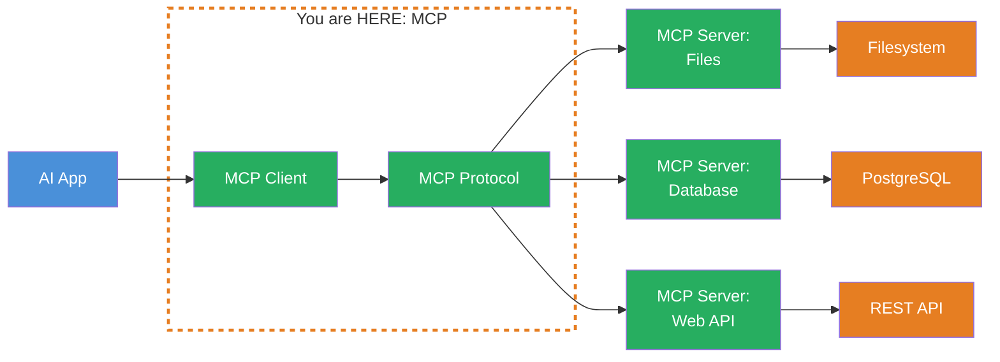
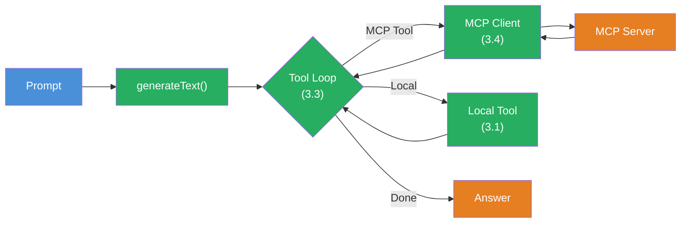

## THINK

How do you connect your LLM to external services — without building a custom integration for each one? What if there were a standardized protocol that every tool server speaks?

## OVERVIEW



**MCP** (Model Context Protocol) is an open protocol that standardizes communication between AI applications and tool servers. An MCP client in your app connects to any number of MCP servers — each server provides tools that your LLM can use.

## WHY

**Without MCP:** For each external service you build a custom integration. Custom `tool()` definition, custom API binding, custom error handling. With 10 services you have 10 different integrations to maintain. Not standardized, not interchangeable.

**With MCP:** One protocol for all tools. You connect to an MCP server and automatically get all its tools — with descriptions, schemas, ready to use. Switch servers? Change transport? A configuration change, not a code rewrite.

## WALKTHROUGH

### Setup for this challenge

MCP requires two additional packages:

```bash
npm install @ai-sdk/mcp @modelcontextprotocol/sdk
```

### Layer 1: Creating an MCP client

The MCP client is the bridge between your app and an MCP server. You create it with `createMCPClient`:

```typescript
import { createMCPClient } from '@ai-sdk/mcp';

const client = await createMCPClient({
  transport: {
    type: 'http',                                        // ← Transport type
    url: 'https://my-mcp-server.com/mcp',               // ← Server URL
  },
});
```

`createMCPClient` is async — it establishes the connection to the server and negotiates capabilities. The client then knows which tools the server offers.

### Layer 2: Transport options

MCP supports different transports for different scenarios:

| Transport | Use case | Example |
|-----------|----------|---------|
| **HTTP (Streamable)** | Remote server, production | Cloud-hosted MCP server |
| **SSE** | Alternative to HTTP | Server-Sent Events based |
| **stdio** | Local server, development | Local process (Node.js, Python) |

**HTTP** — for remote servers in production:

```typescript
const client = await createMCPClient({
  transport: {
    type: 'http',
    url: 'https://my-mcp-server.com/mcp',
    headers: {                                           // ← Optional: Auth headers
      Authorization: 'Bearer my-api-key',
    },
  },
});
```

**stdio** — for local servers during development:

```typescript
import { StdioClientTransport } from '@modelcontextprotocol/sdk/client/stdio.js';

const client = await createMCPClient({
  transport: new StdioClientTransport({
    command: 'node',                                     // ← Command to start the server
    args: ['my-mcp-server.js'],                          // ← Arguments
  }),
});
```

stdio starts the MCP server as a local child process. Communication runs over stdin/stdout. Ideal for development and testing.

### Layer 3: Loading and using MCP tools

`client.tools()` returns all tools from the server as an object — ready for `generateText`:

```typescript
import { createMCPClient } from '@ai-sdk/mcp';
import { generateText } from 'ai';
import { anthropic } from '@ai-sdk/anthropic';

const client = await createMCPClient({
  transport: {
    type: 'http',
    url: 'https://my-mcp-server.com/mcp',
  },
});

// Load all tools from the server
const tools = await client.tools();                      // ← Returns { toolName: tool, ... }

console.log('Available tools:', Object.keys(tools));

// Use tools directly with generateText
const result = await generateText({
  model: anthropic('claude-sonnet-4-5-20250514'),
  tools,                                                 // ← Use MCP tools like local tools
  prompt: 'What is the weather in Berlin?',
});

console.log(result.text);

// Important: Close the client when done
await client.close();
```

`client.tools()` returns an object that has exactly the format `generateText` expects. You can also mix MCP tools and local tools:

```typescript
const mcpTools = await client.tools();
const allTools = {
  ...mcpTools,                                           // ← MCP tools
  calculator: calculatorTool,                            // ← Local tool
};
```

### Layer 4: Typed tools with schemas

By default MCP tools are untyped — the schemas come from the server. But you can specify your own Zod schemas for full TypeScript type safety:

```typescript
import { z } from 'zod';

const tools = await client.tools({
  schemas: {
    'get-weather': {                                     // ← Tool name from the server
      inputSchema: z.object({
        location: z.string(),
      }),
      outputSchema: z.object({                           // ← Optional: Typed output
        temperature: z.number(),
        condition: z.string(),
      }),
    },
  },
});

// Now input and output are typed
```

The schemas don't override the server schemas — they add TypeScript types. If the server has a different schema, you'll get a runtime error.

### Layer 5: Client lifecycle

The MCP client holds an open connection. You must close it when done:

```typescript
const client = await createMCPClient({
  transport: { type: 'http', url: 'https://server.com/mcp' },
});

try {
  const tools = await client.tools();
  const result = await generateText({
    model: anthropic('claude-sonnet-4-5-20250514'),
    tools,
    prompt: 'Hello!',
  });
  console.log(result.text);
} finally {
  await client.close();                                  // ← Always close!
}
```

Alternatively in `onFinish` when streaming:

```typescript
const result = streamText({
  model: anthropic('claude-sonnet-4-5-20250514'),
  tools: await client.tools(),
  prompt: 'Hello!',
  onFinish: async () => {
    await client.close();                                // ← Close after stream ends
  },
});
```

## TRY

**File:** `challenge-3-4.ts`

**Task:** Create an MCP client with stdio transport, load the available tools, and use them with `generateText`.

```typescript
import { createMCPClient } from '@ai-sdk/mcp';
import { StdioClientTransport } from '@modelcontextprotocol/sdk/client/stdio.js';
import { generateText } from 'ai';
import { anthropic } from '@ai-sdk/anthropic';

// TODO 1: Create an MCP client with stdio transport
// - command: 'npx'
// - args: ['-y', '@modelcontextprotocol/server-everything']
//   (a demo server that provides various test tools)

// TODO 2: Load the available tools with client.tools()
// TODO 3: Log the tool names: Object.keys(tools)

// TODO 4: Use the tools with generateText
// - model: anthropic('claude-sonnet-4-5-20250514')
// - tools: the loaded MCP tools
// - prompt: A question that fits the available tools

// TODO 5: Log result.text and result.toolCalls
// TODO 6: Close the client with client.close()
```

**Checklist:**
- [ ] MCP client created with stdio transport
- [ ] `client.tools()` called
- [ ] Available tool names logged
- [ ] Tools used with `generateText`
- [ ] Client closed at the end

<details>
<summary>Show solution</summary>

```typescript
import { createMCPClient } from '@ai-sdk/mcp';
import { StdioClientTransport } from '@modelcontextprotocol/sdk/client/stdio.js';
import { generateText } from 'ai';
import { anthropic } from '@ai-sdk/anthropic';

const client = await createMCPClient({
  transport: new StdioClientTransport({
    command: 'npx',
    args: ['-y', '@modelcontextprotocol/server-everything'],
  }),
});

try {
  const tools = await client.tools();
  console.log('Available tools:', Object.keys(tools));

  const result = await generateText({
    model: anthropic('claude-sonnet-4-5-20250514'),
    tools,
    prompt: 'Use the echo tool to say "Hello from MCP!"',
  });

  console.log('\nAnswer:', result.text);
  console.log('Tool Calls:', result.toolCalls);
} finally {
  await client.close();
}
```

**Explanation:** The `@modelcontextprotocol/server-everything` is an official demo server that provides various test tools (echo, add, etc.). The stdio transport starts it as a local child process. `client.tools()` automatically loads all available tools with their descriptions and schemas. After use, the client — and thus the child process — is cleanly shut down.

> **Note:** `npx -y` downloads and starts the demo server automatically — you don't need to install it first.

**Run:** `npx tsx challenge-3-4.ts`

**Expected output (approximate):**
```
Available tools: [ 'echo', 'add', 'longRunningOperation', ... ]

Answer: Hello from MCP!
Tool Calls: [{ toolName: 'echo', args: { message: 'Hello from MCP!' } }]
```

</details>

## COMBINE



**Exercise:** Combine MCP tools with the agentic loop from Challenge 3.3. Use MCP tools as part of a multi-step agent.

1. Create an MCP client (stdio with the demo server)
2. Load the MCP tools
3. Add a local `calculatorTool` (from Challenge 3.1)
4. Use `generateText` with `stopWhen: stepCountIs(3)` and all tools
5. Prompt: "Use the echo tool to repeat 'Hello', then calculate 42 * 17."
6. Log the agent trace: Which tools (MCP vs. local) were used in which step?
7. Close the client at the end

**Optional Stretch Goal:** Create two MCP clients (e.g. two different servers or the same server twice) and merge their tools into a single tool object. Test whether the agent can use tools from both servers.

## Sources

- [Vercel AI SDK: MCP Tools](https://ai-sdk.dev/docs/ai-sdk-core/mcp-tools)
- [Model Context Protocol: Specification](https://modelcontextprotocol.io)
- [Model Context Protocol: Server Everything (Demo)](https://github.com/modelcontextprotocol/servers/tree/main/src/everything)
- [ai-hero-dev Exercise 03.05](https://github.com/ai-hero-dev/ai-sdk-v6-crash-course/tree/main/exercises/03-agents-and-tools/03.05-mcp)
