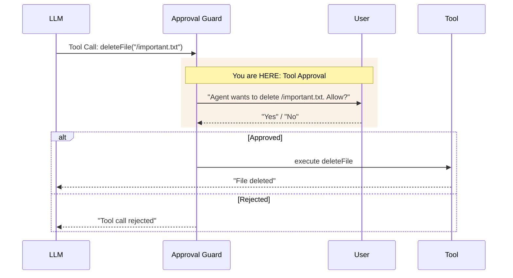

import { Image } from 'astro:assets';
import combineDiagram from '../../../../assets/diagrams/l3-c5-combine.svg';

## THINK

Would you let an agent delete files, send emails, or modify data in a database without asking first?

## OVERVIEW



Between tool call and tool execution sits an **approval guard**. When a tool is marked as critical, the guard asks the user for permission before the tool is executed. This is human-in-the-loop — the human retains control over dangerous actions.

## WHY

**Without approval:** The agent executes everything the LLM decides. Delete files, send emails, overwrite data — without asking. A mistake in the prompt or a hallucination can cause irreversible damage.

**With approval:** Critical operations are only executed after human approval. You define which tools are safe (execute automatically) and which are dangerous (ask first). The agent stays useful but controllable.

## WALKTHROUGH

### Layer 1: Static approval with `needsApproval: true`

The simplest form: Every call to this tool requires approval:

```typescript
import { tool } from 'ai';
import { z } from 'zod';

const deleteFileTool = tool({
  description: 'Delete a file from the filesystem',
  inputSchema: z.object({
    path: z.string().describe('The file path to delete'),
  }),
  needsApproval: true,                                   // ← Always requires approval
  execute: async ({ path }) => {
    // In production: fs.unlink(path)
    return { deleted: path, status: 'success' };
  },
});
```

When `needsApproval: true` is set, `execute` is NOT called automatically. Instead, the caller (your code) must grant approval before execution takes place.

### Layer 2: Dynamic approval

Sometimes the approval logic should depend on context — e.g. only for certain paths or above a certain amount:

```typescript
const deleteFileTool = tool({
  description: 'Delete a file from the filesystem',
  inputSchema: z.object({
    path: z.string().describe('The file path to delete'),
  }),
  needsApproval: async ({ path }) => {                   // ← Async function
    // Only require approval for critical directories
    return path.startsWith('/important/') || path.startsWith('/config/');
  },
  execute: async ({ path }) => {
    return { deleted: path, status: 'success' };
  },
});
```

The `needsApproval` function receives the same parameters as `execute`. It returns `true` when approval is needed, and `false` when the tool can be executed directly.

### Layer 3: Approval flow with generateText

With `generateText`, the approval flow is controlled via the `toolCallApproval` option:

```typescript
import { generateText, tool, stepCountIs } from 'ai';
import { anthropic } from '@ai-sdk/anthropic';
import { z } from 'zod';
import * as readline from 'readline';                    // ← Node.js built-in, no installation needed

const readFileTool = tool({
  description: 'Read a file from the filesystem',
  inputSchema: z.object({
    path: z.string().describe('The file path to read'),
  }),
  execute: async ({ path }) => ({
    content: `Content of ${path}: Lorem ipsum...`,
  }),
});

const deleteFileTool = tool({
  description: 'Delete a file from the filesystem',
  inputSchema: z.object({
    path: z.string().describe('The file path to delete'),
  }),
  needsApproval: true,
  execute: async ({ path }) => ({
    deleted: path, status: 'success',
  }),
});

// Helper function: Ask user in the terminal
function askUser(question: string): Promise<boolean> {
  const rl = readline.createInterface({
    input: process.stdin,
    output: process.stdout,
  });
  return new Promise((resolve) => {
    rl.question(question, (answer) => {
      rl.close();
      resolve(answer.toLowerCase() === 'y' || answer.toLowerCase() === 'yes');
    });
  });
}

const result = await generateText({
  model: anthropic('claude-sonnet-4-5-20250514'),
  tools: { readFile: readFileTool, deleteFile: deleteFileTool },
  stopWhen: stepCountIs(5),
  prompt: 'Read the file /tmp/test.txt and delete it afterwards.',
  toolCallApproval: async ({ toolCall }) => {            // ← Approval handler
    const approved = await askUser(
      `Agent wants to execute ${toolCall.toolName}(${JSON.stringify(toolCall.args)}). Allow? (y/n): `
    );
    return approved ? 'approve' : 'reject';              // ← 'approve' or 'reject'
  },
});

console.log(result.text);
```

`toolCallApproval` is only called for tools with `needsApproval`. Tools without `needsApproval` continue to be executed automatically. The function must return `'approve'` or `'reject'`.

### Layer 4: The dangerous/safe tool pattern

A proven pattern: Separate tools into safe and dangerous categories:

```typescript
import { tool } from 'ai';
import { z } from 'zod';

// Safe tools — execute automatically
const searchTool = tool({
  description: 'Search for information (read-only)',
  inputSchema: z.object({
    query: z.string().describe('Search query'),
  }),
  execute: async ({ query }) => ({
    results: [`Result for "${query}"`],
  }),
});

const readFileTool = tool({
  description: 'Read a file (read-only)',
  inputSchema: z.object({
    path: z.string().describe('File path'),
  }),
  execute: async ({ path }) => ({
    content: `Content of ${path}`,
  }),
});

// Dangerous tools — always require approval
const writeFileTool = tool({
  description: 'Write content to a file (destructive)',
  inputSchema: z.object({
    path: z.string().describe('File path'),
    content: z.string().describe('Content to write'),
  }),
  needsApproval: true,
  execute: async ({ path, content }) => ({
    written: path,
    bytes: content.length,
  }),
});

const deleteFileTool = tool({
  description: 'Delete a file (destructive, irreversible)',
  inputSchema: z.object({
    path: z.string().describe('File path'),
  }),
  needsApproval: true,
  execute: async ({ path }) => ({
    deleted: path,
  }),
});

// Use all tools together:
const tools = {
  search: searchTool,         // ← auto
  readFile: readFileTool,     // ← auto
  writeFile: writeFileTool,   // ← needs approval
  deleteFile: deleteFileTool, // ← needs approval
};
```

**Rule of thumb:** Read-only operations are safe. Anything that writes, deletes, or sends needs approval. When in doubt: add approval.

## TRY

**File:** `challenge-3-5.ts`

**Task:** Build a file management toolset with a `readFile` (safe) and a `deleteFile` (with approval). Simulate the approval flow in the terminal.

```typescript
import { generateText, tool, stepCountIs } from 'ai';
import { anthropic } from '@ai-sdk/anthropic';
import { z } from 'zod';
import * as readline from 'readline';

// TODO 1: Define readFileTool (no approval needed)
// - description: Read a file
// - inputSchema: path (string)
// - execute: Returns simulated content

// TODO 2: Define deleteFileTool (with needsApproval: true)
// - description: Delete a file
// - inputSchema: path (string)
// - needsApproval: true
// - execute: Returns deletion confirmation

// TODO 3: Create an askUser() helper function
// - Asks for approval in the terminal
// - Returns true/false

// TODO 4: Use generateText with toolCallApproval
// - tools: { readFile, deleteFile }
// - stopWhen: stepCountIs(5)
// - toolCallApproval: Asks the user for critical tools
// - prompt: 'Read /tmp/notes.txt and delete the file afterwards.'

// TODO 5: Log result.text and all tool calls
```

**Checklist:**
- [ ] `readFileTool` defined without approval
- [ ] `deleteFileTool` defined with `needsApproval: true`
- [ ] `askUser()` helper function implemented
- [ ] `toolCallApproval` handler returns `'approve'` or `'reject'`
- [ ] On "No": Tool is not executed, agent reacts accordingly

<details>
<summary>Show solution</summary>

```typescript
import { generateText, tool, stepCountIs } from 'ai';
import { anthropic } from '@ai-sdk/anthropic';
import { z } from 'zod';
import * as readline from 'readline';

const readFileTool = tool({
  description: 'Read a file from the filesystem (safe, read-only)',
  inputSchema: z.object({
    path: z.string().describe('The file path to read'),
  }),
  execute: async ({ path }) => ({
    path,
    content: `Content of ${path}: These are important notes.`,
    size: 42,
  }),
});

const deleteFileTool = tool({
  description: 'Delete a file from the filesystem (destructive, irreversible)',
  inputSchema: z.object({
    path: z.string().describe('The file path to delete'),
  }),
  needsApproval: true,
  execute: async ({ path }) => ({
    deleted: path,
    status: 'success',
  }),
});

function askUser(question: string): Promise<boolean> {
  const rl = readline.createInterface({
    input: process.stdin,
    output: process.stdout,
  });
  return new Promise((resolve) => {
    rl.question(question, (answer) => {
      rl.close();
      resolve(answer.toLowerCase() === 'y' || answer.toLowerCase() === 'yes');
    });
  });
}

const { text, steps } = await generateText({
  model: anthropic('claude-sonnet-4-5-20250514'),
  tools: { readFile: readFileTool, deleteFile: deleteFileTool },
  stopWhen: stepCountIs(5),
  prompt: 'Read the file /tmp/notes.txt and delete it afterwards.',
  toolCallApproval: async ({ toolCall }) => {
    console.log(`\n--- Approval Request ---`);
    console.log(`Tool: ${toolCall.toolName}`);
    console.log(`Parameters: ${JSON.stringify(toolCall.args)}`);
    const approved = await askUser('Execute? (y/n): ');
    console.log(approved ? 'Approved.' : 'Rejected.');
    return approved ? 'approve' : 'reject';
  },
});

const allToolCalls = steps.flatMap(s => s.toolCalls);
console.log('\n=== Result ===');
console.log(`Steps: ${steps.length}`);
console.log(`Tool Calls: ${allToolCalls.length}`);
for (const call of allToolCalls) {
  console.log(`  - ${call.toolName}(${JSON.stringify(call.args)})`);
}
console.log(`\nAnswer: ${text}`);
```

**Explanation:** The agent first reads `/tmp/notes.txt` (automatically, no approval needed) and then tries to delete the file. On the `deleteFile` call the approval guard kicks in: The user is asked in the terminal. On "y" the file is deleted, on "n" the LLM receives the rejection and reacts accordingly — e.g. with "The file was not deleted because the action was rejected."

**Run:** `npx tsx challenge-3-5.ts`

**Expected output (approximate):**
```
--- Approval Request ---
Tool: deleteFile
Parameters: {"path":"/tmp/notes.txt"}
Execute? (y/n): y
Approved.

=== Result ===
Steps: 2
Tool Calls: 2
  - readFile({"path":"/tmp/notes.txt"})
  - deleteFile({"path":"/tmp/notes.txt"})

Answer: The file /tmp/notes.txt was read and then deleted.
```

</details>

## COMBINE

<Image src={combineDiagram} alt="Prompt starts agent, LLM chooses safe or dangerous tools, dangerous need approval, rejection goes back to LLM" />

**Exercise:** Extend the research agent from Challenge 3.3 with an approval step for saving results.

1. Take the agent from Challenge 3.3 with `searchTool` and `summarizeTool`
2. Add a `saveResultsTool` with `needsApproval: true`
3. Prompt: "Research TypeScript, summarize it, and save the results to /tmp/research.txt."
4. The agent should first research and summarize (automatically), then ask before saving
5. Log whether the user approved or rejected the save

**Optional Stretch Goal:** Implement dynamic approval: `needsApproval` as a function that only requires approval for paths outside of `/tmp/`. Test with different paths.

## Sources

- [Vercel AI SDK: Tool Calling — Human in the Loop](https://ai-sdk.dev/docs/ai-sdk-core/tools-and-tool-calling#human-in-the-loop)
- [Anthropic: Building Effective Agents](https://docs.anthropic.com/en/docs/build-with-claude/agentic-systems)
- [ai-hero-dev Exercise 03.06](https://github.com/ai-hero-dev/ai-sdk-v6-crash-course/tree/main/exercises/03-agents-and-tools/03.06-tool-approval)
