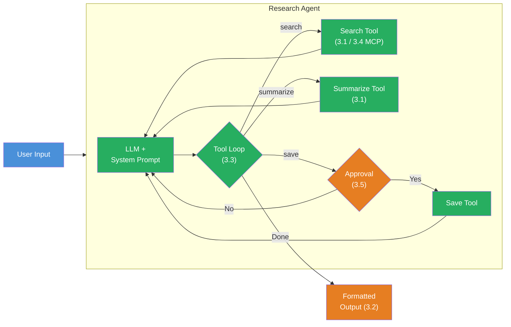

## The Scenario

You're building a **Research Agent** — a terminal program that autonomously researches a topic, summarizes results, and saves them after human approval. The agent combines all five building blocks from Level 3.

Your agent should feel like this:

```
Research: What new features does TypeScript 5.8 have?

[TOOL] search("TypeScript 5.8 features")
  → 3 results found

[TOOL] search("TypeScript 5.8 release notes")
  → 2 results found

[TOOL] summarize(...)
  → Summary created

--- Approval Request ---
Agent wants to execute saveResults("/tmp/research-typescript-5.8.txt").
Allow? (y/n): y
Approved.

[TOOL] saveResults("/tmp/research-typescript-5.8.txt")
  → File saved

=== Result ===
TypeScript 5.8 brings the following new features: ...
(3 steps, 4 tool calls, 847 tokens)
```

This project connects all five building blocks:



## Requirements

1. **Search Tool** (Challenge 3.1 or 3.4) — The agent has a `search` tool that finds information on a topic. You can build it as a local tool with simulated results or connect it as an MCP tool (bonus).

2. **Summarize Tool** (Challenge 3.1) — A `summarize` tool that condenses collected information into key points.

3. **Save Results Tool with Approval** (Challenge 3.5) — A `saveResults` tool with `needsApproval: true` that saves the results to a file. The user must confirm in the terminal.

4. **Agentic Loop** (Challenge 3.3) — The agent uses `stopWhen: stepCountIs(n)` and autonomously decides which tools to call in which order.

5. **Formatted Output** (Challenge 3.2) — Every tool call and tool result is displayed formatted in the terminal. The user sees in real time what the agent is doing.

6. **System Prompt** — The agent has a defined role: "You are a research agent. Research thoroughly, summarize, and save the results."

7. **Agent Trace** — At the end, a summary is displayed: number of steps, all tool calls, token usage.

8. **Interactive Input** — The user enters the research topic in the terminal. "exit" quits the program.

## Starter Code

```typescript
import { generateText, tool, stepCountIs } from 'ai';
import { anthropic } from '@ai-sdk/anthropic';
import { z } from 'zod';
import * as readline from 'readline';

// TODO: Define system prompt

// TODO: Define searchTool (local or MCP)

// TODO: Define summarizeTool

// TODO: Define saveResultsTool (with needsApproval: true)

// TODO: askUser() helper function for terminal approval

// TODO: Main function:
// 1. Read user input (readline)
// 2. generateText with all tools, stopWhen, toolCallApproval
// 3. Output tool events formatted (onStepFinish)
// 4. Display agent trace (steps, tool calls, tokens)
```

## Evaluation Criteria

Your boss fight is passed when:

- [ ] At least 3 tools defined (search, summarize, saveResults)
- [ ] `saveResults` has `needsApproval: true` — user is asked before saving
- [ ] `stopWhen: stepCountIs(n)` limits the steps
- [ ] `toolCallApproval` handler asks for approval in the terminal
- [ ] Agent uses tools autonomously in a sensible order (first search, then summarize, then save)
- [ ] Every tool call is displayed formatted in the terminal (name, parameters, result)
- [ ] At the end: summary with steps, tool calls, and token usage
- [ ] Program runs interactively and responds to user input

## Hints

<details>
<summary>Hint 1: Tool descriptions are crucial</summary>

The `description` of the tools strongly influences the order in which the LLM uses them. Phrase the descriptions so it's clear: `search` is for gathering information, `summarize` is for summarizing collected data, and `saveResults` is for saving at the end. The system prompt can additionally guide the order: "Research first, then summarize, save at the end."

</details>

<details>
<summary>Hint 2: onStepFinish for live output</summary>

Use `onStepFinish` for formatted output during agent execution. In this callback you have access to `stepNumber`, `toolCalls`, `toolResults`, and `usage`. You can write each tool call with its result formatted to the terminal there.

</details>

<details>
<summary>Hint 3: Approval on rejection</summary>

When the user rejects a tool call (return `'reject'`), the LLM receives the information that the tool call was rejected. It can then react — e.g. output the results as text anyway without saving them. Test both paths: approval and rejection.

</details>

## Sources

- [Vercel AI SDK: Tools and Tool Calling](https://ai-sdk.dev/docs/ai-sdk-core/tools-and-tool-calling)
- [Vercel AI SDK: Building Agents](https://ai-sdk.dev/docs/agents/building-agents)
- [Vercel AI SDK: MCP Tools](https://ai-sdk.dev/docs/ai-sdk-core/mcp-tools)
- [ai-hero-dev Exercises 03.01-03.07](https://github.com/ai-hero-dev/ai-sdk-v6-crash-course/tree/main/exercises/03-agents-and-tools)
