## What you've learned

- **Tool Calling:** Define tools with `tool()` — Zod inputSchema, `.describe()` for parameters, `execute` for execution. The LLM autonomously decides when and with which parameters a tool is called.
- **Tools in the Frontend:** Message parts (`text`, `tool-call`, `tool-result`) for transparent UIs. `fullStream` delivers all events for loading states and tool-specific rendering.
- **Tool Loop Agent:** Multi-step agents with `stopWhen: stepCountIs(n)`. The LLM iterates autonomously through the agentic loop — tool call, execute, result, next step — until the task is done.
- **MCP (Model Context Protocol):** Standardized protocol for external tool servers. `createMCPClient` with HTTP or stdio transport, `client.tools()` loads all available tools automatically.
- **Tool Approval:** Human-in-the-loop with `needsApproval`. Static (`true`) or dynamic (async function). `toolCallApproval` handler for controlled execution of critical operations.

## Updated Skill Tree

```mermaid
graph LR
  subgraph "Unlocked"
    L1["Level 1: AI SDK Basics"]
    L2["Level 2: LLM Fundamentals"]
    L3["Level 3: Agents & MCP"]
  end
  subgraph NEXT["Next Level"]
    L4["Level 4: Persistence"]
  end
  subgraph "Locked"
    L5["Level 5: Context Engineering"]
    L6["Level 6: Evals"]
    L7["Level 7: Streaming"]
    L8["Level 8: Workflows"]
    L9["Level 9: Advanced Patterns"]
  end
  L1 --> L2
  L2 --> L3
  L3 --> L4
  L4 -.-> L5
  L5 -.-> L6
  L6 -.-> L7
  L7 -.-> L8
  L8 -.-> L9
  style L1 fill:#27AE60,color:#fff
  style L2 fill:#27AE60,color:#fff
  style L3 fill:#27AE60,color:#fff
  style NEXT fill:none,stroke:#E67E22,stroke-width:3px,color:#E67E22
  style L4 fill:#E67E22,color:#fff
  style L5 fill:#95a5a6,color:#fff
  style L6 fill:#95a5a6,color:#fff
  style L7 fill:#95a5a6,color:#fff
  style L8 fill:#95a5a6,color:#fff
  style L9 fill:#95a5a6,color:#fff
```

## Next Level

**Level 4: Persistence** — Your agent can now act, but it forgets everything after each request. How do you store chat histories, restore conversations, and build persistent agents? You'll learn database integration, message history, and session management.
