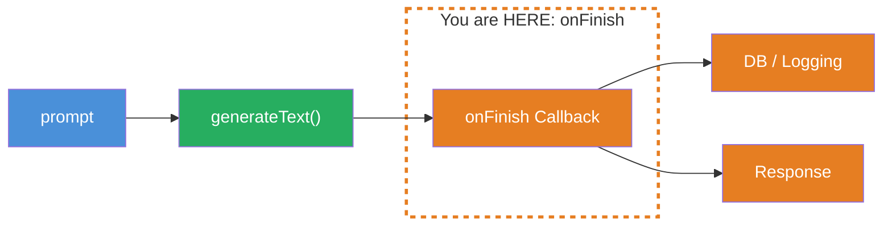
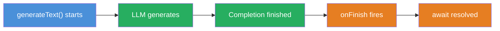
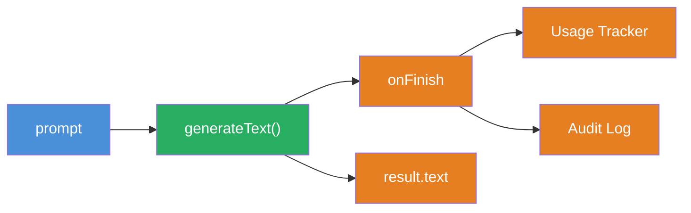

## THINK

How do you save the result of an LLM call — AFTER it finishes, but BEFORE the response goes back to the user?

## OVERVIEW



`generateText` calls an `onFinish` callback after the full completion. In this callback you have access to `text`, `usage`, `finishReason`, and the full `response` — the perfect place to save results, track tokens, or write logs.

## WHY

**Without `onFinish`:** You have to manually save results after the `await`. That works, but if an error occurs between `generateText` and your save code, the data is lost. No automatic logging, no audit trail, no token tracking "out of the box".

**With `onFinish`:** Saving happens automatically, right after the LLM finishes. The callback is guaranteed to be called — no matter what happens afterward in the code. You have a central place for logging, analytics, and persistence.

## WALKTHROUGH

### Layer 1: The onFinish Callback

`onFinish` is an optional parameter of `generateText`. It is called once after the completion is finished:

```typescript
import { generateText } from 'ai';
import { anthropic } from '@ai-sdk/anthropic';

const result = await generateText({
  model: anthropic('claude-sonnet-4-5-20250514'),
  prompt: 'Was ist TypeScript?',
  onFinish({ text, usage, finishReason, response }) {  // ← Called after completion
    console.log('Text:', text.substring(0, 50) + '...');
    console.log('Tokens:', usage.totalTokens);
    console.log('Finish Reason:', finishReason);
  },
});
```

The callback receives an object with the most important properties (see the [generateText API Reference](https://ai-sdk.dev/docs/reference/ai-sdk-core/generate-text) for the full list):

| Property | Type | Description |
|----------|------|-------------|
| `text` | `string` | The generated text |
| `usage` | `{ promptTokens, completionTokens, totalTokens }` | Token usage |
| `finishReason` | `'stop' \| 'length' \| 'tool-calls'` | Why the LLM stopped |
| `response` | `{ messages, headers }` | Full response with all messages |

### Layer 2: When Does onFinish Fire?

The timing is critical:



`onFinish` is called **after** the completion finishes and **before** the `await` resolves. This means: Your save code in the callback runs before the remaining code after `await generateText(...)` executes.

### Layer 3: Typical Use Cases

**Token tracking for cost calculation:**

```typescript
let sessionTokens = 0;

const result = await generateText({
  model: anthropic('claude-sonnet-4-5-20250514'),
  prompt: 'Erklaere Promises.',
  onFinish({ usage }) {
    sessionTokens += usage.totalTokens;                          // ← Session counter
    console.log(`Request: ${usage.totalTokens} Tokens`);
    console.log(`Session gesamt: ${sessionTokens} Tokens`);
  },
});
```

**Logging with timestamp:**

```typescript
const result = await generateText({
  model: anthropic('claude-sonnet-4-5-20250514'),
  prompt: 'Erklaere Promises.',
  onFinish({ text, usage, finishReason }) {
    const logEntry = {
      timestamp: new Date().toISOString(),
      promptTokens: usage.promptTokens,
      completionTokens: usage.completionTokens,
      totalTokens: usage.totalTokens,
      finishReason,
      textLength: text.length,
    };
    console.log('LOG:', JSON.stringify(logEntry));               // ← Structured log
  },
});
```

**Simulated DB save:**

```typescript
// Simulated database (in-memory)
const chatLog: Array<{ role: string; content: string; tokens: number }> = [];

const result = await generateText({
  model: anthropic('claude-sonnet-4-5-20250514'),
  prompt: 'Was ist TypeScript?',
  onFinish({ text, usage }) {
    chatLog.push({                                               // ← Save to "DB"
      role: 'assistant',
      content: text,
      tokens: usage.totalTokens,
    });
    console.log(`Gespeichert. ${chatLog.length} Eintraege in DB.`);
  },
});
```

### Layer 4: onFinish with streamText

`onFinish` also works with `streamText` — it is called after the entire stream is complete:

```typescript
import { streamText } from 'ai';
import { anthropic } from '@ai-sdk/anthropic';

const result = streamText({
  model: anthropic('claude-sonnet-4-5-20250514'),
  prompt: 'Erklaere Promises.',
  onFinish({ text, usage, finishReason }) {                      // ← After stream ends
    console.log(`Stream fertig. ${usage.totalTokens} Tokens.`);
  },
});

for await (const chunk of result.textStream) {
  process.stdout.write(chunk);
}
```

With `streamText`, `onFinish` fires only after the last chunk has been streamed. The complete `text` is then available in the callback.

## TRY

**Task:** Implement a `generateText` call with an `onFinish` callback that logs usage and finish reason and saves the result to a simulated log array.

Create a file `challenge-4-1.ts`:

```typescript
import { generateText } from 'ai';
import { anthropic } from '@ai-sdk/anthropic';

// Simulated log
const auditLog: Array<{
  timestamp: string;
  tokens: number;
  finishReason: string;
  textPreview: string;
}> = [];

// TODO 1: Call generateText with:
//   - model: anthropic('claude-sonnet-4-5-20250514')
//   - prompt: A question of your choice
//   - onFinish: Callback that:
//     a) logs usage.totalTokens
//     b) logs finishReason
//     c) pushes an entry to auditLog (timestamp, tokens, finishReason, textPreview)

// TODO 2: Log result.text (first 100 characters)
// TODO 3: Log the auditLog array
```

**Checklist:**
- [ ] `onFinish` callback implemented
- [ ] `usage.totalTokens` logged
- [ ] `finishReason` logged
- [ ] Entry pushed to `auditLog`
- [ ] `result.text` logged after `await`

**Run with:** `npx tsx challenge-4-1.ts`

<details>
<summary>Show solution</summary>

```typescript
import { generateText } from 'ai';
import { anthropic } from '@ai-sdk/anthropic';

const auditLog: Array<{
  timestamp: string;
  tokens: number;
  finishReason: string;
  textPreview: string;
}> = [];

const result = await generateText({
  model: anthropic('claude-sonnet-4-5-20250514'),
  prompt: 'Erklaere den Unterschied zwischen let und const in JavaScript.',
  onFinish({ text, usage, finishReason }) {
    console.log(`--- onFinish ---`);
    console.log(`Tokens: ${usage.totalTokens}`);
    console.log(`Finish Reason: ${finishReason}`);

    auditLog.push({
      timestamp: new Date().toISOString(),
      tokens: usage.totalTokens,
      finishReason,
      textPreview: text.substring(0, 80) + '...',
    });
  },
});

console.log(`\n--- Result ---`);
console.log(result.text.substring(0, 100) + '...');

console.log(`\n--- Audit Log ---`);
console.log(JSON.stringify(auditLog, null, 2));
```

**Expected output (approximate — LLM responses vary):**

```
--- onFinish ---
Tokens: 285
Finish Reason: stop

--- Result ---
The main difference between let and const lies in reassignment...

--- Audit Log ---
[
  {
    "timestamp": "2026-03-08T14:30:00.000Z",
    "tokens": 285,
    "finishReason": "stop",
    "textPreview": "The main difference between let and const lies in reassignment..."
  }
]
```

**Explanation:** The `onFinish` callback is automatically called after the completion. It logs the token usage and finish reason and saves an audit entry. The `auditLog` is populated after the `await` because `onFinish` runs before the resolve.

</details>

## COMBINE



**Exercise:** Connect `onFinish` with the usage tracking from Level 2. Build a simple cost tracker that calculates and accumulates costs per request in the `onFinish` callback.

1. Create a `totalCost` variable that accumulates across multiple calls
2. In the `onFinish` callback: Calculate the cost per request (`usage.promptTokens * inputRate + usage.completionTokens * outputRate`)
3. Run 2-3 different `generateText` calls
4. Log after each call: Cost of the request + total cost

**Example rates (Claude Sonnet):**
- Input: $3 / 1M Tokens → `0.000003` per token
- Output: $15 / 1M Tokens → `0.000015` per token

**Optional Stretch Goal:** Build a `withCostTracking` wrapper function that accepts `generateText` options and automatically injects an `onFinish` callback for cost tracking.

## Sources

- [Vercel AI SDK: Generating Text — Callbacks](https://ai-sdk.dev/docs/ai-sdk-core/generating-text#callbacks)
- [Vercel AI SDK: generateText API Reference](https://ai-sdk.dev/docs/reference/ai-sdk-core/generate-text)
- [ai-hero-dev Exercise 04.01](https://github.com/ai-hero-dev/ai-sdk-v6-crash-course/tree/main/exercises/04-persistence)
