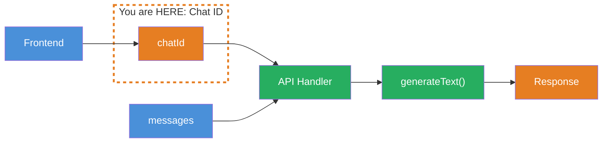
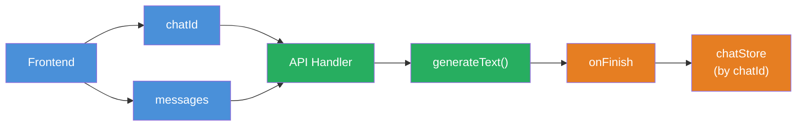

## THINK

How does your backend know which chat a new message belongs to?

## OVERVIEW



Every chat needs a unique ID. The frontend generates it when starting a new chat and sends it along with every request. The backend uses the ID to assign messages, load history, and manage sessions.

## WHY

**Without Chat ID:** Every message is a new, anonymous request for your backend. There is no connection between "Hello" and the follow-up question "What do you mean by that?". You cannot load history, resume a session, or build chat management.

**With Chat ID:** Every message belongs to an identifiable chat. You can load history, append new messages, manage multiple parallel chats, and offer the user a chat history.

## WALKTHROUGH

### Layer 1: Generating a Chat ID

A chat ID is a unique string. The standard: `crypto.randomUUID()` — generates a UUID v4:

```typescript
// In the frontend: New chat ID at start
const chatId = crypto.randomUUID();
// → "a1b2c3d4-e5f6-7890-abcd-ef1234567890"
```

`crypto.randomUUID()` is available in Node.js (from v19) and all modern browsers. The probability of a collision is practically zero (2^122 possible values).

### Layer 2: Sending the Chat ID in the Request

The frontend sends the chat ID together with the messages to the backend:

```typescript
// Frontend: Request to the API
const response = await fetch('/api/chat', {
  method: 'POST',
  headers: { 'Content-Type': 'application/json' },
  body: JSON.stringify({
    chatId,                                                      // ← Send chat ID along
    messages: [
      { role: 'user', content: 'Was ist TypeScript?' },
    ],
  }),
});
```

The chat ID stays the same for the entire conversation. New messages are sent with the same ID. A new chat gets a new ID.

### Layer 3: Reading the Chat ID in the Backend

The backend extracts the chat ID from the request and uses it for assignment:

```typescript
// Backend: API Handler (e.g. Express, Next.js Route Handler)
async function handleChatRequest(req: Request): Promise<Response> {
  const { chatId, messages } = await req.json();                 // ← Read chat ID

  console.log(`Chat ${chatId}: ${messages.length} neue Message(s)`);

  // Messages are now assigned to a chat
  // → Load history, append new messages, save
  return new Response(JSON.stringify({ chatId, status: 'ok' }));
}
```

### Layer 4: Managing Multiple Chats

With chat IDs you can manage multiple parallel chats:

```typescript
// Simulated chat management
const chatSessions = new Map<string, Array<{ role: string; content: string }>>();

function getOrCreateChat(chatId: string) {
  if (!chatSessions.has(chatId)) {
    chatSessions.set(chatId, []);                                // ← New chat
    console.log(`Neuer Chat erstellt: ${chatId}`);
  }
  return chatSessions.get(chatId)!;
}

function addMessage(chatId: string, role: string, content: string) {
  const chat = getOrCreateChat(chatId);
  chat.push({ role, content });                                  // ← Assign message
  console.log(`Chat ${chatId}: ${chat.length} Messages`);
}

// Three different chats
const chat1 = crypto.randomUUID();
const chat2 = crypto.randomUUID();

addMessage(chat1, 'user', 'Was ist TypeScript?');
addMessage(chat2, 'user', 'Erklaere mir React.');
addMessage(chat1, 'user', 'Und worin unterscheidet es sich von JavaScript?');

// chat1 has 2 messages, chat2 has 1 message — cleanly separated
```

## TRY

**Task:** Build a minimal API handler that reads `chatId` and `messages` from a request and logs them grouped by chat ID.

Create a file `challenge-4-2.ts`:

```typescript
// Simulated "database"
const chatStore = new Map<string, Array<{ role: string; content: string }>>();

// TODO 1: Write a function handleChat(chatId: string, messages: Array<{ role: string; content: string }>)
//   - If the chat doesn't exist yet: create a new entry in chatStore
//   - Append messages to the existing chat
//   - Log: Chat ID (truncated to 8 characters), number of new messages, total message count

// TODO 2: Simulate 3 requests:
//   - Chat A: User asks "Was ist TypeScript?"
//   - Chat B: User asks "Erklaere React."
//   - Chat A: User asks "Und was ist der Unterschied zu JavaScript?"

// TODO 3: Log the contents of chatStore — how many chats, how many messages per chat?
```

**Checklist:**
- [ ] `handleChat` function created
- [ ] New chats are created automatically
- [ ] Messages are assigned to the correct chat
- [ ] Chat A has 2 messages, Chat B has 1 message
- [ ] Log shows chat ID and message count

**Run with:** `npx tsx challenge-4-2.ts`

<details>
<summary>Show solution</summary>

```typescript
const chatStore = new Map<string, Array<{ role: string; content: string }>>();

function handleChat(
  chatId: string,
  messages: Array<{ role: string; content: string }>,
) {
  if (!chatStore.has(chatId)) {
    chatStore.set(chatId, []);
    console.log(`Neuer Chat: ${chatId.substring(0, 8)}...`);
  }

  const chat = chatStore.get(chatId)!;
  chat.push(...messages);

  console.log(
    `Chat ${chatId.substring(0, 8)}...: +${messages.length} Message(s), gesamt: ${chat.length}`,
  );
}

// Simulate 3 requests
const chatA = crypto.randomUUID();
const chatB = crypto.randomUUID();

handleChat(chatA, [{ role: 'user', content: 'Was ist TypeScript?' }]);
handleChat(chatB, [{ role: 'user', content: 'Erklaere React.' }]);
handleChat(chatA, [
  { role: 'user', content: 'Und was ist der Unterschied zu JavaScript?' },
]);

// Status
console.log(`\n--- Chat Store ---`);
console.log(`Anzahl Chats: ${chatStore.size}`);
for (const [id, messages] of chatStore) {
  console.log(`Chat ${id.substring(0, 8)}...: ${messages.length} Messages`);
}
```

**Expected output (chat IDs will vary):**

```
Neuer Chat: a1b2c3d4...
Chat a1b2c3d4...: +1 Message(s), gesamt: 1
Neuer Chat: e5f6a7b8...
Chat e5f6a7b8...: +1 Message(s), gesamt: 1
Chat a1b2c3d4...: +1 Message(s), gesamt: 2

--- Chat Store ---
Anzahl Chats: 2
Chat a1b2c3d4...: 2 Messages
Chat e5f6a7b8...: 1 Messages
```

**Explanation:** `crypto.randomUUID()` generates unique IDs. The `Map` stores messages grouped by chat ID. By truncating the ID in the log, the output remains readable. Chat A has two messages, Chat B has one — cleanly separated.

</details>

## COMBINE



**Exercise:** Connect Chat ID with `onFinish` — save the assistant response in the `onFinish` callback, grouped by chat ID.

1. Create a `chatStore` as `Map<string, Array<{ role: string; content: string }>>`
2. Write a `chat` function that takes `chatId` and `userMessage`
3. Save the user message in the store
4. Call `generateText` with the `chatStore` history as `messages`
5. In the `onFinish` callback: Save the assistant response in the store under the same `chatId`
6. Run 2 messages in the same chat and log the history

**Optional Stretch Goal:** Build a `listChats()` function that displays all chat IDs with creation date and message count.

## Sources

- [Vercel AI SDK: Chatbot Persistence](https://ai-sdk.dev/docs/ai-sdk-ui/chatbot-message-persistence)
- [MDN: crypto.randomUUID()](https://developer.mozilla.org/en-US/docs/Web/API/Crypto/randomUUID)
- [ai-hero-dev Exercise 04.02](https://github.com/ai-hero-dev/ai-sdk-v6-crash-course/tree/main/exercises/04-persistence)
