## What You Learned

- **On Finish Callback:** Automatically capture results after completion — `onFinish` provides `text`, `usage`, `finishReason`, and `response` for logging, analytics, and persistence
- **Chat ID:** Uniquely identify sessions with `crypto.randomUUID()` — the frontend sends the ID with every request, the backend assigns messages to the correct chat
- **Persistence:** Save messages to a database and load them on reload — the complete cycle: Load → Generate → Save. Chats survive server restarts and deployments
- **Message Validation:** Validate incoming messages with Zod schemas before processing — `safeParse` for structured error handling, protection against schema drift and injection

## Updated Skill Tree

```mermaid
graph LR
  subgraph "Unlocked"
    L1["Level 1: AI SDK Basics"]
    L2["Level 2: LLM Fundamentals"]
    L3["Level 3: Agents & MCP"]
    L4["Level 4: Persistence"]
  end
  subgraph NEXT["Next Level"]
    L5["Level 5: Context Engineering"]
  end
  subgraph "Locked"
    L6["Level 6: Evals"]
    L7["Level 7: Streaming"]
    L8["Level 8: Workflows"]
    L9["Level 9: Advanced Patterns"]
  end
  L1 --> L2
  L2 --> L3
  L3 --> L4
  L4 --> L5
  L5 -.-> L6
  L6 -.-> L7
  L7 -.-> L8
  L8 -.-> L9
  style L1 fill:#27AE60,color:#fff
  style L2 fill:#27AE60,color:#fff
  style L3 fill:#27AE60,color:#fff
  style L4 fill:#27AE60,color:#fff
  style NEXT fill:none,stroke:#E67E22,stroke-width:3px,color:#E67E22
  style L5 fill:#E67E22,color:#fff
  style L6 fill:#95a5a6,color:#fff
  style L7 fill:#95a5a6,color:#fff
  style L8 fill:#95a5a6,color:#fff
  style L9 fill:#95a5a6,color:#fff
```

## Next Level

**Level 5: Context Engineering** — You now know how to save and load chats. But what exactly do you send to the LLM? Context engineering is the art of giving the LLM the optimal input — from structured prompt templates to few-shot learning to RAG and chain of thought. You'll learn how to turn vague prompts into precise, reproducible results.
