## TL;DR

> Context Engineering is the art of giving an LLM the optimal input. You will learn to structure prompts as reusable templates (XML tags), produce consistent outputs with examples (few-shot), integrate external knowledge (RAG), and make the LLM reason step by step (chain of thought). After this level you can combine all five techniques in a single prompt.

## Skill Tree

```mermaid
graph LR
  subgraph "Unlocked"
    L1["Level 1: AI SDK Basics"]
    L2["Level 2: LLM Fundamentals"]
    L3["Level 3: Agents & MCP"]
    L4["Level 4: Persistence"]
  end
  subgraph "Current Level"
    L5["Level 5: Context Engineering"]
  end
  subgraph "Locked"
    L6["Level 6: Evals"]
    L7["Level 7: Streaming"]
    L8["Level 8: Workflows"]
    L9["Level 9: Advanced Patterns"]
  end
  L1 --> L2
  L2 --> L3
  L3 --> L4
  L4 --> L5
  L5 -.-> L6
  L6 -.-> L7
  L7 -.-> L8
  L8 -.-> L9
  style L5 fill:#E67E22,color:#fff
  style L1 fill:#27AE60,color:#fff
  style L2 fill:#27AE60,color:#fff
  style L3 fill:#27AE60,color:#fff
  style L4 fill:#27AE60,color:#fff
  style L6 fill:#95a5a6,color:#fff
  style L7 fill:#95a5a6,color:#fff
  style L8 fill:#95a5a6,color:#fff
  style L9 fill:#95a5a6,color:#fff
```

## What You Will Learn

- **The Template:** Structure system prompts as reusable, parameterised templates with XML tags
- **Basic Prompting:** Turn vague prompts into clear, structured instructions using the Anthropic Prompt Template
- **Exemplars (Few-Shot Learning):** Show the LLM what you expect with concrete input-output examples
- **Retrieval (RAG):** Dynamically load external knowledge and inject it as context into the prompt
- **Chain of Thought:** Make the LLM reason step by step before it answers

## Why This Matters

> "The hottest new programming skill is not prompting, it's context engineering."
> — Simon Willison

An LLM only knows what you give it. Too little context means hallucinations. Too much context means noise, high costs, and lost focus. Context Engineering is the difference between a chatbot that guesses and an AI system that works reliably.

The concrete problem: Without structured prompts you write a new prompt for every API call via copy-paste. The results are inconsistent, untestable, and hard to maintain. With Context Engineering you build a system that delivers consistent, reproducible results across 20 different calls.

## Prerequisites

- **Level 1: AI SDK Basics** — you must be comfortable with `generateText` and `streamText`
- **Basic understanding of what an LLM is** — you know that an LLM generates text based on input

> **Skip hint:** You already work with structured system prompts, use XML tags, and have experience with few-shot prompting? Then jump straight to the [Boss Fight](/en/level-5-context-engineering/07-boss-fight/) and check whether you can combine all the concepts.

## Challenges

| # | Challenge | Concept |
|---|-----------|---------|
| 5.1 | [The Template](/en/level-5-context-engineering/02-the-template/) | Structure system prompts as reusable templates |
| 5.2 | [Basic Prompting](/en/level-5-context-engineering/03-basic-prompting/) | Turn vague prompts into clear instructions with XML tags |
| 5.3 | [Exemplars](/en/level-5-context-engineering/04-exemplars/) | Few-shot learning with input-output examples |
| 5.4 | [Retrieval (RAG)](/en/level-5-context-engineering/05-retrieval/) | Dynamically load external knowledge into the prompt |
| 5.5 | [Chain of Thought](/en/level-5-context-engineering/06-chain-of-thought/) | Make the LLM reason step by step |

## Boss Fight

Build a **Documentation Assistant**: A system that loads documents from a local source (RAG), works with a structured prompt template, uses exemplars for consistent answers, and employs chain of thought for complex questions. All five building blocks in one system.

## Sources for This Level

- [Anthropic: Prompt Engineering Guide](https://docs.anthropic.com/en/docs/build-with-claude/prompt-engineering)
- [Vercel AI SDK: Prompts](https://ai-sdk.dev/docs/foundations/prompts)
- [ai-hero-dev Exercises 05.01-05.05](https://github.com/ai-hero-dev/ai-sdk-v6-crash-course/tree/main/exercises/05-context-engineering)
