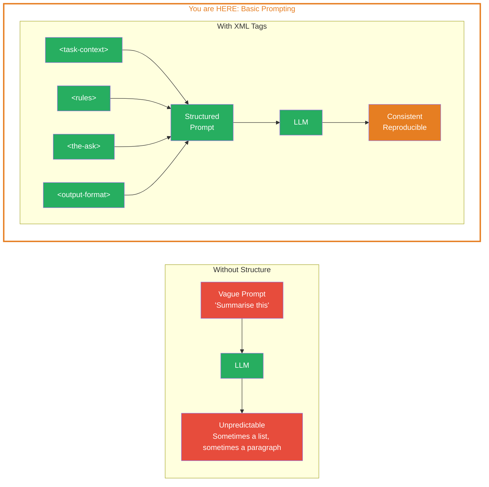
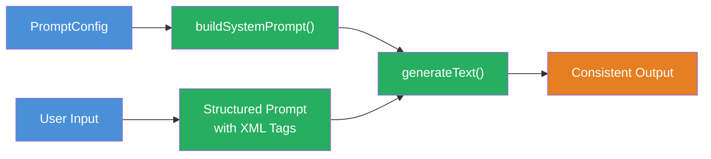

## THINK

What is the difference between "Summarise this" and a prompt with a clear role, context, and format specification?

## OVERVIEW



Left: A vague prompt leads to unpredictable results. Right: A structured prompt with XML tags delivers consistent, reproducible outputs.

## WHY

**Without structure:** A different quality every time. The LLM does not know which format you want, how long the answer should be, or what role it has. Sometimes you get a list of 10 items, sometimes a paragraph, sometimes a question back. No control, no reproducibility.

**With XML tags:** The prompt is divided into clearly separated sections. The LLM knows exactly what its task is, which rules apply, and what the output should look like. The results are reproducible, measurable, and iterable.

## WALKTHROUGH

### Layer 1: The XML Tag Structure

The Anthropic Prompt Template uses XML tags to clearly separate different prompt sections. Each tag has a specific purpose:

```xml
<task-context>
Who is the LLM? What is its task?
Placed at the START — high influence on overall behaviour.
</task-context>

<background-data>
Documents, context, background information.
Placed in the MIDDLE — this is where the data goes.
</background-data>

<rules>
Detailed instructions and constraints.
Placed in the MIDDLE.
</rules>

<the-ask>
The actual question or task.
Placed at the END — high influence on concrete execution.
</the-ask>

<output-format>
How should the answer be formatted?
Placed at the END — controls the output.
</output-format>
```

Why this order? LLMs weigh the beginning and end of a prompt more heavily than the middle. Critical instructions therefore belong at the edges.

### Layer 2: Each Tag Explained with an Example

Let us take a concrete scenario: You want to build a **Chat Title Generator**. Given a conversation, the LLM should produce a short title.

**`<task-context>`** — Defines the role and scope:

```xml
<task-context>
You are a helpful assistant that generates titles for conversations.
</task-context>
```

**`<rules>`** — Defines concrete constraints:

```xml
<rules>
Find the most concise title that captures the essence of the conversation.
Titles should be at most 30 characters.
Titles should be formatted in title case.
Do not provide a period at the end.
</rules>
```

**`<the-ask>`** — The actual task:

```xml
<the-ask>
Generate a title for the conversation.
</the-ask>
```

**`<output-format>`** — Controls the output:

```xml
<output-format>
Return only the title. No additional text, no explanation, no quotes.
</output-format>
```

### Layer 3: Turning a Bad Prompt into a Good One

**Before** — vague prompt without structure:

```typescript
import { streamText } from 'ai';
import { anthropic } from '@ai-sdk/anthropic';

const INPUT = `Do some research on induction hobs and how I can replace
a 100cm wide AGA cooker with an induction range cooker.
Which is the cheapest, which is the best?`;

// Schlecht: Das LLM weiss nicht, was fuer ein Titel, wie lang, welches Format
const result = await streamText({
  model: anthropic('claude-sonnet-4-5-20250514'),
  prompt: `Generate me a title: ${INPUT}`,
});
```

**After** — structured prompt with XML tags:

```typescript
import { streamText } from 'ai';
import { anthropic } from '@ai-sdk/anthropic';

const INPUT = `Do some research on induction hobs and how I can replace
a 100cm wide AGA cooker with an induction range cooker.
Which is the cheapest, which is the best?`;

const result = await streamText({
  model: anthropic('claude-sonnet-4-5-20250514'),
  prompt: `
<task-context>
You are a helpful assistant that generates titles for conversations.
</task-context>

<conversation-history>
${INPUT}
</conversation-history>

<rules>
Find the most concise title that captures the essence of the conversation.
Titles should be at most 30 characters.
Titles should be formatted in title case.
Do not provide a period at the end.
</rules>

<the-ask>
Generate a title for the conversation.
</the-ask>

<output-format>
Return only the title. No additional text, no explanation, no quotes.
</output-format>
  `.trim(),
});

for await (const chunk of result.textStream) {
  process.stdout.write(chunk);
}
```

The difference: The structured prompt has clear sections. The LLM knows it is a title generator (`task-context`), how the title should look (`rules`), what to do (`the-ask`), and what to return (`output-format`). The result is reproducible — the same prompt consistently produces short titles in title case.

## TRY

**Task:** Take the bad prompt below and restructure it with XML tags. Goal: The LLM should summarise an article in exactly 3 sentences.

```typescript
import { generateText } from 'ai';
import { anthropic } from '@ai-sdk/anthropic';

const ARTICLE = `TypeScript 5.8 introduces several improvements to type
inference and control flow analysis. The new release includes support for
granular checks on branches in return expressions, allowing the compiler
to better narrow types. Additionally, the release adds support for
requiring return type annotations via the new --isolatedDeclarations
flag, making it easier to generate declaration files from source code
without type-checking.`;

// TODO: Strukturiere diesen Prompt mit XML Tags
// Der schlechte Prompt:
const result = await generateText({
  model: anthropic('claude-sonnet-4-5-20250514'),
  prompt: `Fasse den Text zusammen: ${ARTICLE}`,
});

// TODO: Ersetze den Prompt oben durch einen strukturierten Prompt mit:
// 1. <task-context> — Definiere die Rolle (z.B. technischer Redakteur)
// 2. <rules> — Definiere Einschraenkungen (genau 3 Saetze, Deutsch, keine Wertung)
// 3. <the-ask> — Was genau soll das LLM tun?
// 4. <output-format> — Nur die Zusammenfassung, kein zusaetzlicher Text

console.log(result.text);
```

**Checklist:**
- [ ] Prompt uses at least 3 XML tags
- [ ] `<task-context>` defines the role
- [ ] `<rules>` defines constraints
- [ ] `<output-format>` defines the expected format

<details>
<summary>Show solution</summary>

```typescript
import { generateText } from 'ai';
import { anthropic } from '@ai-sdk/anthropic';

const ARTICLE = `TypeScript 5.8 introduces several improvements to type
inference and control flow analysis. The new release includes support for
granular checks on branches in return expressions, allowing the compiler
to better narrow types. Additionally, the release adds support for
requiring return type annotations via the new --isolatedDeclarations
flag, making it easier to generate declaration files from source code
without type-checking.`;

const result = await generateText({
  model: anthropic('claude-sonnet-4-5-20250514'),
  prompt: `
<task-context>
Du bist ein technischer Redakteur, der Artikel fuer Entwickler zusammenfasst.
</task-context>

<background-data>
${ARTICLE}
</background-data>

<rules>
- Fasse den Artikel in genau 3 Saetzen zusammen
- Schreibe auf Deutsch
- Bleibe sachlich, keine Wertung
- Verwende die korrekten Fachbegriffe aus dem Original
</rules>

<the-ask>
Fasse den obenstehenden Artikel zusammen.
</the-ask>

<output-format>
Gib nur die Zusammenfassung zurueck. Keine Ueberschrift, keine Einleitung,
keine zusaetzliche Erklaerung.
</output-format>
  `.trim(),
});

console.log(result.text);
```

**Explanation:** The prompt defines a clear role (`technischer Redakteur`), provides the article as `<background-data>`, sets concrete rules (3 sentences, German, factual), and controls the output format. The LLM knows exactly what is expected.

</details>

## COMBINE



**Exercise:** Combine the structured prompt with the template from Challenge 5.1. Build a `buildPrompt` function that unifies both:

1. Use `buildSystemPrompt()` from Challenge 5.1 for the `system` parameter
2. Build a `buildUserPrompt(input: string): string` function that wraps the user input in XML tags (`<background-data>`, `<the-ask>`, `<output-format>`)
3. Call `generateText` with both together

**Optional Stretch Goal:** Make the rules (`<rules>`) configurable — add them as a parameter to the `buildPrompt` function.

## Sources

- [Anthropic: Prompt Engineering Guide](https://docs.anthropic.com/en/docs/build-with-claude/prompt-engineering)
- [ai-hero-dev Exercise 05.02](https://github.com/ai-hero-dev/ai-sdk-v6-crash-course/tree/main/exercises/05-context-engineering/05.02-basic-prompting)
