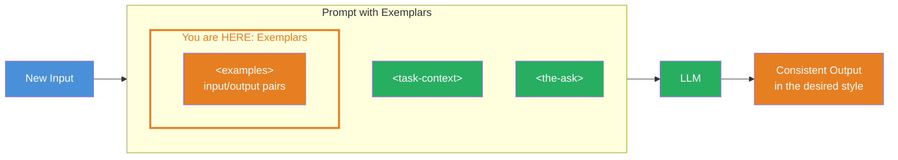
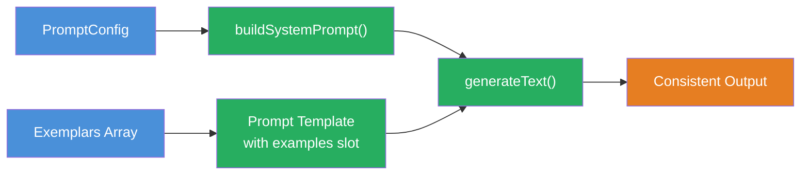

## THINK

How would you explain a specific writing style to a new colleague — with rules or with examples?

## OVERVIEW



The `<examples>` tag is the building block added in this challenge. It contains concrete input-output pairs that the LLM uses as a reference. Together with `<task-context>` and `<the-ask>` from the previous challenges, you get a prompt that delivers consistent results in the desired style.

## WHY

**Without exemplars:** The LLM interprets style and format freely. You write detailed rules ("Titles should be at most 30 characters, in title case, with no period at the end"), but the LLM does not always follow them. Outputs vary.

**With exemplars:** You show the LLM concrete examples: "This is what the result should look like." The LLM recognises the pattern and applies it to new inputs. Fewer rules needed, more consistent results. Show instead of describe.

## WALKTHROUGH

### Layer 1: What Are Exemplars (The Few-Shot Learning Principle)

Few-shot learning means: You give the LLM a few examples (shots) and it learns the pattern from them. Instead of formulating rules, you show the LLM 2-5 concrete input-output pairs.

The principle is simple: If you show a new employee three finished emails, they instantly understand the desired style — without having to read 20 rules. It works the same way with LLMs.

### Layer 2: The examples XML Tag Structure

Anthropic recommends wrapping exemplars in a clear XML structure:

```xml
<examples>
  <example>
    <input>Was ist der Unterschied zwischen TypeScript und JavaScript?</input>
    <output>TypeScript vs JavaScript</output>
  </example>
  <example>
    <input>Ich will anfangen zu investieren, bin aber Anfaenger.</input>
    <output>Beginner Investment Options</output>
  </example>
  <example>
    <input>Wie konfiguriere ich ESLint mit TypeScript?</input>
    <output>ESLint TypeScript Setup</output>
  </example>
</examples>
```

Each `<example>` has an `<input>` (what goes in) and an `<output>` (what should come out). The LLM infers implicitly from the examples:
- The desired length (3-4 words)
- The format (title case)
- The style (no punctuation, no explanation)

### Layer 3: How Many Exemplars Do You Need?

The rule of thumb: **2-5 exemplars are optimal.**

- **1 exemplar:** Sufficient for simple formats, but the LLM might treat it as a one-off case
- **2-3 exemplars:** Good for most cases — the pattern becomes clear
- **4-5 exemplars:** Ideal for complex formats or when edge cases need to be covered
- **More than 5:** Diminishing returns — more tokens, barely better results

Important: The exemplars should **cover different cases**. If all examples are similar, the LLM only learns that one case.

In TypeScript you can build exemplars dynamically into the prompt:

```typescript
const exemplars = [
  {
    input: 'What is the difference between TypeScript and JavaScript?',
    output: 'TypeScript vs JavaScript',
  },
  {
    input: 'I want to start investing but I am a complete beginner.',
    output: 'Beginner Investment Options',
  },
  {
    input: 'How do I configure ESLint with TypeScript in a monorepo?',
    output: 'ESLint TypeScript Setup',
  },
];

// Exemplars dynamisch in XML Tags umwandeln
const exemplarsXml = exemplars
  .map(
    (e) => `  <example>
    <input>${e.input}</input>
    <output>${e.output}</output>
  </example>`
  )
  .join('\n');

const prompt = `
<task-context>
You are a helpful assistant that generates titles for conversations.
</task-context>

<examples>
${exemplarsXml}
</examples>

<conversation-history>
${INPUT}
</conversation-history>

<the-ask>
Generate a title for the conversation.
</the-ask>
`;
```

Note: With good exemplars you can often skip `<rules>` and `<output-format>`. The examples implicitly convey format, length, and style.

## TRY

**Task:** Build a sentiment classifier with exemplars. The LLM should categorise texts into one of three categories: `positiv`, `negativ`, or `neutral`. Use at least 3 exemplars that cover all three cases.

Create **`challenge-5-3.ts`** and run with: **`npx tsx challenge-5-3.ts`**

```typescript
import { generateText } from 'ai';
import { anthropic } from '@ai-sdk/anthropic';

// TODO: Definiere mindestens 3 Exemplars als Array
// Jedes Exemplar braucht einen input (Text) und output (positiv/negativ/neutral)
const exemplars = [
  // TODO: 1 positives Beispiel
  // TODO: 1 negatives Beispiel
  // TODO: 1 neutrales Beispiel
];

const NEW_INPUT = 'Das Produkt ist okay, nichts Besonderes aber auch nicht schlecht.';

// TODO: Baue den Prompt mit <examples> XML Tags
// Nutze .map() um die Exemplars in XML zu verwandeln
// Verwende <task-context>, <examples> und <the-ask>
const result = await generateText({
  model: anthropic('claude-sonnet-4-5-20250514'),
  prompt: '', // TODO: Dein strukturierter Prompt hier
});

console.log(result.text);
```

**Checklist:**
- [ ] At least 3 exemplars
- [ ] Each exemplar has input and output
- [ ] Exemplars cover different cases (positive, negative, neutral)
- [ ] LLM output follows the pattern of the exemplars

<details>
<summary>Show solution</summary>

```typescript
import { generateText } from 'ai';
import { anthropic } from '@ai-sdk/anthropic';

const exemplars = [
  {
    input: 'Das neue Update ist fantastisch! Endlich funktioniert alles schnell und zuverlaessig.',
    output: 'positiv',
  },
  {
    input: 'Der Kundenservice war eine Katastrophe. Drei Stunden Wartezeit und keine Loesung.',
    output: 'negativ',
  },
  {
    input: 'Das Meeting hat um 14 Uhr stattgefunden. Es wurden drei Punkte besprochen.',
    output: 'neutral',
  },
];

const exemplarsXml = exemplars
  .map(
    (e) => `  <example>
    <input>${e.input}</input>
    <output>${e.output}</output>
  </example>`
  )
  .join('\n');

const NEW_INPUT = 'Das Produkt ist okay, nichts Besonderes aber auch nicht schlecht.';

const result = await generateText({
  model: anthropic('claude-sonnet-4-5-20250514'),
  prompt: `
<task-context>
Du bist ein Sentiment Classifier. Du ordnest Texte in genau eine Kategorie ein.
</task-context>

<examples>
${exemplarsXml}
</examples>

<the-ask>
Klassifiziere den folgenden Text: ${NEW_INPUT}
</the-ask>
  `.trim(),
});

console.log(result.text); // Erwartete Ausgabe: "neutral"
```

**Explanation:** The three exemplars cover all three categories. The LLM infers from the examples that the output should be exactly one word (`positiv`, `negativ`, or `neutral`). The text "okay, nichts Besonderes aber auch nicht schlecht" is correctly classified as `neutral` — without us having to define explicit rules for it.

</details>

## COMBINE



**Exercise:** Extend the template from Challenge 5.1 with an `examples` slot. Build a function that accepts exemplars as a parameter and inserts them into the template.

Specifically:
1. Extend the `PromptConfig` interface with an `exemplars` field (array of `input`/`output` pairs)
2. In `buildSystemPrompt()`: Convert the exemplars with `.map()` into `<examples>` XML
3. Insert the `<examples>` block at the right place in the template (after `<task-context>`, before `<rules>`)
4. Test with the Chat Title Generator and compare the result with and without exemplars

**Optional Stretch Goal:** Make the exemplars optional — if none are passed, the `<examples>` block should be omitted.

## Sources

- [Anthropic: Prompting Best Practices (Examples)](https://platform.claude.com/docs/en/build-with-claude/prompt-engineering/claude-prompting-best-practices)
- [ai-hero-dev Exercise 05.03](https://github.com/ai-hero-dev/ai-sdk-v6-crash-course/tree/main/exercises/05-context-engineering/05.03-exemplars)
