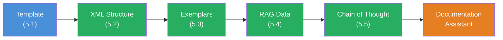

## The Scenario

You are building a **Documentation Assistant** — an AI system that analyses technical documentation and answers developer questions. The assistant must work reliably: source-based answers, consistent format, traceable reasoning process. No hallucinations.

This project combines all five building blocks from Level 5:



## Requirements

1. A `buildDocAssistantPrompt` function that unifies all 5 concepts
2. Documentation as `<background-data>` with source citation (`<url>` and `<content>`)
3. At least 2 exemplars in the `<examples>` section that demonstrate the desired answer format
4. `<thinking-instructions>` that guide the LLM to structured reasoning for complex questions
5. `<rules>` that prevent hallucinations: only use provided data, be honest about knowledge gaps
6. `streamText` for output to the terminal

## Starter Code

```typescript
import { streamText } from 'ai';
import { anthropic } from '@ai-sdk/anthropic';

// Simulierte Dokumentation — in Production: fs.readFileSync oder Vector DB
const documentation = `
# Authentication API

## Setup
Install the auth package: \`npm install @example/auth\`

## Configuration
Create an auth.config.ts file in your project root:

\`\`\`typescript
import { defineConfig } from '@example/auth';

export default defineConfig({
  providers: ['github', 'google'],
  secret: process.env.AUTH_SECRET,
  database: process.env.DATABASE_URL,
});
\`\`\`

## Middleware
Add the auth middleware to your server:

\`\`\`typescript
import { authMiddleware } from '@example/auth';

app.use(authMiddleware());
\`\`\`

## Protected Routes
Use the \`requireAuth\` helper:

\`\`\`typescript
app.get('/dashboard', requireAuth(), (req, res) => {
  res.json({ user: req.user });
});
\`\`\`

## Error Handling
The middleware throws AuthError for invalid tokens.
Catch it in your error handler.
`;

const question = 'How do I protect a route that only admins can access?';

// Deine Aufgabe: Baue den vollstaendigen Documentation Assistant.
// Nutze ALLE 5 Techniken aus Level 5.

// 1. buildDocAssistantPrompt() — wiederverwendbare Template-Funktion
// 2. XML Tags — strukturierter Prompt
// 3. Exemplars — mindestens 2 Beispiele fuer das Antwort-Format
// 4. background-data — die Dokumentation als Kontext
// 5. thinking-instructions — Denkprozess vor der Antwort
// 6. streamText — Ausgabe ins Terminal

const result = await streamText({
  model: anthropic('claude-sonnet-4-5-20250514'),
  prompt: '// Dein Prompt hier',
});

for await (const chunk of result.textStream) {
  process.stdout.write(chunk);
}
```

## Evaluation Criteria

Your Boss Fight is passed when:

- [ ] The prompt is generated by a reusable `buildDocAssistantPrompt` function (Template, 5.1)
- [ ] The prompt uses XML tags in the correct order: `<task-context>` -> `<background-data>` -> `<examples>` -> `<rules>` -> `<the-ask>` -> `<thinking-instructions>` -> `<output-format>` (XML Structure, 5.2)
- [ ] At least 2 exemplars demonstrate the desired answer format with a `<thinking>` block and structured answer (Exemplars, 5.3)
- [ ] The documentation sits in `<background-data>` with `<url>` and `<content>` tags (RAG, 5.4)
- [ ] `<thinking-instructions>` define how the LLM should search the docs and analyse the question (CoT, 5.5)
- [ ] `<rules>` prevent hallucinations: only use doc content, use quotes, be honest about knowledge gaps
- [ ] `<output-format>` clearly defines the answer structure
- [ ] The code runs with `streamText` and produces a meaningful answer

## Hints

<details>
<summary>Hint 1: Structuring the function</summary>

Your `buildDocAssistantPrompt` function needs a config object with at least these fields: `docUrl`, `docContent`, `question`, `exemplars`. The function returns a string containing all XML tags in the correct order. Look at the `buildSystemPrompt` function from Challenge 5.1 — same idea, just with more tags.

</details>

<details>
<summary>Hint 2: Exemplars for the Documentation Assistant</summary>

Your exemplars should show the complete answer format: first a `<thinking>` block with the search process through the docs, then the structured answer with quotes. Show at least one case where the question is answerable and one case where the docs do not have an answer. This way the LLM learns both paths.

</details>

<details>
<summary>Hint 3: The anti-hallucination rule</summary>

The most important rule in `<rules>` is: "If the question cannot be answered from the provided documentation, say so honestly and suggest where the user might find the answer." Without this rule the LLM will try to answer questions that are not covered in the docs — with made-up answers.

</details>

## Sources

- [Anthropic: Prompt Engineering Guide](https://docs.anthropic.com/en/docs/build-with-claude/prompt-engineering)
- [Anthropic: RAG Overview](https://docs.anthropic.com/en/docs/build-with-claude/retrieval-augmented-generation)
- [Vercel AI SDK: Prompts](https://ai-sdk.dev/docs/foundations/prompts)
- [ai-hero-dev Exercises 05.01-05.05](https://github.com/ai-hero-dev/ai-sdk-v6-crash-course/tree/main/exercises/05-context-engineering)
