## What You Learned

> Level 5 complete! You now master the five core building blocks of context engineering — from reusable templates and few-shot learning to RAG and chain of thought. Your Documentation Assistant from the Boss Fight shows you can combine all techniques in a single system.

- **Templates:** Structure system prompts as reusable, testable blueprints with `buildSystemPrompt()`
- **XML Tags:** Structured prompts with clear sections — `<task-context>`, `<rules>`, `<output-format>`, and more
- **Exemplars:** Few-shot learning for consistent outputs — show instead of describe
- **RAG:** Dynamically load external knowledge into the prompt with `<background-data>`, prevent hallucinations
- **Chain of Thought:** Structured reasoning for complex tasks with `<thinking-instructions>`

## Updated Skill Tree

```mermaid
graph LR
  subgraph "Unlocked"
    L1["Level 1: AI SDK Basics"]
    L2["Level 2: LLM Fundamentals"]
    L3["Level 3: Agents & MCP"]
    L4["Level 4: Persistence"]
    L5["Level 5: Context Engineering"]
  end
  subgraph "Next Level"
    L6["Level 6: Evals"]
  end
  subgraph "Locked"
    L7["Level 7: Streaming"]
    L8["Level 8: Workflows"]
    L9["Level 9: Advanced Patterns"]
  end
  L1 --> L2
  L2 --> L3
  L3 --> L4
  L4 --> L5
  L5 --> L6
  L6 -.-> L7
  L7 -.-> L8
  L8 -.-> L9
  style L1 fill:#27AE60,color:#fff
  style L2 fill:#27AE60,color:#fff
  style L3 fill:#27AE60,color:#fff
  style L4 fill:#27AE60,color:#fff
  style L5 fill:#27AE60,color:#fff
  style L6 fill:#E67E22,color:#fff
  style L7 fill:#95a5a6,color:#fff
  style L8 fill:#95a5a6,color:#fff
  style L9 fill:#95a5a6,color:#fff
```

## Next Level

**Level 6: Evals** — How do you measure whether your AI system works well? Automated tests for LLM applications. You will learn to systematically evaluate prompts, detect regressions, and make quality measurable.
