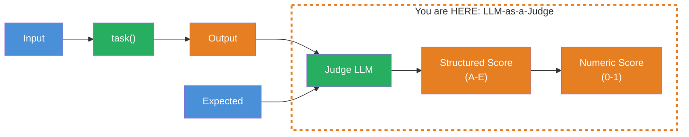
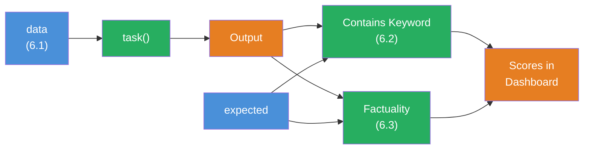

## THINK

How do you evaluate whether a summary is "good" — when there is no single correct answer? "Paris" as the capital of France can be checked with `includes()`. But "Explain Machine Learning" has a thousand valid answers.

## OVERVIEW



The principle: A second LLM (the "Judge") receives the output and the expected value and evaluates how factually correct the answer is. The result is a structured score with a rationale.

## WHY

**Without LLM-as-Judge:** You would have to read and evaluate every open-ended answer yourself. With 50 test cases, that takes hours. And again with every prompt change. Human evaluation doesn't scale.

**With LLM-as-Judge:** You define once WHAT "good" means (a score scale), and the judge LLM evaluates automatically. 50 test cases in seconds instead of hours. Not perfect — but good enough to detect regressions and measure progress.

## WALKTHROUGH

### Layer 1: The Problem with Open-Ended Answers

Consider this test case:

```typescript
{
  input: 'Explain what Machine Learning is.',
  expected: 'Machine Learning is a subfield of AI where algorithms learn from data.',
}
```

A valid answer could be:
- "ML is an area of artificial intelligence that uses statistical methods to recognize patterns in data."
- "Machine Learning enables computers to learn from experience without being explicitly programmed."

Both are correct, but neither matches the `expected` value exactly. `Levenshtein` would give low scores. An LLM can evaluate: "Factually equivalent, just phrased differently."

### Layer 2: The Score Scale

The Factuality scorer uses a 5-level scale:

| Grade | Meaning | Score | Description |
|-------|---------|-------|-------------|
| **A** | Subset | 0.4 | Answer is a subset of the expert opinion — correct, but incomplete |
| **B** | Superset | 0.6 | Answer contains everything from the expert opinion plus more — correct and more detailed |
| **C** | Identical | 1.0 | Answer and expert opinion are factually identical |
| **D** | Conflict | 0.0 | Answer contradicts the expert opinion — factually wrong |
| **E** | Irrelevant Diff | 1.0 | Answers differ, but the differences don't matter from the perspective of factuality |

The scale allows gradations: An incomplete answer (A: 0.4) is better than a wrong one (D: 0.0), but worse than a perfect one (C: 1.0).

### Layer 3: The Factuality Scorer — Step by Step

We use `gpt-4o` as the judge model — it's particularly well-suited for nuanced content evaluations. The scorer uses `generateObject` from the AI SDK to get a structured evaluation from the judge LLM:

```typescript
import { createScorer } from 'evalite';
import { generateObject } from 'ai';
import { openai } from '@ai-sdk/openai';
import { z } from 'zod';

const Factuality = createScorer<string, string, string>({
  name: 'Factuality',
  description: 'Evaluates factual correctness of the answer compared to the expert answer.',
  scorer: async ({ input, expected, output }) => {
    // 1. The judge LLM receives input, expected, and output
    const { object } = await generateObject({
      model: openai('gpt-4o'),
      prompt: `You are comparing a submitted answer to an expert answer on a given question.

[BEGIN DATA]
[Question]: ${input}
[Expert]: ${expected}
[Submission]: ${output}
[END DATA]

Compare the factual content of the submitted answer with the expert answer.
Ignore differences in style, grammar, or punctuation.
Select one:
(A) The submission is a subset of the expert answer and is fully consistent with it.
(B) The submission is a superset of the expert answer and is fully consistent with it.
(C) The submission contains all the same details as the expert answer.
(D) There is a disagreement between the submission and the expert answer.
(E) The answers differ, but these differences don't matter from the perspective of factuality.`,
      schema: z.object({
        answer: z.enum(['A', 'B', 'C', 'D', 'E']),  // <- Structured answer
        rationale: z.string(),                         // <- Rationale
      }),
    });

    // 2. Convert grade to numeric score
    const scores: Record<string, number> = {
      A: 0.4,  // Subset — correct, but incomplete
      B: 0.6,  // Superset — correct and more detailed
      C: 1.0,  // Identical — perfect
      D: 0.0,  // Conflict — wrong
      E: 1.0,  // Irrelevant diff — differences don't matter
    };

    // 3. Return score + metadata
    return {
      score: scores[object.answer],
      metadata: {
        rationale: object.rationale,  // <- Traceability!
        grade: object.answer,
      },
    };
  },
});
```

**Three critical points:**
1. `generateObject` with a Zod schema enforces a structured answer — no free-text parsing needed
2. The `rationale` gives you traceability — you can see WHY the judge evaluated the way it did
3. The score mapping (A->0.4, B->0.6, etc.) translates the qualitative evaluation into a numeric value

### Layer 4: Using the Factuality Scorer

```typescript
import { evalite } from 'evalite';
import { traceAISDKModel } from 'evalite/ai-sdk';
import { generateText } from 'ai';
import { openai } from '@ai-sdk/openai';

evalite('Knowledge Check', {
  data: async () => [
    {
      input: 'What is TypeScript?',
      expected: 'TypeScript is a typed superset of JavaScript that compiles to plain JavaScript.',
    },
    {
      input: 'What is the difference between let and const?',
      expected: 'let allows reassignment, const does not. Both are block-scoped.',
    },
  ],
  task: async (input) => {
    const result = await generateText({
      model: traceAISDKModel(openai('gpt-4o-mini')),
      system: 'Answer technical questions concisely in one sentence.',
      prompt: input,
    });
    return result.text;
  },
  scorers: [Factuality],
});
```

In the dashboard you'll now see the Factuality score AND the judge's rationale per test case. When a score is low, you read the rationale and understand what went wrong.

### Layer 5: Costs and Trade-offs

LLM-as-Judge is powerful, but not free:

| Aspect | Deterministic | LLM-as-Judge |
|--------|--------------|--------------|
| **Speed** | Microseconds | Seconds |
| **Cost** | 0 | Tokens per evaluation |
| **Reproducibility** | 100% identical | ~95% consistent |
| **Flexibility** | Only exact checks | Open-ended evaluations |

**Rule of thumb:** If you can write the evaluation as an `if` statement, use a deterministic scorer. If not, use LLM-as-Judge.

## TRY

**Task:** Build a Factuality scorer and test it with correct and incorrect answers.

Create the file `factuality.eval.ts` and run it with `pnpm eval:dev`. This scorer requires an OPENAI_API_KEY (see Briefing).

```typescript
// factuality.eval.ts

import { evalite } from 'evalite';
import { createScorer } from 'evalite';
import { generateObject } from 'ai';
import { openai } from '@ai-sdk/openai';
import { z } from 'zod';

// TODO 1: Implement the Factuality scorer with createScorer
//   - Use generateObject with the prompt from the walkthrough
//   - Schema: { answer: z.enum(['A','B','C','D','E']), rationale: z.string() }
//   - Map the grades to scores: A->0.4, B->0.6, C->1.0, D->0.0, E->1.0
//   - Return { score, metadata: { rationale, grade } }

// TODO 2: Create an evalite() with the name 'Factuality Test'
//   - data: 3 test cases — one correct, one partially correct,
//     one wrong answer (as a simulated task)
//   - scorers: [Factuality]

// TODO 3: Check the judge's rationale in the dashboard
//   - Does the rationale make sense? Is it comprehensible?
```

**Checklist:**
- [ ] Factuality scorer implemented with `createScorer`
- [ ] `generateObject` with Zod schema for structured evaluation
- [ ] Score mapping (A-E -> 0-1) implemented
- [ ] `metadata` with `rationale` returned
- [ ] At least 3 test cases with different quality levels

<details>
<summary>Show solution</summary>

```typescript
// factuality.eval.ts

import { evalite } from 'evalite';
import { createScorer } from 'evalite';
import { generateObject } from 'ai';
import { openai } from '@ai-sdk/openai';
import { z } from 'zod';

const Factuality = createScorer<string, string, string>({
  name: 'Factuality',
  description: 'Evaluates factual correctness with LLM-as-Judge.',
  scorer: async ({ input, expected, output }) => {
    const { object } = await generateObject({
      model: openai('gpt-4o'),
      prompt: `You are comparing a submitted answer to an expert answer on a given question.

[BEGIN DATA]
[Question]: ${input}
[Expert]: ${expected}
[Submission]: ${output}
[END DATA]

Compare the factual content of the submitted answer with the expert answer.
Ignore differences in style, grammar, or punctuation.
Select one:
(A) The submission is a subset of the expert answer and is fully consistent with it.
(B) The submission is a superset of the expert answer and is fully consistent with it.
(C) The submission contains all the same details as the expert answer.
(D) There is a disagreement between the submission and the expert answer.
(E) The answers differ, but these differences don't matter from the perspective of factuality.`,
      schema: z.object({
        answer: z.enum(['A', 'B', 'C', 'D', 'E']),
        rationale: z.string(),
      }),
    });

    const scores: Record<string, number> = { A: 0.4, B: 0.6, C: 1.0, D: 0.0, E: 1.0 };
    return {
      score: scores[object.answer],
      metadata: { rationale: object.rationale, grade: object.answer },
    };
  },
});

evalite('Factuality Test', {
  data: async () => [
    {
      input: 'What is the capital of France?',
      expected: 'Paris is the capital of France.',
    },
    {
      input: 'What is TypeScript?',
      expected: 'TypeScript is a typed superset of JavaScript that compiles to plain JavaScript.',
    },
    {
      input: 'What is the speed of light?',
      expected: 'The speed of light is approximately 300,000 km/s.',
    },
  ],
  task: async (input) => {
    // Simulated answers with different quality levels
    const answers: Record<string, string> = {
      'What is the capital of France?': 'The capital of France is Paris.',         // <- Correct (C)
      'What is TypeScript?': 'TypeScript adds types to JavaScript.',               // <- Partial (A)
      'What is the speed of light?': 'The speed of light is 500,000 km/s.',       // <- Wrong (D)
    };
    return answers[input] ?? 'I do not know.';
  },
  scorers: [Factuality],
});
```

**Explanation:** The three test cases cover different quality levels:
- "The capital of France is Paris." -> Grade C (1.0) — factually identical
- "TypeScript adds types to JavaScript." -> Grade A (0.4) — correct, but incomplete (missing "compiles to plain JavaScript")
- "The speed of light is 500,000 km/s." -> Grade D (0.0) — factually wrong

In the dashboard you'll see the rationale explaining why the judge decided the way it did.

</details>

## COMBINE



**Exercise:** Combine a deterministic scorer (Challenge 6.2) with the Factuality scorer (Challenge 6.3) in one eval. Test with a real LLM call.

1. Create an eval with 5 knowledge questions (e.g., programming concepts)
2. Use `generateText` with `traceAISDKModel` as the `task`
3. Scorers: `containsKeyword` (from 6.2) AND `Factuality` (from 6.3)
4. Compare in the dashboard: Where do both scorers agree? Where don't they?

**Food for thought:** Are there cases where `containsKeyword` gives a 1, but `Factuality` gives a 0? And vice versa?

## Sources

- [Evalite: Custom Scorers](https://github.com/mattpocock/evalite)
- [Braintrust: Autoevals](https://github.com/braintrustdata/autoevals)
- [ai-hero-dev Exercise 06.03](https://github.com/ai-hero-dev/ai-sdk-v6-crash-course/tree/main/exercises/06-evals/06.03-llm-as-a-judge)
