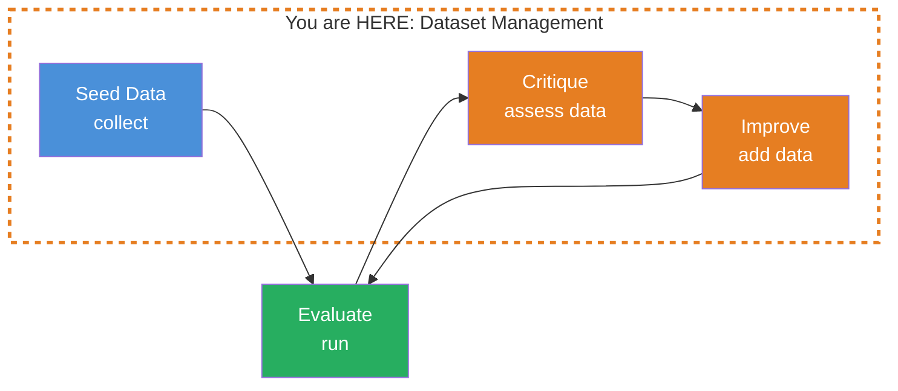
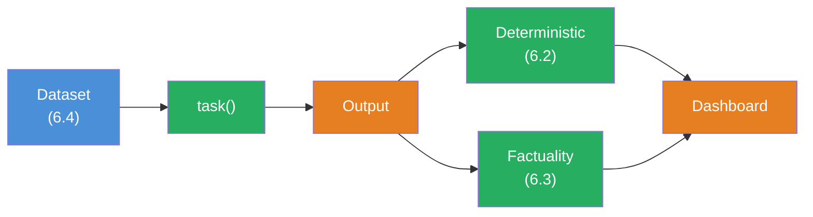

## THINK

How many test cases do you need — and how do you know if they're good enough? 3 examples that all look similar only test the normal case. What happens with edge cases, unexpected inputs, or empty entries?

## OVERVIEW



Dataset management is a cycle: You collect seed data, run evals, assess the quality of your test data, add missing cases, and evaluate again. The data gets better with each iteration.

## WHY

**Without good datasets:** Your evals measure the wrong thing. 5 test cases that all come from the same category give you false confidence. The score says 0.95 — but on an edge case the LLM hallucinates. You don't notice because the edge case isn't in the dataset.

**With good datasets:** 20-50 diverse test cases cover normal cases, edge cases, and boundary cases. When the score says 0.85, you know it's representative. You spot weaknesses early and can improve in a targeted way.

## WALKTHROUGH

### Layer 1: Dataset as an async Function

In Evalite you can define `data` as an async function. This allows dynamic loading — from files, APIs, or databases:

```typescript
import { evalite } from 'evalite';

evalite('Chat Titles', {
  data: async () => {
    // Can load from a JSON file, query an API, etc.
    return [
      {
        input: 'Hey, I need help with TypeScript Generics.',
        expected: 'TypeScript Generics',
      },
      {
        input: 'How do I configure ESLint for a React project?',
        expected: 'ESLint React Setup',
      },
    ];
  },
  task: async (input) => { /* ... */ return ''; },
  scorers: [],
});
```

The async function is called on every eval run. This lets you load test data from external sources without hardcoding it.

### Layer 2: Dataset Size and Diversity

How many test cases do you need? The rule of thumb:

| Phase | Count | Purpose |
|-------|-------|---------|
| **Prototype** | 5-10 | Quick feedback, check basic functionality |
| **Development** | 20-50 | Representative coverage, include edge cases |
| **Production** | 50-200+ | Statistically significant, all categories covered |

More important than the count is **diversity**. 50 similar test cases are worth less than 20 diverse ones:

```typescript
data: async () => [
  // Normal cases
  { input: 'Explain React Hooks.', expected: 'React Hooks' },
  { input: 'How does async/await work?', expected: 'Async/Await in JavaScript' },

  // Short inputs
  { input: 'TypeScript?', expected: 'TypeScript' },
  { input: 'help', expected: 'General Help' },

  // Long inputs
  { input: 'I have a problem with my Next.js project. When I try to create an API route, I get a 500 error. The server starts, but the route doesn\'t respond. I\'m using the App Router architecture.', expected: 'Next.js API Route Error' },

  // Ambiguous inputs
  { input: 'That doesn\'t work', expected: 'Troubleshooting' },
  { input: 'Can you do that again?', expected: 'Repetition' },

  // Special characters and formatting
  { input: 'What is O(n log n)?', expected: 'Algorithm Complexity' },
  { input: 'Difference: map() vs forEach()?', expected: 'Array Methods Comparison' },

  // Empty or trivial inputs
  { input: '', expected: 'Empty Input' },
  { input: '   ', expected: 'Empty Input' },
],
```

### Layer 3: Systematically Covering Categories

Define categories for your dataset and make sure each one is covered:

```typescript
// Dataset categories for a chat title generator
const categories = {
  technical: [
    { input: 'How does Git Rebase work?', expected: 'Git Rebase' },
    { input: 'What is a Docker Container?', expected: 'Docker Container' },
  ],
  conversational: [
    { input: 'Hey, I need help!', expected: 'Help Request' },
    { input: 'Thanks, that helped.', expected: 'Feedback' },
  ],
  edgeCases: [
    { input: '', expected: 'Empty Input' },
    { input: 'a', expected: 'Single Character' },
    { input: '🚀🔥💡', expected: 'Emoji Input' },
  ],
  multilingual: [
    { input: 'Comment faire du cafe?', expected: 'Coffee Question (FR)' },
    { input: 'What is the meaning of life?', expected: 'Meaning Question (EN)' },
  ],
};

evalite('Chat Titles', {
  data: async () => [
    ...categories.technical,
    ...categories.conversational,
    ...categories.edgeCases,
    ...categories.multilingual,
  ],
  task: async (input) => { /* ... */ return ''; },
  scorers: [],
});
```

### Layer 4: Dataset Critiquing

An advanced technique: Let an LLM evaluate the quality of your test data. "Are my test cases representative enough? What cases are missing?"

```typescript
import { generateObject } from 'ai';
import { openai } from '@ai-sdk/openai';
import { z } from 'zod';

async function critiqueDataset(
  dataset: Array<{ input: string; expected: string }>
) {
  const { object } = await generateObject({
    model: openai('gpt-4o'),
    prompt: `You are a QA expert reviewing a test dataset for a chat title generator.
The system takes a user message as input and generates a short title.

Here is the current dataset:
${JSON.stringify(dataset, null, 2)}

Analyze the dataset for:
1. Coverage: Are important categories missing?
2. Edge cases: Are boundary conditions tested?
3. Diversity: Are the inputs diverse enough?
4. Quality: Are the expected values reasonable?

Suggest specific test cases that should be added.`,
    schema: z.object({
      overallAssessment: z.string(),
      missingCategories: z.array(z.string()),
      suggestedTestCases: z.array(z.object({
        input: z.string(),
        expected: z.string(),
        reason: z.string(),
      })),
      qualityScore: z.number().min(0).max(1),
    }),
  });

  return object;
}
```

The result tells you which categories are missing and suggests specific test cases. You review the suggestions, adopt the useful ones, and run the evals again.

### Layer 5: Versioning Your Dataset

Your dataset changes over time. Version it like code:

```typescript
// datasets/chat-titles-v1.ts
export const chatTitleDataset = [
  { input: 'Explain React Hooks.', expected: 'React Hooks' },
  // ...
];

// Version information
export const datasetMeta = {
  version: '1.0',
  lastUpdated: '2026-03-08',
  totalCases: 25,
  categories: ['technical', 'conversational', 'edgeCases'],
};
```

```typescript
// chat-titles.eval.ts
import { evalite } from 'evalite';
import { chatTitleDataset } from './datasets/chat-titles-v1';

evalite('Chat Titles', {
  data: async () => chatTitleDataset,
  task: async (input) => { /* ... */ return ''; },
  scorers: [],
});
```

This way you can compare later: Did the score change with dataset v2?

## TRY

**Task:** Create a dataset for a chat title generator with at least 15 test cases from different categories.

```typescript
// chat-title-dataset.eval.ts

import { evalite } from 'evalite';
import { Levenshtein } from 'autoevals';

// TODO 1: Create a dataset with at least 15 test cases
//   Categories:
//   - Technical (at least 4 cases)
//   - Conversational (at least 3 cases)
//   - Edge Cases (at least 3 cases): empty strings, special characters, very long inputs
//   - Multilingual (at least 2 cases)
//   - Ambiguous (at least 3 cases)

// TODO 2: Define an evalite() with:
//   - data: Your dataset
//   - task: Simulated title generation (e.g., the first 5 words of the input)
//   - scorers: [Levenshtein]

// TODO 3: Think about: What categories are still missing?
//   What edge cases haven't you covered?
```

**Checklist:**
- [ ] At least 15 test cases
- [ ] At least 4 different categories
- [ ] Edge cases included (empty input, special characters, long input)
- [ ] Expected values are realistic titles (short, descriptive)
- [ ] No duplicate or nearly identical test cases

<details>
<summary>Show solution</summary>

```typescript
// chat-title-dataset.eval.ts

import { evalite } from 'evalite';
import { Levenshtein } from 'autoevals';

const chatTitleDataset = [
  // Technical (5)
  { input: 'How does Git Rebase work?', expected: 'Git Rebase' },
  { input: 'Explain React useEffect with cleanup.', expected: 'React useEffect Cleanup' },
  { input: 'What is the difference between REST and GraphQL?', expected: 'REST vs GraphQL' },
  { input: 'Help with TypeScript Generics and multiple constraints.', expected: 'TypeScript Generics' },
  { input: 'Docker container won\'t start — port already in use.', expected: 'Docker Port Conflict' },

  // Conversational (3)
  { input: 'Hey, can you help me?', expected: 'Help Request' },
  { input: 'Thanks, that worked great!', expected: 'Positive Feedback' },
  { input: 'I don\'t understand, can you explain it again?', expected: 'Repeat Explanation' },

  // Edge Cases (4)
  { input: '', expected: 'Empty Message' },
  { input: '???', expected: 'Unclear Request' },
  { input: 'a', expected: 'Minimal Input' },
  { input: 'I have a really complicated problem with my Next.js project that uses the App Router and the API routes aren\'t working because the server returns a 500 error when I try to send a POST request with a JSON body that contains nested objects and TypeScript throws errors.', expected: 'Next.js API Route Error' },

  // Multilingual (2)
  { input: 'How do I deploy to Vercel?', expected: 'Vercel Deployment' },
  { input: 'Comment configurer ESLint?', expected: 'ESLint Configuration' },

  // Ambiguous (3)
  { input: 'That doesn\'t work.', expected: 'Troubleshooting' },
  { input: 'Do that again.', expected: 'Repetition' },
  { input: 'Continue.', expected: 'Continuation' },
];

evalite('Chat Titles', {
  data: async () => chatTitleDataset,
  task: async (input) => {
    // Simulated title generation: first 5 words or fallback
    if (!input.trim()) return 'Empty Message';
    const words = input.split(' ').slice(0, 5).join(' ');
    return words.length > 50 ? words.slice(0, 50) : words;
  },
  scorers: [Levenshtein],
});
```

**Explanation:** The Levenshtein scores will be low because the simulated `task` only takes the first 5 words — not the ideal title. That's the point: With the dataset you can see WHERE the task fails and iteratively improve. Missing categories could include: code snippets as input, URLs, questions in non-Latin scripts.

</details>

## COMBINE



**Exercise:** Use your chat title dataset (6.4) with the scorers from Challenge 6.2 and 6.3.

1. Take your dataset from the TRY exercise
2. Fill the `task` with a real LLM call (system prompt: "Generate a short, descriptive title for this chat message. Max 50 characters. Only the title, nothing else.")
3. Scorer 1: `containsKeyword` (from 6.2) — does the title contain a keyword?
4. Scorer 2: `Factuality` (from 6.3) — is the title factually appropriate?
5. Check: For which categories does the `task` fail?

**Optional Stretch Goal:** Run `critiqueDataset` from Layer 4 on your dataset. Adopt 3 of the suggested test cases and compare the scores before/after.

## Sources

- [Evalite: Data](https://github.com/mattpocock/evalite)
- [ai-hero-dev Exercise 06.04](https://github.com/ai-hero-dev/ai-sdk-v6-crash-course/tree/main/exercises/06-evals/06.04-dataset-management)
- [ai-hero-dev Exercise 06.06](https://github.com/ai-hero-dev/ai-sdk-v6-crash-course/tree/main/exercises/06-evals/06.06-critiquing-datasets)
