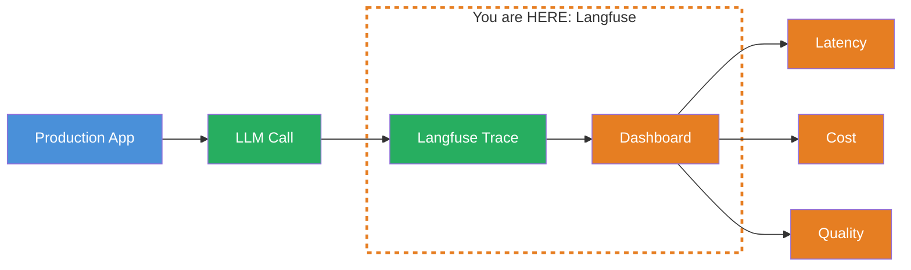
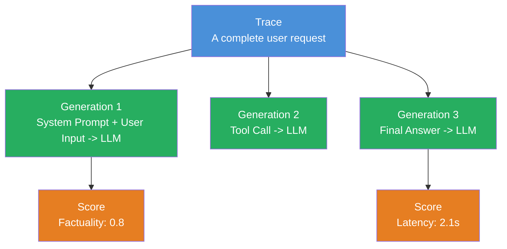
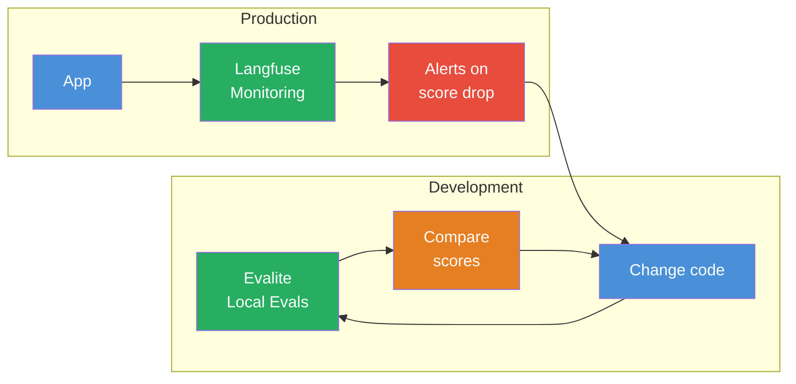
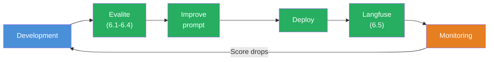

## THINK

Your evals run locally — but what happens with LLM calls in production? How do you notice that your system is getting slower, costs are exploding, or quality is dropping — before a user complains?

## OVERVIEW



Langfuse is an open-source observability tool for LLM applications. It captures every LLM call in production and shows you latency, token costs, and quality in a dashboard. Like Datadog or Sentry — but specifically for LLMs.

## WHY

**Without observability:** Your LLM system is running in production. A user reports: "The answers are bad." You look at the logs — nothing. You don't know which prompt was sent, how the LLM responded, or how much it cost. You're flying blind.

**With observability:** You open the Langfuse dashboard and see: Trace #4721, prompt "Explain X", response "...", latency 3.2s, cost $0.003, score 0.4. You immediately see where the problem is — and can reproduce it in an eval.

## WALKTHROUGH

### Layer 1: Langfuse Core Concepts

Langfuse organizes data in three levels:



| Concept | What | Example |
|---------|------|---------|
| **Trace** | A complete request lifecycle | User asks "What is TypeScript?" -> Answer |
| **Generation** | A single LLM call within a trace | `generateText({ prompt: '...' })` |
| **Score** | An evaluation of a trace or generation | Factuality: 0.8, Latency: 2.1s |
| **Span** | An arbitrary code section (non-LLM) | Database query, retrieval step |

A trace can contain multiple generations — for example with an agent that makes multiple tool calls (Level 3).

### Layer 2: What Langfuse Captures

Per generation, Langfuse stores:

```typescript
// This is what Langfuse automatically captures for every LLM call:
{
  // Input
  model: 'gpt-4o',
  input: {
    system: 'You are a helpful assistant.',
    messages: [{ role: 'user', content: 'What is TypeScript?' }],
  },

  // Output
  output: 'TypeScript is a typed extension of JavaScript...',

  // Metrics
  usage: {
    promptTokens: 42,
    completionTokens: 128,
    totalTokens: 170,
  },
  latency: 1842,       // ms
  cost: 0.00085,        // USD (calculated from token prices)

  // Metadata
  traceId: 'trace_abc123',
  timestamp: '2026-03-08T14:30:00Z',
}
```

### Layer 3: Integration with the AI SDK

Langfuse integrates with the AI SDK via OpenTelemetry. The configuration looks like this:

```typescript
import { Langfuse } from 'langfuse';

// 1. Initialize Langfuse client
const langfuse = new Langfuse({
  publicKey: process.env.LANGFUSE_PUBLIC_KEY,
  secretKey: process.env.LANGFUSE_SECRET_KEY,
  baseUrl: 'https://cloud.langfuse.com',  // or self-hosted URL
});

// 2. Create a trace
const trace = langfuse.trace({
  name: 'chat-completion',
  userId: 'user_123',
  metadata: { feature: 'chat-titles' },
});

// 3. Log a generation
const generation = trace.generation({
  name: 'generate-title',
  model: 'gpt-4o-mini',
  input: { prompt: 'Generate a title for: ...' },
});

// 4. After the LLM call: log output and metrics
generation.end({
  output: 'TypeScript Generics Explained',
  usage: { promptTokens: 42, completionTokens: 8 },
});

// 5. Optional: Add a score
trace.score({
  name: 'title-quality',
  value: 0.85,
  comment: 'Title is concise and relevant.',
});

// 6. At the end: flush (important for serverless/Edge!)
await langfuse.flushAsync();
```

**Important:** In serverless environments (Vercel, Cloudflare Workers) you must call `flushAsync()` before the function terminates. Otherwise traces will be lost.

### Layer 4: Dashboard Features

The Langfuse dashboard offers:

| Feature | What You See |
|---------|-------------|
| **Traces** | All requests with timeline — click in for details |
| **Generations** | Each LLM call with input, output, tokens, latency |
| **Scores** | Average quality over time |
| **Cost Analytics** | Token usage and costs per day, model, feature |
| **Latency Distribution** | P50, P95, P99 latencies — where are your bottlenecks? |
| **User Analytics** | Which users generate the most costs? |

### Layer 5: Evalite vs. Langfuse

Evalite and Langfuse are complementary — they cover different phases:



| Aspect | Evalite | Langfuse |
|--------|---------|---------|
| **When** | Development, CI/CD | Production |
| **Where** | Local, your machine | Cloud or self-hosted |
| **What** | Defined test cases with known expected values | Real user requests |
| **Purpose** | Prompt iteration, regression detection | Monitoring, debugging, cost control |
| **Data** | Your dataset | Real production data |

**The workflow:** You iterate with Evalite (locally) until the score is good enough. Then you deploy. Langfuse monitors in production. When scores drop there, you go back to Evalite and fix the issue.

## TRY

**Task:** Familiarize yourself with the Langfuse concepts — traces, generations, scores.

1. Go to [langfuse.com](https://langfuse.com) and create a free account
2. Explore the demo project in the dashboard:
   - Open a trace and follow the request lifecycle
   - Look at the generation details: input, output, tokens, latency
   - Find the cost analytics: Which model costs the most?
3. Answer for yourself:
   - What is the difference between a trace and a generation?
   - Where would you add a score — on the trace or on the generation?
   - When would you set up an alert?

**Checklist:**
- [ ] Langfuse account created (or demo project explored)
- [ ] Opened a trace in the dashboard and understood it
- [ ] Explained the difference between trace and generation
- [ ] Found and interpreted cost analytics
- [ ] Own notes: Where would you use Langfuse in your project?

<details>
<summary>Hint: No coding in this challenge</summary>

This challenge is intentionally conceptual. Integrating Langfuse with the AI SDK requires an OpenTelemetry setup that varies depending on the hosting environment (Node.js, Vercel, Cloudflare). The focus here is on understanding the concepts — the practical integration comes when you deploy your first project to production.

If you still want hands-on work: Langfuse offers a [Quickstart Guide](https://langfuse.com/docs/get-started) that lets you create a local trace in under 5 minutes.

</details>

## COMBINE



**Exercise:** Sketch the eval-driven development workflow for yourself:

1. You have a chat title generator (from the previous challenges)
2. How would you set up the Evalite-Langfuse workflow?
   - When does Evalite run? (local, CI/CD)
   - When does Langfuse run? (production)
   - What happens when a Langfuse alert fires?
3. Consider: Which scores would you track in production?
   - Latency? Cost per request? Title quality?

**Food for thought:** Langfuse captures real user requests. Could you automatically feed that data back into the Evalite dataset to improve the test data?

## Sources

- [Langfuse: Docs Overview](https://langfuse.com/docs)
- [Langfuse: Get Started](https://langfuse.com/docs/get-started)
- [Langfuse: Evaluation Overview](https://langfuse.com/docs/evaluation/overview)
- [Langfuse: AI SDK Integration](https://langfuse.com/docs/integrations/vercel-ai-sdk)
- [ai-hero-dev Exercise 06.07](https://github.com/ai-hero-dev/ai-sdk-v6-crash-course/tree/main/exercises/06-evals/06.07-langfuse)
