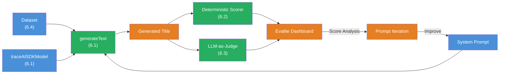

## The Scenario

You are building a **complete eval pipeline for a chat title generator**. The system takes a user message and generates a short, descriptive title for the chat. Your pipeline automatically evaluates the quality of these titles — with deterministic scorers AND LLM-as-Judge.

This is how it should work:

```
Input:  "I need help with TypeScript Generics and Constraints"
Title:  "TypeScript Generics"

Input:  "How do I configure Docker Compose for a multi-container setup?"
Title:  "Docker Compose Setup"

Input:  ""
Title:  "New Chat"
```

This project connects all five building blocks:



## Requirements

1. **Dataset** (Challenge 6.4) — Create a dataset with at least 20 diverse chat histories. Cover: technical questions, short inputs, long inputs, empty inputs, ambiguous inputs, multilingual inputs.

2. **Task: generateText** (Challenge 6.1) — Use `generateText` with a system prompt that controls the title generator. The system prompt should define rules: maximum length, no punctuation at the end, descriptive but concise.

3. **traceAISDKModel** (Challenge 6.1) — Wrap the model with `traceAISDKModel` to see token usage and latency in the dashboard.

4. **Deterministic Scorer: Title Length** (Challenge 6.2) — Create a `createScorer` that evaluates title length:
   - 1-50 characters -> Score 1.0
   - 51-80 characters -> Score 0.5
   - 0 or >80 characters -> Score 0.0

5. **Deterministic Scorer: No Trailing Period** (Challenge 6.2) — Create a scorer that checks whether the title does NOT end with a period.

6. **LLM-as-Judge Scorer: Relevance** (Challenge 6.3) — Create a scorer that evaluates whether the generated title matches the user message. Use `generateObject` with a Zod schema and a score scale.

7. **Multiple Scorers Combined** — All three scorers (title length, no trailing period, relevance) must run in a single `scorers` array.

8. **Eval-Driven Iteration** — Run the evals once, analyze the results, adjust the system prompt, and run the evals again. Did the score improve?

## Starter Code

```typescript
// chat-titles.eval.ts

import { evalite } from 'evalite';
import { createScorer } from 'evalite';
import { traceAISDKModel } from 'evalite/ai-sdk';
import { generateText, generateObject } from 'ai';
import { openai } from '@ai-sdk/openai';
import { z } from 'zod';

// TODO 1: Create the titleLength scorer (createScorer)
//   - 1-50 characters -> 1.0
//   - 51-80 characters -> 0.5
//   - 0 or >80 -> 0.0

// TODO 2: Create the noTrailingPeriod scorer (createScorer)
//   - Does NOT end with a period -> 1.0
//   - Ends with a period -> 0.0

// TODO 3: Create the titleRelevance scorer (createScorer with LLM-as-Judge)
//   - Use generateObject with a judge prompt
//   - Score scale: A (perfectly relevant), B (partially relevant),
//     C (vaguely relevant), D (not relevant)
//   - Return score + metadata (rationale)

// TODO 4: Define the system prompt for the title generator

// TODO 5: Create the dataset with 20+ test cases

// TODO 6: Create the evalite() with:
//   - data: Your dataset
//   - task: generateText with traceAISDKModel
//   - scorers: [titleLength, noTrailingPeriod, titleRelevance]
```

## Evaluation Criteria

Your Boss Fight is passed when:

- [ ] Dataset with at least 20 diverse test cases (technical, conversational, edge cases, ambiguous)
- [ ] `generateText` with `traceAISDKModel` as `task` — titles are generated by the LLM
- [ ] System prompt defines rules for title generation (length, format, style)
- [ ] `titleLength` scorer evaluates length with graduated scores
- [ ] `noTrailingPeriod` scorer checks for no trailing period
- [ ] `titleRelevance` scorer uses LLM-as-Judge with `generateObject` and Zod schema
- [ ] All three scorers run in a single `scorers` array
- [ ] At least one iteration: adjust system prompt, re-evaluate, compare scores

## Hints

<details>
<summary>Hint 1: System Prompt Design</summary>

A good system prompt for title generation could look like this:

```
Generate a short, descriptive title for the following chat message.
Rules:
- Maximum 50 characters
- No periods at the end
- Be specific, not generic
- If the input is empty, return "New Chat"
- Use the language of the input
```

Start with this and iterate based on the eval results.

</details>

<details>
<summary>Hint 2: Relevance Scorer Prompt</summary>

The judge prompt for relevance could ask the question: "How well does this title describe the chat message?" and offer a scale:
- A (1.0): Title captures the main topic precisely
- B (0.7): Title is related but too vague or too specific
- C (0.3): Title is only loosely related
- D (0.0): Title is unrelated to the message

</details>

<details>
<summary>Hint 3: Edge Cases in the Dataset</summary>

Don't forget:
- Empty strings (`''`)
- Whitespace only (`'   '`)
- Very short inputs (`'Hi'`, `'?'`)
- Very long inputs (200+ characters)
- Inputs with special characters, emojis, or code snippets
- Inputs in different languages

</details>

## Sources

- [github.com/mattpocock/evalite](https://github.com/mattpocock/evalite)
- [Vercel AI SDK: generateText](https://ai-sdk.dev/docs/ai-sdk-core/generating-text)
- [Vercel AI SDK: generateObject](https://ai-sdk.dev/docs/ai-sdk-core/generating-structured-data)
- [ai-hero-dev Exercises 06.01-06.07](https://github.com/ai-hero-dev/ai-sdk-v6-crash-course/tree/main/exercises/06-evals)
