## What You Learned

- **Evalite Basics:** The TypeScript-native eval framework with `data`, `task`, and `scorers` — `.eval.ts` files, `traceAISDKModel` for AI SDK integration, dashboard at localhost:3006
- **Deterministic Eval:** Fast, cheap scorers without an LLM — inline scorers, `createScorer` for reusability, Levenshtein from the Autoevals library, graduated scores (0-1)
- **LLM-as-a-Judge:** An LLM evaluates the output of another — Factuality scorer with `generateObject` and Zod schema, score scale (A-E), rationale for traceability
- **Dataset Management:** Representative, diverse test data with 20-50 cases for development — systematically covering categories, including edge cases, dataset critiquing with LLM
- **Langfuse:** Production observability for LLM applications — traces, generations, scores, cost monitoring. Evalite for development, Langfuse for production

## Updated Skill Tree

```mermaid
graph LR
  subgraph "Unlocked"
    L1["Level 1: AI SDK Basics"]
    L2["Level 2: LLM Fundamentals"]
    L3["Level 3: Agents & MCP"]
    L4["Level 4: Persistence"]
    L5["Level 5: Context Engineering"]
    L6["Level 6: Evals"]
  end
  subgraph NEXT["Next Level"]
    L7["Level 7: Streaming"]
  end
  subgraph "Locked"
    L8["Level 8: Workflows"]
    L9["Level 9: Advanced Patterns"]
  end
  L1 --> L2
  L2 --> L3
  L3 --> L4
  L4 --> L5
  L5 --> L6
  L6 --> L7
  L7 -.-> L8
  L8 -.-> L9
  style L1 fill:#27AE60,color:#fff
  style L2 fill:#27AE60,color:#fff
  style L3 fill:#27AE60,color:#fff
  style L4 fill:#27AE60,color:#fff
  style L5 fill:#27AE60,color:#fff
  style L6 fill:#27AE60,color:#fff
  style NEXT fill:none,stroke:#E67E22,stroke-width:3px,color:#E67E22
  style L7 fill:#E67E22,color:#fff
  style L8 fill:#95a5a6,color:#fff
  style L9 fill:#95a5a6,color:#fff
```

## Next Level

**Level 7: Streaming** — How do you deliver LLM answers to the user in real time? You'll learn stream events, partial updates, and how to build streaming UIs that feel like the LLM is typing live.
