## TL;DR

> Advanced Streaming — Custom Data Parts, Message Metadata, Stream Transforms, and Error Handling for production apps. You'll learn how to transport structured data alongside text in the stream, cleanly separate metadata from LLM content, smooth out stuttering streams, and catch errors without crashing your app.

## Skill Tree

```mermaid
graph LR
  subgraph "Unlocked"
    L1["Level 1: AI SDK Basics"]
    L2["Level 2: LLM Fundamentals"]
    L3["Level 3: Agents & MCP"]
    L4["Level 4: Persistence"]
    L5["Level 5: Context Engineering"]
    L6["Level 6: Evals"]
  end
  subgraph HERE["Current Level"]
    L7["Level 7: Streaming"]
  end
  subgraph "Locked"
    L8["Level 8: Workflows"]
    L9["Level 9: Advanced Patterns"]
  end
  L1 --> L2
  L2 --> L3
  L3 --> L4
  L4 --> L5
  L5 --> L6
  L6 --> L7
  L7 -.-> L8
  L8 -.-> L9
  style L1 fill:#27AE60,color:#fff
  style L2 fill:#27AE60,color:#fff
  style L3 fill:#27AE60,color:#fff
  style L4 fill:#27AE60,color:#fff
  style L5 fill:#27AE60,color:#fff
  style L6 fill:#27AE60,color:#fff
  style HERE fill:none,stroke:#E67E22,stroke-width:3px,stroke-dasharray:5 5
  style L7 fill:#E67E22,color:#fff
  style L8 fill:#95a5a6,color:#fff
  style L9 fill:#95a5a6,color:#fff
```

## What You'll Learn

- **Custom Data Parts** — transport structured data alongside text in the stream (progress bars, status updates, sources)
- **Message Metadata** — attach additional information to messages that the LLM doesn't see
- **Stream Transforms** — smooth out stuttering streams with `smoothStream` and write custom transforms
- **Error Handling** — catch errors in the stream, user-friendly messages, and retry strategies

## Why This Matters

In Level 1 you learned about `streamText` — writing tokens to the terminal one by one. That's enough for prototypes. In production you need more: structured data alongside the text, clean metadata separation, smooth output, and robust error handling.

The concrete problem: your stream delivers only raw text. But your UI needs progress indicators, source citations, and status updates — and when the provider crashes mid-stream, your user sees a blank page.

## Prerequisites

- **Level 1: AI SDK Basics** — specifically `streamText`, `textStream`, and `fullStream` (Challenge 1.4)
- **TypeScript** — async/await, AsyncIterable, Generics
- **Basic understanding of Web Streams** — `TransformStream`, `ReadableStream` (helpful but not required)

> **Skip hint:** You're already using `smoothStream`, Custom Data Parts, and `onError` in production? Jump straight to the [Boss Fight](/en/level-7-streaming/06-boss-fight/) and test your knowledge.

## Challenges

| # | Challenge | Concept |
|---|-----------|---------|
| 7.1 | [Custom Data Parts](/en/level-7-streaming/02-custom-data-parts/) | Structured data in the stream, Data Part Types, frontend consumption |
| 7.2 | [Message Metadata](/en/level-7-streaming/03-message-metadata/) | Metadata on messages, separation from LLM content, use cases |
| 7.3 | [Stream Transforms](/en/level-7-streaming/04-stream-transforms/) | `smoothStream`, Custom TransformStream, Transform chains |
| 7.4 | [Error Handling](/en/level-7-streaming/05-error-handling/) | `onError`, NoSuchToolError, retry strategies, Graceful Degradation |

## Boss Fight

Build a **Real-Time Dashboard**: A streaming system that sends Custom Data Parts for status updates, uses Message Metadata for session tracking, applies `smoothStream` for smooth output, and catches errors gracefully — all in one project.

## Sources for This Level

- [Vercel AI SDK: Streaming](https://ai-sdk.dev/docs/ai-sdk-core/generating-text#streamtext)
- [Vercel AI SDK: Stream Helpers](https://ai-sdk.dev/docs/ai-sdk-core/stream-helpers)
- [Vercel Blog: AI SDK 6](https://vercel.com/blog/ai-sdk-6)
- [ai-hero-dev Exercises 07.01-07.04](https://github.com/ai-hero-dev/ai-sdk-v6-crash-course/tree/main/exercises/07-production-streaming)
