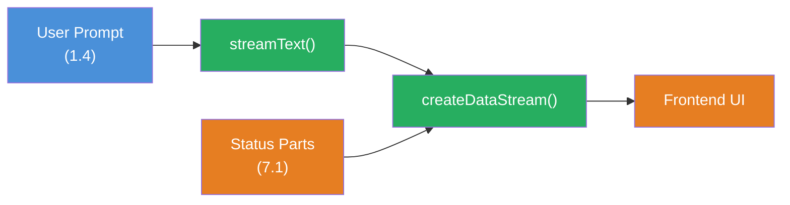

## THINK

What if you want to transport structured data alongside text in the stream — e.g., a progress bar showing how many of 5 research steps are completed?

## OVERVIEW

```mermaid
sequenceDiagram
  participant Client as Frontend
  participant Server as API Route
  participant LLM as LLM Provider

  Client->>Server: POST /api/chat
  Server->>LLM: streamText()

  rect rgba(230, 126, 34, 0.1)
    Note over Server,LLM: Stream Events
    LLM-->>Server: text-delta: "The analysis"
    LLM-->>Server: text-delta: " shows..."
    Note over Server: custom-data: { progress: 1/3 }
    LLM-->>Server: text-delta: " Result:"
    Note over Server: custom-data: { progress: 2/3 }
    LLM-->>Server: text-delta: " done."
    Note over Server: custom-data: { progress: 3/3 }
  end

  subgraph HERE["You are HERE: Custom Data Parts"]
    Note over Client: UI renders text AND<br/>progress bar
  end

  Server-->>Client: UI Message Stream

  style HERE fill:none,stroke:#E67E22,stroke-width:3px,stroke-dasharray:5 5
```

The stream doesn't just carry text chunks. Custom Data Parts let you send structured data — progress, sources, status — alongside the text to the frontend.

## WHY

**Without Custom Data Parts:** Your stream delivers only text. If you want to show the user progress, sources, or status, you have to either embed this information in the text (ugly, hard to parse) or send it over a separate channel (complex, race conditions).

**With Custom Data Parts:** Structured data flows in the same stream as the text. The frontend receives typed objects and can render them directly in the UI — progress bars, source citations, status badges. One stream, one channel, everything in sync.

## WALKTHROUGH

### Layer 1: The Data Part Types

Every chunk in the `fullStream` has a `type`. The most important standard types:

| Type | Description | Data |
|------|-------------|------|
| `text-delta` | Text chunk | `chunk.textDelta` |
| `reasoning` | Reasoning/Chain-of-Thought | `chunk.textDelta` |
| `source` | Source citation | `chunk.source` |
| `tool-call` | Tool is invoked | `chunk.toolName`, `chunk.args` |
| `tool-result` | Tool result | `chunk.toolName`, `chunk.result` |
| `data` | Custom Data Part | `chunk.data` (arbitrary object) |

You already know the first five partly from Level 1 and 3. The `data` type is new — it lets you send your own structured data.

### Layer 2: Sending Custom Data Parts

You send Custom Data Parts via `sendDataPart` on the stream result or via the `onChunk`/`onStepFinish` callbacks. The simplest way is `mergeIntoDataStream` combined with `createDataStream`:

```typescript
import { createDataStream, streamText } from 'ai';

export async function POST(req: Request) {
  const { messages } = await req.json();

  const dataStream = createDataStream({
    execute(dataStream) {                             // ← dataStream Controller
      // Send Custom Data Part BEFORE the LLM stream starts
      dataStream.writeData({ status: 'searching' }); // ← Any JSON object

      const result = streamText({
        model: anthropic('claude-sonnet-4-5-20250514'),
        messages,
        onFinish() {
          dataStream.writeData({ status: 'done' });  // ← After completion
        },
      });

      result.mergeIntoDataStream(dataStream);         // ← Insert LLM stream
    },
  });

  return dataStream.toDataStreamResponse();
}
```

`createDataStream` opens a channel into which you can feed both your own data (`writeData`) and the LLM stream (`mergeIntoDataStream`). The frontend receives everything in the correct order.

### Layer 3: Consuming Custom Data Parts in the Frontend

> **Web app context:** The following code shows Custom Data Parts in a Next.js/React app. Your TRY exercise below works in the terminal (CLI).

In the frontend you receive Custom Data Parts via the `data` array in the `useChat` hook:

```typescript
'use client';
import { useChat } from '@ai-sdk/react';

export function Chat() {
  const { messages, input, handleInputChange, handleSubmit, data } = useChat();

  // data contains all Custom Data Parts as an array
  const latestStatus = data?.at(-1);                  // ← Latest Data Part

  return (
    <div>
      {latestStatus?.status === 'searching' && (
        <div className="status-bar">Suche laeuft...</div>
      )}

      {messages.map((m) => (
        <div key={m.id}>
          <strong>{m.role}:</strong> {m.content}
        </div>
      ))}

      {latestStatus?.status === 'done' && (
        <div className="status-bar">Fertig!</div>
      )}

      <form onSubmit={handleSubmit}>
        <input value={input} onChange={handleInputChange} />
      </form>
    </div>
  );
}
```

### Layer 4: Typed Data Parts with writeData

You can send any JSON objects. Here's an example with progress display and source citations:

```typescript
// Send progress
dataStream.writeData({
  type: 'progress',                                   // ← Custom type for differentiation
  current: 2,
  total: 5,
  label: 'Recherche-Schritt 2 von 5',
});

// Send source citation
dataStream.writeData({
  type: 'source',
  url: 'https://ai-sdk.dev/docs/streaming',
  title: 'AI SDK Streaming Docs',
});

// Send status update
dataStream.writeData({
  type: 'status',
  phase: 'analyzing',
  timestamp: Date.now(),
});
```

In the frontend you then filter by type:

```typescript
const progressParts = data?.filter((d) => d.type === 'progress') ?? [];
const sourceParts = data?.filter((d) => d.type === 'source') ?? [];
const latestProgress = progressParts.at(-1);
```

## TRY

**Task:** Build a stream that sends a status ("searching", "analyzing", "done") AND the LLM stream via `createDataStream`. Consume the Data Parts in the terminal.

Create the file `custom-data-parts.ts`:

```typescript
import { createDataStream, streamText } from 'ai';
import { anthropic } from '@ai-sdk/anthropic';

// TODO 1: Erstelle einen dataStream mit createDataStream
// const dataStream = createDataStream({
//   execute(dataStream) {
//     // TODO 2: Sende ein Data Part mit status: 'searching'
//     // dataStream.writeData({ ??? });
//
//     // TODO 3: Starte streamText
//     // const result = streamText({
//     //   model: anthropic('claude-sonnet-4-5-20250514'),
//     //   prompt: 'Erklaere Custom Data Parts im AI SDK.',
//     //   onFinish() {
//     //     // TODO 4: Sende ein Data Part mit status: 'done'
//     //   },
//     // });
//
//     // TODO 5: Merge den LLM-Stream in den dataStream
//     // result.mergeIntoDataStream(dataStream);
//   },
// });

// Fuer CLI-Test: Den dataStream als ReadableStream konsumieren
// const reader = dataStream.toDataStream().getReader();
// const decoder = new TextDecoder();
// while (true) {
//   const { done, value } = await reader.read();
//   if (done) break;
//   console.log(decoder.decode(value));
// }
```

**Checklist:**
- [ ] `createDataStream` created and `execute` callback implemented
- [ ] At least one `writeData` call with a JSON object
- [ ] `streamText` started and merged into the `dataStream`
- [ ] Data Part with status "done" is sent in `onFinish`

Run: `npx tsx custom-data-parts.ts`

<details>
<summary>Show solution</summary>

```typescript
import { createDataStream, streamText } from 'ai';
import { anthropic } from '@ai-sdk/anthropic';

const dataStream = createDataStream({
  execute(dataStream) {
    // Status: Suche startet
    dataStream.writeData({ type: 'status', status: 'searching', timestamp: Date.now() });

    const result = streamText({
      model: anthropic('claude-sonnet-4-5-20250514'),
      prompt: 'Erklaere Custom Data Parts im AI SDK in 3 Saetzen.',
      onFinish() {
        // Status: Fertig
        dataStream.writeData({ type: 'status', status: 'done', timestamp: Date.now() });
      },
    });

    result.mergeIntoDataStream(dataStream);
  },
});

// Den Stream als ReadableStream konsumieren
const reader = dataStream.toDataStream().getReader();
const decoder = new TextDecoder();

while (true) {
  const { done, value } = await reader.read();
  if (done) break;
  const chunk = decoder.decode(value);
  process.stdout.write(chunk);
}

console.log('\n--- Stream beendet ---');
```

**Explanation:** `createDataStream` opens a mixed channel. `writeData` sends Custom Data Parts as JSON, `mergeIntoDataStream` inserts the LLM text stream. In the output you'll see Data Parts (as JSON lines) and text chunks alternating — all in one stream, in the correct order.

**Expected output (approximately):**

```
2:["status","searching"]
0:"Custom Data Parts "
0:"are a mechanism "
0:"in the AI SDK..."
2:["status","done"]
--- Stream beendet ---
```

> Lines with `2:` are Data Parts (JSON objects), lines with `0:` are text chunks. The exact text varies (LLM output).

</details>

## COMBINE



**Exercise:** Combine Custom Data Parts with the `streamText` knowledge from Level 1.4. Build a stream that:

1. Sends a status "thinking" before the LLM call starts
2. During LLM generation, increments a progress counter every 2 seconds (via `setInterval` in the `execute` callback)
3. After completion, sends the final token usage as a Data Part
4. Streams the LLM text stream in parallel

**Optional Stretch Goal:** Build a frontend with `useChat` that renders the progress counter as an animated progress bar and displays the token usage at the end.

## Sources

- [Vercel AI SDK: Data Streams](https://ai-sdk.dev/docs/ai-sdk-core/data-streams)
- [Vercel AI SDK: createDataStream API Reference](https://ai-sdk.dev/docs/reference/ai-sdk-core/create-data-stream)
- [ai-hero-dev Exercise 07.01](https://github.com/ai-hero-dev/ai-sdk-v6-crash-course/tree/main/exercises/07-production-streaming/07.01-custom-data-parts)
