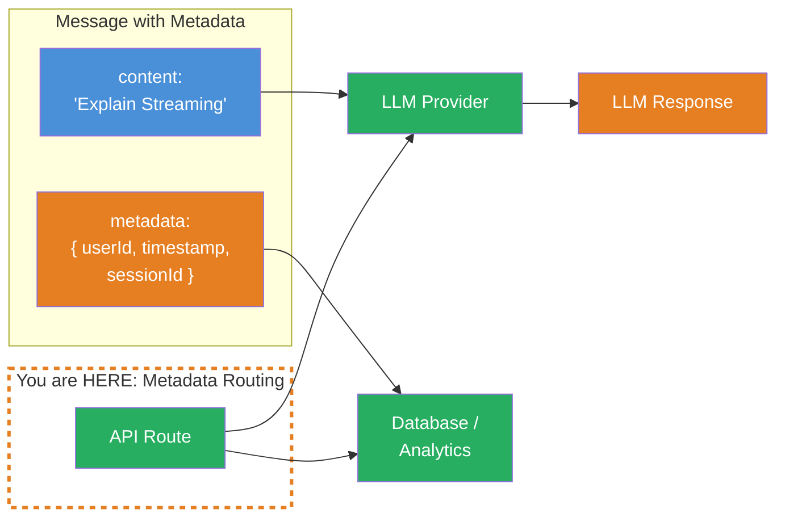
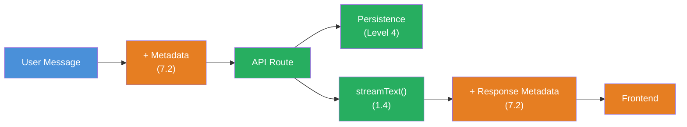

## THINK

How do you attach additional info to a message that should NOT go to the LLM — e.g., a timestamp, the user ID, or the IP address? Packing everything into the message content would waste tokens and could confuse the LLM.

## OVERVIEW



Message Metadata lives alongside the content but is NOT sent to the LLM. The content goes to the LLM, the metadata stays in your app — for logging, persistence, analytics.

## WHY

**Without Metadata:** You pack everything into the message content. The LLM sees irrelevant information ("userId: abc123, timestamp: 1709..."), wastes tokens, and may get confused. Or you store metadata in a separate data structure and have to keep it manually in sync with the messages — error-prone and cumbersome.

**With Metadata:** Clean separation. The content contains only what the LLM should see. The metadata contains everything your app needs — timestamps, user IDs, session data, ratings. Both travel together in one message, but only the content goes to the LLM.

## WALKTHROUGH

### Layer 1: The Metadata Concept

Every message in the AI SDK has an optional `metadata` property. It's a freely definable object:

```typescript
import type { UIMessage } from 'ai';

const message: UIMessage = {
  id: 'msg-1',
  role: 'user',
  content: 'Erklaere Streaming im AI SDK.',
  parts: [{ type: 'text', text: 'Erklaere Streaming im AI SDK.' }],
  metadata: {                                         // ← Metadata: Does NOT go to the LLM
    userId: 'user-42',
    timestamp: Date.now(),
    sessionId: 'session-abc',
    source: 'web-app',
  },
};
```

The `metadata` property is automatically ignored by the AI SDK when sending to the LLM provider. It's exclusively for your application logic.

### Layer 2: Using Metadata on the Server Side

In your API route you can read the metadata before starting the LLM call:

```typescript
import { streamText } from 'ai';
import { anthropic } from '@ai-sdk/anthropic';

export async function POST(req: Request) {
  const { messages } = await req.json();

  // Read metadata from the last user message
  const lastMessage = messages.at(-1);
  const metadata = lastMessage?.metadata ?? {};

  // For logging / analytics
  console.log(`User ${metadata.userId} fragt:`, lastMessage?.content);
  console.log(`Session: ${metadata.sessionId}`);
  console.log(`Timestamp: ${new Date(metadata.timestamp).toISOString()}`);

  // Only the content goes to the LLM — metadata stays here
  const result = streamText({
    model: anthropic('claude-sonnet-4-5-20250514'),
    messages,                                         // ← SDK filters out metadata
  });

  return result.toUIMessageStreamResponse();
}
```

### Layer 3: Setting Metadata on the Response

You can also attach metadata to the response messages. This happens via `messageMetadata` in `toUIMessageStreamResponse`:

```typescript
const result = streamText({
  model: anthropic('claude-sonnet-4-5-20250514'),
  messages,
});

return result.toUIMessageStreamResponse({
  messageMetadata: {                                  // ← Metadata for the response
    generatedAt: Date.now(),
    modelId: 'claude-sonnet-4-5-20250514',
    cached: false,
  },
});
```

In the frontend the metadata is then available on the assistant message:

```typescript
const { messages } = useChat();

messages.map((m) => {
  if (m.role === 'assistant') {
    console.log('Generiert am:', m.metadata?.generatedAt);
    console.log('Modell:', m.metadata?.modelId);
  }
});
```

### Layer 4: Metadata for Persistence

Metadata is especially valuable in combination with persistence (Level 4). You can store timestamps, versions, and user data directly on the message:

```typescript
// Beim Speichern in die Datenbank
async function saveMessage(message: UIMessage) {
  await db.insert('messages', {
    id: message.id,
    role: message.role,
    content: message.content,
    // Metadata wird MIT der Message gespeichert
    userId: message.metadata?.userId,
    timestamp: message.metadata?.timestamp,
    sessionId: message.metadata?.sessionId,
    modelId: message.metadata?.modelId,
  });
}

// Beim Laden aus der Datenbank — Metadata wird rekonstruiert
async function loadMessages(chatId: string): Promise<UIMessage[]> {
  const rows = await db.select('messages', { chatId });
  return rows.map((row) => ({
    id: row.id,
    role: row.role,
    content: row.content,
    parts: [{ type: 'text', text: row.content }],
    metadata: {
      userId: row.userId,
      timestamp: row.timestamp,
      sessionId: row.sessionId,
      modelId: row.modelId,
    },
  }));
}
```

## TRY

**Task:** Create messages with metadata (userId, timestamp) and log the metadata server-side before the LLM call starts. Verify that the LLM does not see the metadata.

```typescript
import { streamText } from 'ai';
import { anthropic } from '@ai-sdk/anthropic';
import type { UIMessage } from 'ai';

// TODO 1: Erstelle eine Message mit metadata
// const messages: UIMessage[] = [
//   {
//     id: 'msg-1',
//     role: 'user',
//     content: 'Was siehst Du in dieser Nachricht? Liste ALLES auf.',
//     parts: [{ type: 'text', text: 'Was siehst Du in dieser Nachricht? Liste ALLES auf.' }],
//     metadata: {
//       // TODO: Fuege userId, timestamp und sessionId hinzu
//     },
//   },
// ];

// TODO 2: Logge die Metadata der letzten Message
// const lastMessage = messages.at(-1);
// console.log('Metadata:', lastMessage?.metadata);

// TODO 3: Sende an streamText und pruefe ob das LLM die Metadata erwaehnt
// const result = streamText({
//   model: anthropic('claude-sonnet-4-5-20250514'),
//   messages,
// });

// TODO 4: Konsumiere den Stream und pruefe die Antwort
// for await (const chunk of result.textStream) {
//   process.stdout.write(chunk);
// }
```

**Checklist:**
- [ ] Message with `metadata` object created (at least userId and timestamp)
- [ ] Metadata logged on the "server side"
- [ ] `streamText` called with the messages
- [ ] Verified: LLM does NOT mention userId/timestamp in the response

<details>
<summary>Show solution</summary>

```typescript
import { streamText } from 'ai';
import { anthropic } from '@ai-sdk/anthropic';
import type { UIMessage } from 'ai';

const messages: UIMessage[] = [
  {
    id: 'msg-1',
    role: 'user',
    content: 'Was siehst Du in dieser Nachricht? Liste ALLES auf, was Du sehen kannst.',
    parts: [{ type: 'text', text: 'Was siehst Du in dieser Nachricht? Liste ALLES auf, was Du sehen kannst.' }],
    metadata: {
      userId: 'user-42',
      timestamp: Date.now(),
      sessionId: 'session-abc-123',
      source: 'level-7-test',
    },
  },
];

// Metadata loggen (bleibt in der App)
const lastMessage = messages.at(-1)!;
console.log('--- App-Metadata (geht NICHT zum LLM) ---');
console.log('userId:', lastMessage.metadata?.userId);
console.log('timestamp:', new Date(lastMessage.metadata?.timestamp as number).toISOString());
console.log('sessionId:', lastMessage.metadata?.sessionId);
console.log('');

// LLM-Call — Metadata wird NICHT mitgesendet
const result = streamText({
  model: anthropic('claude-sonnet-4-5-20250514'),
  messages,
});

console.log('--- LLM-Antwort ---');
for await (const chunk of result.textStream) {
  process.stdout.write(chunk);
}
console.log('\n');

// Pruefe: Die Antwort sollte NUR den Text-Content erwaehnen,
// NICHT userId, sessionId oder timestamp.
```

**Explanation:** The LLM only sees the `content` of the message: "Was siehst Du in dieser Nachricht? Liste ALLES auf, was Du sehen kannst." The metadata (`userId`, `timestamp`, `sessionId`) is filtered out by the AI SDK and does not appear in the LLM response. This lets you transport metadata safely without wasting tokens or confusing the LLM.

</details>

## COMBINE



**Exercise:** Combine Message Metadata with the persistence concept from Level 4. Build a function that:

1. Creates user messages with metadata (userId, timestamp)
2. Automatically filters out the metadata when sending to `streamText` (handled by the SDK)
3. Enriches the LLM response with its own metadata (modelId, generatedAt, tokenCount)
4. Saves both messages (user + assistant) including metadata into an array

**Optional Stretch Goal:** Build a `getSessionStats(sessionId)` function that calculates the total number of tokens, session duration, and message count from the stored messages — all from the metadata, without parsing the content.

## Sources

- [Vercel AI SDK: UI Messages](https://ai-sdk.dev/docs/ai-sdk-ui/chatbot#messages)
- [Vercel AI SDK: Message Metadata](https://ai-sdk.dev/docs/ai-sdk-ui/chatbot-message-metadata)
- [ai-hero-dev Exercise 07.02](https://github.com/ai-hero-dev/ai-sdk-v6-crash-course/tree/main/exercises/07-production-streaming/07.02-message-metadata)
