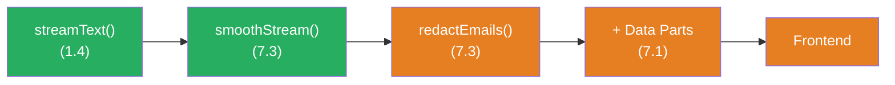

## THINK

Have you noticed that LLM streams sometimes stutter — individual characters instead of smooth words? And what if you want to post-process the stream before it reaches the user — e.g., replacing or filtering certain words?

## OVERVIEW


Stream Transforms sit between the LLM and your UI. They transform, filter, or smooth the chunks before they reach the user. You can use built-in transforms like `smoothStream` or write your own.

## WHY

**Without Transforms:** The raw stream from the LLM sometimes arrives character by character ("H", "e", "l", "l", "o"), sometimes in large blocks. The output stutters and feels unpolished. If you want to post-process the stream (filter, format, enrich), you have to do it manually after receiving — inflexible and error-prone.

**With Transforms:** `smoothStream()` buffers individual characters and outputs them in natural word groups. Custom transforms let you modify every chunk before it's forwarded. And with the `experimental_transform` option you can chain multiple transforms like a pipeline.

## WALKTHROUGH

### Layer 1: smoothStream — the Built-in Smoothing

`smoothStream()` is a built-in transform function. It collects individual characters and outputs them in longer, more natural chunks:

```typescript
import { smoothStream, streamText } from 'ai';
import { anthropic } from '@ai-sdk/anthropic';

const result = streamText({
  model: anthropic('claude-sonnet-4-5-20250514'),
  prompt: 'Erklaere Stream Transforms.',
  experimental_transform: smoothStream(),             // ← One line, big impact
});

for await (const chunk of result.textStream) {
  process.stdout.write(chunk);                        // ← Smoother output
}
```

Without `smoothStream`: `"S"` `"t"` `"r"` `"e"` `"a"` `"m"` `" T"` `"r"` `"a"` `"n"` `"s"` ...
With `smoothStream`: `"Stream "` `"Transforms "` `"sind ein "` `"Mechanismus..."` ...

`smoothStream` accepts optional configuration:

```typescript
experimental_transform: smoothStream({
  delayInMs: 10,                                      // ← Delay between chunks (Default: 10)
  chunking: 'word',                                   // ← 'word' or 'line' or RegExp
}),
```

| Option | Default | Description |
|--------|---------|-------------|
| `delayInMs` | `10` | Milliseconds between chunk emissions |
| `chunking` | `'word'` | How chunks are grouped: `'word'`, `'line'`, or a custom RegExp |

### Layer 2: Custom TransformStream

A custom transform is a function that returns a `TransformStream` factory. Every chunk passes through the `transform` method:

```typescript
// Custom Transform: Alle Buchstaben in Grossbuchstaben
const upperCase = () =>                               // ← Factory function
  (options: { tools: Record<string, unknown> }) =>    // ← Receives tool info
    new TransformStream({
      transform(chunk, controller) {
        // Nur text-delta Chunks transformieren, Rest durchlassen
        if (chunk.type === 'text-delta') {
          controller.enqueue({                        // ← Forward modified chunk
            ...chunk,
            textDelta: chunk.textDelta.toUpperCase(), // ← Transform text
          });
        } else {
          controller.enqueue(chunk);                  // ← Other chunks unchanged
        }
      },
    });
```

The structure is always the same:
1. **Outer function:** Returns the factory (configuration level)
2. **Inner function:** Receives options (tools etc.), returns `TransformStream`
3. **transform method:** Processes each individual chunk

### Layer 3: Chaining Transforms

With `experimental_transform` as an array you can chain multiple transforms in sequence. Every chunk passes through all transforms in order:

```typescript
import { smoothStream, streamText } from 'ai';

// Custom Transform: Filtert Chunks die "[INTERN]" enthalten
const filterInternal = () => (options: { tools: Record<string, unknown> }) =>
  new TransformStream({
    transform(chunk, controller) {
      if (chunk.type === 'text-delta' && chunk.textDelta.includes('[INTERN]')) {
        // Chunk verschlucken — nicht weiterleiten
        return;
      }
      controller.enqueue(chunk);
    },
  });

const result = streamText({
  model: anthropic('claude-sonnet-4-5-20250514'),
  prompt: 'Erklaere Streaming.',
  experimental_transform: [                           // ← Array = Pipeline
    smoothStream(),                                   // ← Smooth first
    filterInternal(),                                 // ← Then filter
  ],
});
```

The order matters: the first transform processes the raw stream, the second receives the output of the first. Like pipes in the Unix shell.

### Layer 4: Practical Example — Filtering Sensitive Data

A realistic use case: you want to prevent email addresses from appearing in the stream:

```typescript
const redactEmails = () => (options: { tools: Record<string, unknown> }) =>
  new TransformStream({
    transform(chunk, controller) {
      if (chunk.type === 'text-delta') {
        const redacted = chunk.textDelta.replace(
          /[\w.-]+@[\w.-]+\.\w+/g,                    // ← Simple email RegExp
          '[EMAIL REDACTED]',
        );
        controller.enqueue({ ...chunk, textDelta: redacted });
      } else {
        controller.enqueue(chunk);
      }
    },
  });

const result = streamText({
  model: anthropic('claude-sonnet-4-5-20250514'),
  prompt: 'Nenne mir Kontaktdaten von Vercel.',
  experimental_transform: [
    smoothStream(),
    redactEmails(),                                   // ← Emails get masked
  ],
});
```

**Caution:** Stream transforms work chunk by chunk. An email address could be split across two chunks ("user@" + "example.com"). For robust filtering you need a buffer in the transform — that's an advanced technique.

## TRY

**Task:** Apply `smoothStream`, then write a custom transform that converts all text chunks to uppercase.

```typescript
import { smoothStream, streamText } from 'ai';
import { anthropic } from '@ai-sdk/anthropic';

// TODO 1: Schreibe einen upperCase Transform
// const upperCase = () => (options) =>
//   new TransformStream({
//     transform(chunk, controller) {
//       // TODO: text-delta Chunks transformieren, Rest durchlassen
//     },
//   });

// TODO 2: Nutze experimental_transform mit smoothStream UND upperCase
// const result = streamText({
//   model: anthropic('claude-sonnet-4-5-20250514'),
//   prompt: 'Erklaere in 2 Saetzen, was Stream Transforms sind.',
//   experimental_transform: [???],
// });

// TODO 3: Konsumiere den Stream
// for await (const chunk of result.textStream) {
//   process.stdout.write(chunk);
// }
```

**Checklist:**
- [ ] `smoothStream()` configured as the first transform
- [ ] Custom `upperCase` transform written with `TransformStream`
- [ ] Only `text-delta` chunks transformed, other types passed through
- [ ] Both transforms chained in the `experimental_transform` array
- [ ] Output shows smooth, uppercased text

<details>
<summary>Show solution</summary>

```typescript
import { smoothStream, streamText } from 'ai';
import { anthropic } from '@ai-sdk/anthropic';

// Custom Transform: Grossbuchstaben
const upperCase = () => (options: { tools: Record<string, unknown> }) =>
  new TransformStream({
    transform(chunk, controller) {
      if (chunk.type === 'text-delta') {
        controller.enqueue({
          ...chunk,
          textDelta: chunk.textDelta.toUpperCase(),
        });
      } else {
        controller.enqueue(chunk);
      }
    },
  });

const result = streamText({
  model: anthropic('claude-sonnet-4-5-20250514'),
  prompt: 'Erklaere in 2 Saetzen, was Stream Transforms sind.',
  experimental_transform: [
    smoothStream(),   // Erst glaetten
    upperCase(),      // Dann in Grossbuchstaben
  ],
});

for await (const chunk of result.textStream) {
  process.stdout.write(chunk);
}
console.log(); // Zeilenumbruch am Ende
```

**Explanation:** `smoothStream()` collects the individual characters from the LLM and outputs them in word groups. Then `upperCase()` transforms each text chunk to uppercase. Non-text chunks (like `finish` or `tool-call`) are passed through unchanged. The order in the array determines the pipeline order.

</details>

## COMBINE



**Exercise:** Combine Stream Transforms with Custom Data Parts from Challenge 7.1. Build a stream that:

1. Uses `smoothStream()` for smooth output
2. Has a custom transform that filters certain words (e.g., "TODO", "FIXME") from the text and replaces them with "[REDACTED]"
3. Sends a Data Part via `createDataStream` that counts how many words were filtered

**Optional Stretch Goal:** Build a `wordCounter` transform that tracks how many words have been streamed in total and sends a Data Part with the current count every 50 words.

## Sources

- [Vercel AI SDK: smoothStream](https://ai-sdk.dev/docs/reference/ai-sdk-core/smooth-stream)
- [Vercel AI SDK: streamText — experimental_transform](https://ai-sdk.dev/docs/reference/ai-sdk-core/stream-text#experimental-transform)
- [MDN: TransformStream](https://developer.mozilla.org/en-US/docs/Web/API/TransformStream)
- [ai-hero-dev Exercise 07.03](https://github.com/ai-hero-dev/ai-sdk-v6-crash-course/tree/main/exercises/07-production-streaming/07.03-stream-transforms)
