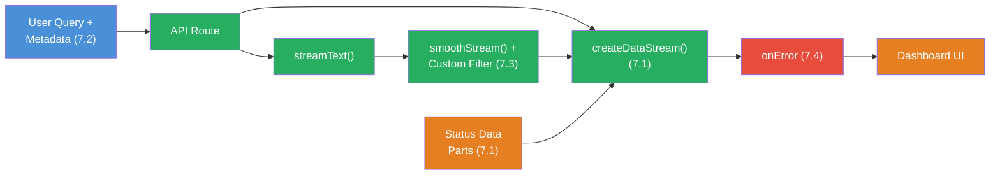

## The Scenario

You're building a **Real-Time Dashboard** — a streaming system that delivers an analysis to a user in real time. The stream transports structured status updates alongside the analysis text, uses Message Metadata for session tracking, smooths the output, and catches errors gracefully.

Your dashboard should feel like this:

```
[Status: searching] Recherchiere Daten...
[Fortschritt: 1/3] Marktdaten geladen.

Die Analyse zeigt folgende Trends: Im ersten Quartal stieg
der Umsatz um 12%. Der wichtigste Treiber war...

[Fortschritt: 2/3] Wettbewerbsanalyse abgeschlossen.

Im Vergleich zum Wettbewerb liegt das Unternehmen bei...

[Fortschritt: 3/3] Prognose berechnet.
[Status: done] Analyse abgeschlossen.
[Session: user-42 | Dauer: 4.2s | Tokens: 847]
```

This project connects all four building blocks:



## Requirements

1. **Custom Data Parts** (Challenge 7.1) — Send structured status updates in the stream: "searching", "analyzing", "done". Send at least 3 progress updates with the current step and total count (e.g., `{ step: 1, total: 3, label: "Market data loaded" }`).

2. **Message Metadata** (Challenge 7.2) — Every user message carries metadata: `userId`, `timestamp`, `sessionId`. The assistant response carries metadata: `modelId`, `generatedAt`, `tokenCount`. Log the user metadata server-side BEFORE the LLM call starts.

3. **Stream Transforms** (Challenge 7.3) — Use `smoothStream()` for smooth text output. Write a custom transform that masks confidential data (e.g., replaces email addresses with "[REDACTED]").

4. **Error Handling** (Challenge 7.4) — Implement `onError` in `streamText` for server-side logging. Implement `onError` in `toUIMessageStreamResponse` for user-friendly error messages. Wrap the stream consumer in try/catch as a last fallback.

5. **Session Statistics** — At the end of the stream: calculate the duration (from metadata timestamps) and send a final statistic as a Data Part: `{ type: 'stats', duration, tokenCount, userId }`.

## Starter Code

```typescript
import { createDataStream, smoothStream, streamText } from 'ai';
import { anthropic } from '@ai-sdk/anthropic';

// TODO: Message mit Metadata erstellen
// TODO: Custom Transform fuer Daten-Maskierung
// TODO: createDataStream mit Status-Updates
// TODO: streamText mit smoothStream + Custom Transform
// TODO: Error Handling (onError + try/catch)
// TODO: Session-Statistik am Ende
```

## Evaluation Criteria

Your Boss Fight is passed when:

- [ ] At least 3 Custom Data Parts with progress updates are sent in the stream
- [ ] User messages carry metadata (userId, timestamp, sessionId) that the LLM does not see
- [ ] The assistant response carries metadata (modelId, generatedAt)
- [ ] `smoothStream()` is configured as a transform
- [ ] A custom transform masks at least one data pattern (email, phone number, etc.)
- [ ] `onError` is implemented in both `streamText` and `toUIMessageStreamResponse`
- [ ] A try/catch around the stream consumer catches unexpected errors
- [ ] At the end, a session statistic is sent as a Data Part (duration + tokens)

## Hints

<details>
<summary>Hint 1: createDataStream Structure</summary>

`createDataStream` expects an `execute` function that receives the `dataStream` controller as a parameter. In this function you call `dataStream.writeData()` for Custom Data Parts and `result.mergeIntoDataStream(dataStream)` for the LLM stream. The order determines when Data Parts appear in the stream.

</details>

<details>
<summary>Hint 2: Timing for Progress Updates</summary>

You can use `setTimeout` or `setInterval` to send progress updates with a delay. Or use the `onStepFinish` or `onChunk` callbacks from `streamText` to send Data Parts based on stream progress. Important: end intervals in `onFinish`, otherwise the stream never completes.

</details>

<details>
<summary>Hint 3: Combining Custom Transform + smoothStream</summary>

`experimental_transform` accepts an array. `smoothStream()` should come first (smooths the raw stream), then your custom transform (works with the smoothed chunks). Remember: your transform must modify `text-delta` chunks and pass all other types through unchanged.

</details>

<details>
<summary>Hint 4: Calculating Session Duration</summary>

Store `Date.now()` at the beginning of the `execute` callback. In `onFinish` of `streamText` you calculate the difference. Send the result as a Data Part: `dataStream.writeData({ type: 'stats', durationMs: Date.now() - startTime, ... })`.

</details>

## Sources

- [Vercel AI SDK: Data Streams](https://ai-sdk.dev/docs/ai-sdk-core/data-streams)
- [Vercel AI SDK: smoothStream](https://ai-sdk.dev/docs/reference/ai-sdk-core/smooth-stream)
- [Vercel AI SDK: Error Handling](https://ai-sdk.dev/docs/ai-sdk-core/error-handling)
- [ai-hero-dev Exercises 07.01-07.04](https://github.com/ai-hero-dev/ai-sdk-v6-crash-course/tree/main/exercises/07-production-streaming)
