## What You Learned

- **Custom Data Parts:** Transport structured data alongside text in the stream — `createDataStream`, `writeData`, `mergeIntoDataStream`. One channel for text and metadata, synchronous and typed.
- **Message Metadata:** Attach additional information to messages that the LLM doesn't see — userId, timestamps, session data. Clean separation of content and app data, ideal for persistence and analytics.
- **Stream Transforms:** Smooth out stuttering streams with `smoothStream()` and build custom `TransformStream` pipelines — filter, transform, enrich. `experimental_transform` as an array for chained processing.
- **Error Handling:** Catch errors in the stream with `onError` in `streamText` (server logging) and `toUIMessageStreamResponse` (user message). Typed error classes like `NoSuchToolError`, retry with exponential backoff, try/catch as a last fallback.

## Updated Skill Tree

```mermaid
graph LR
  subgraph "Unlocked"
    L1["Level 1: AI SDK Basics"]
    L2["Level 2: LLM Fundamentals"]
    L3["Level 3: Agents & MCP"]
    L4["Level 4: Persistence"]
    L5["Level 5: Context Engineering"]
    L6["Level 6: Evals"]
    L7["Level 7: Streaming"]
  end
  subgraph NEXT["Next Level"]
    L8["Level 8: Workflows"]
  end
  subgraph "Locked"
    L9["Level 9: Advanced Patterns"]
  end
  L1 --> L2
  L2 --> L3
  L3 --> L4
  L4 --> L5
  L5 --> L6
  L6 --> L7
  L7 --> L8
  L8 -.-> L9
  style L1 fill:#27AE60,color:#fff
  style L2 fill:#27AE60,color:#fff
  style L3 fill:#27AE60,color:#fff
  style L4 fill:#27AE60,color:#fff
  style L5 fill:#27AE60,color:#fff
  style L6 fill:#27AE60,color:#fff
  style L7 fill:#27AE60,color:#fff
  style NEXT fill:none,stroke:#E67E22,stroke-width:3px,stroke-dasharray:5 5
  style L8 fill:#E67E22,color:#fff
  style L9 fill:#95a5a6,color:#fff
```

## Next Level

**Level 8: Workflows** — Individual LLM calls are powerful. But what if a task requires multiple steps — research, analysis, summarization? You'll learn how to build sequential and parallel workflows, implement custom agent loops, and deliberately break out of loops when the result is good enough.
