## TL;DR

> Workflows orchestrate multiple LLM calls into complex pipelines. Instead of one large prompt: many small, specialized steps. You'll learn how to build sequential workflows, stream progress to the frontend, implement custom agent loops, and deliberately break loops before they spin out of control.

## Skill Tree

```mermaid
graph LR
  subgraph "Unlocked"
    L1["Level 1: AI SDK Basics"]
    L2["Level 2: LLM Fundamentals"]
    L3["Level 3: Agents & MCP"]
    L4["Level 4: Persistence"]
    L5["Level 5: Context Engineering"]
    L6["Level 6: Evals"]
    L7["Level 7: Streaming"]
  end
  subgraph HIER["Current Level"]
    L8["Level 8: Workflows"]
  end
  subgraph "Locked"
    L9["Level 9: Advanced Patterns"]
  end
  L1 --> L2
  L2 --> L3
  L3 --> L4
  L4 --> L5
  L5 --> L6
  L6 --> L7
  L7 --> L8
  L8 -.-> L9
  style L1 fill:#27AE60,color:#fff
  style L2 fill:#27AE60,color:#fff
  style L3 fill:#27AE60,color:#fff
  style L4 fill:#27AE60,color:#fff
  style L5 fill:#27AE60,color:#fff
  style L6 fill:#27AE60,color:#fff
  style L7 fill:#27AE60,color:#fff
  style HIER fill:none,stroke:#E67E22,stroke-width:3px,stroke-dasharray:5 5
  style L8 fill:#E67E22,color:#fff
  style L9 fill:#95a5a6,color:#fff
```

## What You'll Learn

- **Workflows** — chain multiple `generateText` calls sequentially, where the output of Step N becomes the input of Step N+1
- **Streaming to Frontend** — stream workflow progress to the frontend in real time with `createDataStream` and Custom Data Parts
- **Custom Loop** — build your own agent loops with full control over termination conditions, state tracking, and the messages array
- **Breaking the Loop** — prevent infinite loops with max iterations, timeout, cost guard, and quality checks

## Why This Matters

In Level 3 you learned about agents that use tools autonomously. But what if a task doesn't just need one tool, but an entire pipeline — first research, then summarize, then format? A single massive prompt quickly becomes unreliable. Workflows break complex tasks into specialized steps that you can test, debug, and optimize individually.

The concrete problem: You want to build a research pipeline that searches for sources, summarizes results, and produces a finished report. A single LLM call produces inconsistent results. With workflows you control each step separately — and when something goes wrong, you know exactly where.

## Prerequisites

- **Level 3: Agents & MCP** — Tool Calling, Multi-Step Agents, `stopWhen` (Challenge 3.1-3.3)
- **Level 7: Streaming** — Custom Data Parts, `createDataStream`, `writeData`, `mergeIntoDataStream` (Challenge 7.1)
- **TypeScript** — async/await, while loops, AbortController

> **Skip hint:** You're already building custom agent loops with your own termination conditions, streaming progress to the frontend, and have implemented timeout guards? Jump straight to the [Boss Fight](/en/level-8-workflows/06-boss-fight/) and build a multi-step research pipeline.

## Challenges

| # | Challenge | Concept |
|---|-----------|---------|
| 8.1 | [Workflow](/en/level-8-workflows/02-workflow/) | Sequential `generateText` calls, output chaining, specialized steps |
| 8.2 | [Streaming to Frontend](/en/level-8-workflows/03-streaming-to-frontend/) | `createDataStream` + `writeData` for step progress, frontend consumption |
| 8.3 | [Custom Loop](/en/level-8-workflows/04-custom-loop/) | Custom while loop, messages array, state tracking, finishReason check |
| 8.4 | [Breaking the Loop](/en/level-8-workflows/05-breaking-the-loop/) | Max iterations, timeout, cost guard, quality check, partial results |

## Boss Fight

Build a **Multi-Step Research Pipeline** — a system that researches a topic (custom loop with tools), streams progress in real time, summarizes the results (workflow), and is protected with safeguards (max iterations, timeout, cost limit). You'll combine all four building blocks of this level in one project.

## Sources for This Level

- [Vercel AI SDK: Generating Text](https://ai-sdk.dev/docs/ai-sdk-core/generating-text)
- [Vercel AI SDK: Building Agents](https://ai-sdk.dev/docs/agents/building-agents)
- [Vercel AI SDK: Data Streams](https://ai-sdk.dev/docs/ai-sdk-core/data-streams)
- [Vercel Blog: AI SDK 6](https://vercel.com/blog/ai-sdk-6)
- [ai-hero-dev Exercises 08.01-08.04](https://github.com/ai-hero-dev/ai-sdk-v6-crash-course/tree/main/exercises/08-workflows)
