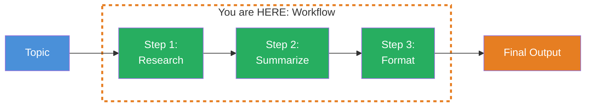
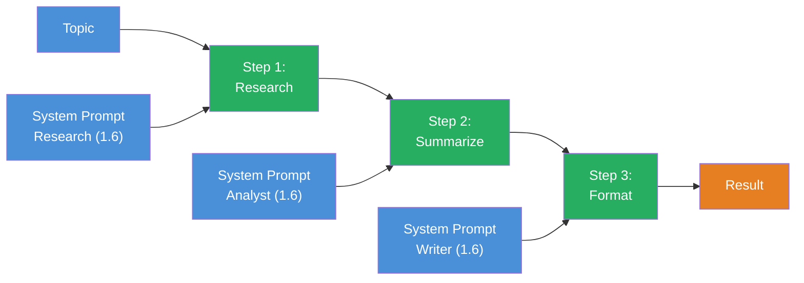

## THINK

What if a task is too complex for a single LLM call — e.g., researching, summarizing, and formatting? Would you pack everything into one prompt, or split the task up?

## OVERVIEW



A workflow chains multiple `generateText` calls. The output of Step 1 becomes the input of Step 2. Each step has its own prompt, its own role — and can be tested individually.

## WHY

**Without workflows:** A massive prompt that has to research, summarize, and format all at once. Hard to debug — if the result is bad, you don't know which sub-step failed. No intermediate results, no step-by-step testing.

**With workflows:** Specialized steps, each with its own system prompt. You can test Step 2 in isolation by giving it a fixed input. You see intermediate results after each step. And if Step 3 delivers poor results, you know: the problem is in the format prompt, not the research.

## WALKTHROUGH

### Layer 1: The Simplest Workflow

Three `generateText` calls in sequence. The output of Step N becomes the input of Step N+1:

```typescript
import { generateText } from 'ai';
import { anthropic } from '@ai-sdk/anthropic';

const model = anthropic('claude-sonnet-4-5-20250514');

// Step 1: Research
const research = await generateText({
  model,
  system: 'Du bist ein Research-Assistent. Sammle Fakten und Daten zum Thema.',
  prompt: 'Recherchiere die aktuellen Trends im Bereich Edge Computing.',
});

console.log('--- Step 1: Research ---');
console.log(research.text);

// Step 2: Summarize
const summary = await generateText({
  model,
  system: 'Du bist ein Analyst. Fasse die folgenden Recherche-Ergebnisse in 3-5 Kernaussagen zusammen.',
  prompt: research.text,  // ← Output from Step 1 becomes input of Step 2
});

console.log('--- Step 2: Summary ---');
console.log(summary.text);

// Step 3: Format
const email = await generateText({
  model,
  system: 'Du bist ein Business-Writer. Formatiere die Zusammenfassung als professionelle E-Mail an das Management-Team.',
  prompt: summary.text,  // ← Output from Step 2 becomes input of Step 3
});

console.log('--- Step 3: Formatted Email ---');
console.log(email.text);
```

Three calls, three roles, three specialized outputs. The key point: each `system` prompt defines a different expertise. Step 1 gathers facts, Step 2 analyzes, Step 3 formats.

### Layer 2: Encapsulating as a Function

To make the workflow reusable, we wrap it in a function:

```typescript
import { generateText } from 'ai';
import { anthropic } from '@ai-sdk/anthropic';

const model = anthropic('claude-sonnet-4-5-20250514');

async function contentPipeline(topic: string) {
  // Step 1: Research
  const research = await generateText({
    model,
    system: 'Du bist ein Research-Assistent. Sammle Fakten und Daten zum gegebenen Thema. Nenne konkrete Zahlen und Beispiele.',
    prompt: `Recherchiere: ${topic}`,
  });

  // Step 2: Summarize
  const summary = await generateText({
    model,
    system: 'Du bist ein Analyst. Fasse die folgenden Informationen in maximal 5 praegnanten Kernaussagen zusammen. Jede Aussage in einem Satz.',
    prompt: `Fasse zusammen:\n\n${research.text}`,
  });

  // Step 3: Format as Email
  const email = await generateText({
    model,
    system: 'Du bist ein Business-Writer. Formatiere den folgenden Inhalt als professionelle E-Mail. Betreff, Anrede, Kernpunkte, Gruss.',
    prompt: `Formatiere als E-Mail an das Team:\n\n${summary.text}`,
  });

  return {
    research: research.text,
    summary: summary.text,
    email: email.text,
    totalTokens:
      research.usage.totalTokens +
      summary.usage.totalTokens +
      email.usage.totalTokens,
  };
}

// Execute
const result = await contentPipeline('Edge Computing Trends 2026');
console.log(result.email);
console.log(`\nTotal Tokens: ${result.totalTokens}`);
```

The function returns all intermediate results. This is important for debugging — if the email is bad, you check `result.summary`. If the summary is bad, you check `result.research`. Each layer debuggable on its own.

### Layer 3: Token Tracking Across the Pipeline

A workflow with three steps consumes three times as many API calls as a single one. Token tracking matters:

```typescript
async function trackedPipeline(topic: string) {
  const steps: Array<{ name: string; tokens: number; duration: number }> = [];

  async function runStep(name: string, system: string, prompt: string) {
    const start = Date.now();
    const result = await generateText({ model, system, prompt });
    steps.push({
      name,
      tokens: result.usage.totalTokens,
      duration: Date.now() - start,
    });
    return result.text;
  }

  const research = await runStep(
    'research',
    'Du bist ein Research-Assistent. Sammle Fakten zum Thema.',
    `Recherchiere: ${topic}`,
  );

  const summary = await runStep(
    'summarize',
    'Fasse die Informationen in 3-5 Kernaussagen zusammen.',
    research,
  );

  const formatted = await runStep(
    'format',
    'Formatiere als professionelle E-Mail.',
    summary,
  );

  // Log step statistics
  for (const step of steps) {
    console.log(`${step.name}: ${step.tokens} Tokens, ${step.duration}ms`);
  }

  const totalTokens = steps.reduce((sum, s) => sum + s.tokens, 0);
  const totalDuration = steps.reduce((sum, s) => sum + s.duration, 0);
  console.log(`\nTotal: ${totalTokens} Tokens, ${totalDuration}ms`);

  return { result: formatted, steps };
}

await trackedPipeline('Edge Computing Trends 2026');
```

The `runStep` helper function encapsulates the shared code: call `generateText`, measure tokens and duration, return the result. This reduces boilerplate and makes token tracking consistent.

## TRY

**Task:** Build a 3-step content pipeline: research, summarize, translate (to English). Track tokens per step.

Create the file `workflow.ts` and run it with `npx tsx workflow.ts`.

```typescript
import { generateText } from 'ai';
import { anthropic } from '@ai-sdk/anthropic';

const model = anthropic('claude-sonnet-4-5-20250514');

// TODO 1: Define an async function contentPipeline(topic: string)

// TODO 2: Step 1 — Research
//   system: 'Du bist ein Research-Assistent. Sammle Fakten zum Thema.'
//   prompt: `Recherchiere: ${topic}`

// TODO 3: Step 2 — Summarize
//   system: 'Fasse die Informationen in 3-5 Kernaussagen zusammen.'
//   prompt: Output from Step 1

// TODO 4: Step 3 — Translate
//   system: 'Translate the following German text to English. Keep it professional.'
//   prompt: Output from Step 2

// TODO 5: Track tokens per step and print them at the end

// TODO 6: Call the pipeline
// const result = await contentPipeline('Kuenstliche Intelligenz in der Medizin');
```

**Checklist:**
- [ ] 3 sequential `generateText` calls implemented
- [ ] Output of Step N becomes input of Step N+1
- [ ] Each step has its own `system` prompt
- [ ] Token usage per step is logged
- [ ] Total token usage is calculated

<details>
<summary>Show solution</summary>

```typescript
import { generateText } from 'ai';
import { anthropic } from '@ai-sdk/anthropic';

const model = anthropic('claude-sonnet-4-5-20250514');

async function contentPipeline(topic: string) {
  const steps: Array<{ name: string; tokens: number }> = [];

  // Step 1: Research (Deutsch)
  const research = await generateText({
    model,
    system: 'Du bist ein Research-Assistent. Sammle Fakten und aktuelle Entwicklungen zum gegebenen Thema. Nenne konkrete Beispiele.',
    prompt: `Recherchiere: ${topic}`,
  });
  steps.push({ name: 'research', tokens: research.usage.totalTokens });

  // Step 2: Summarize (Deutsch)
  const summary = await generateText({
    model,
    system: 'Du bist ein Analyst. Fasse die folgenden Informationen in exakt 5 praegnanten Kernaussagen zusammen. Jede Aussage in einem Satz.',
    prompt: `Fasse zusammen:\n\n${research.text}`,
  });
  steps.push({ name: 'summarize', tokens: summary.usage.totalTokens });

  // Step 3: Translate (Englisch)
  const translated = await generateText({
    model,
    system: 'You are a professional translator. Translate the following German text to English. Keep the bullet-point structure and professional tone.',
    prompt: `Translate to English:\n\n${summary.text}`,
  });
  steps.push({ name: 'translate', tokens: translated.usage.totalTokens });

  // Print statistics
  for (const step of steps) {
    console.log(`${step.name}: ${step.tokens} Tokens`);
  }
  const totalTokens = steps.reduce((sum, s) => sum + s.tokens, 0);
  console.log(`\nTotal: ${totalTokens} Tokens`);

  return {
    research: research.text,
    summary: summary.text,
    translated: translated.text,
    totalTokens,
  };
}

const result = await contentPipeline('Kuenstliche Intelligenz in der Medizin');
console.log('\n--- Result (English) ---');
console.log(result.translated);
```

**Expected output (approximate):**
```
research: 342 Tokens
summarize: 187 Tokens
translate: 156 Tokens

Total: 685 Tokens

--- Result (English) ---
[Translated text appears here — varies depending on LLM response]
```

**Explanation:** Three specialized steps — each with its own role. Step 1 researches in German, Step 2 summarizes, Step 3 translates to English. Token usage is tracked per step. You can test each step individually by giving it a fixed input.

</details>

## COMBINE



**Exercise:** Combine the workflow with system prompts from Level 1.6. Build a pipeline with three different roles:

1. **Step 1 — Researcher:** `system: 'Du bist ein Experte fuer [Dein Thema]. Recherchiere gruendlich und nenne Zahlen und Quellen.'`
2. **Step 2 — Critic:** `system: 'Du bist ein kritischer Reviewer. Pruefe die folgenden Aussagen auf Schwachstellen und Luecken. Benenne was fehlt.'`
3. **Step 3 — Writer:** `system: 'Du bist ein erfahrener Autor. Schreibe einen ausgewogenen Artikel, der sowohl die Fakten als auch die Kritikpunkte integriert.'`

Through the Critic step, the final article gains more substance than a simple research-to-format workflow.

**Optional Stretch Goal:** Add a 4th step that converts the finished article into structured metadata (title, summary, tags, reading time) using `Output.object` and a Zod schema. Use `Output.object` from Level 1.5 for this.

## Sources

- [Vercel AI SDK: Generating Text](https://ai-sdk.dev/docs/ai-sdk-core/generating-text)
- [Vercel AI SDK: generateText API Reference](https://ai-sdk.dev/docs/reference/ai-sdk-core/generate-text)
- [ai-hero-dev Exercise 08.01](https://github.com/ai-hero-dev/ai-sdk-v6-crash-course/tree/main/exercises/08-workflows/08.01-workflow)
