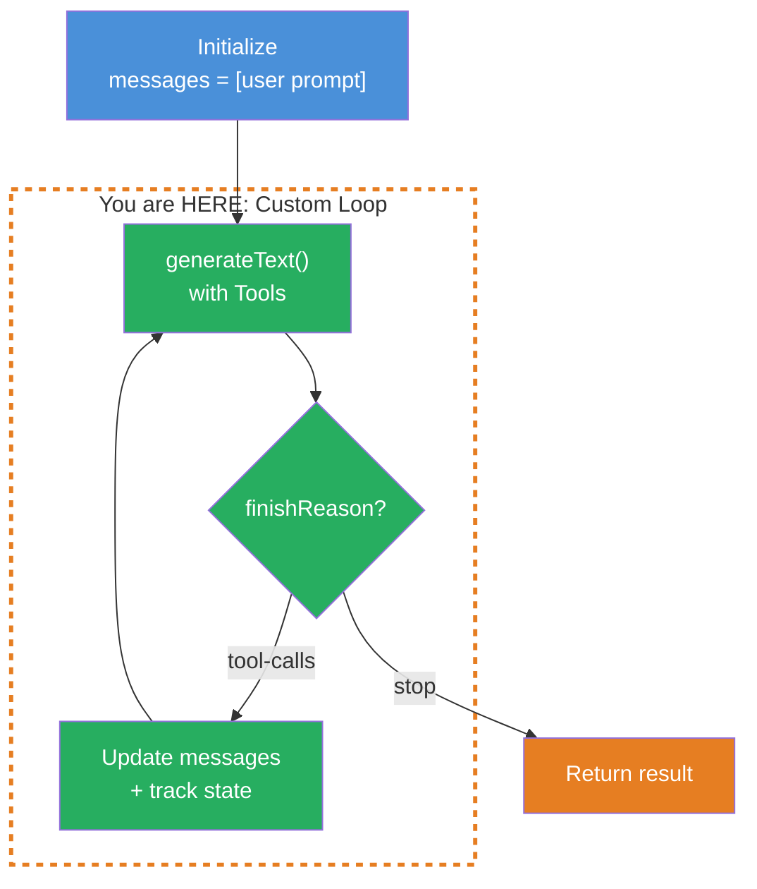
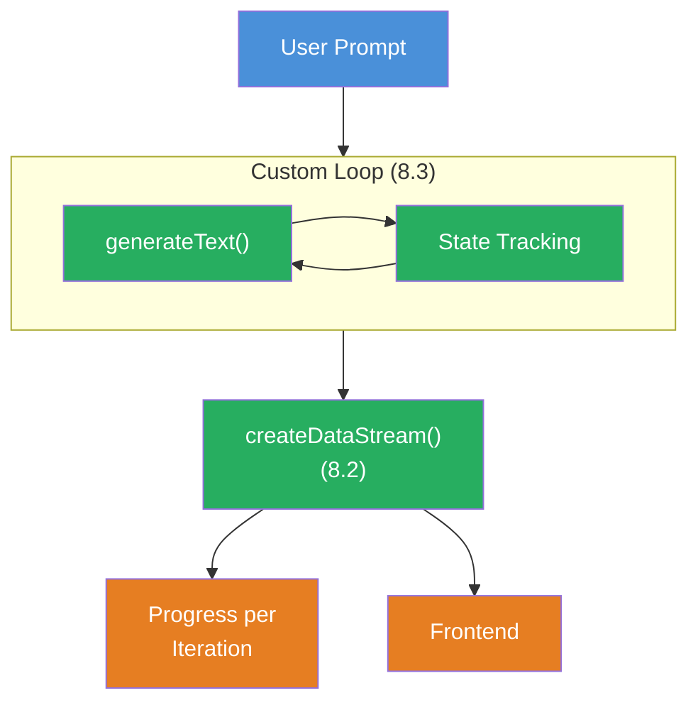

## THINK

What if you need more control than the built-in `maxSteps`/`stopWhen` pattern of `generateText` provides — e.g., custom termination conditions, state tracking, or decisions between loop iterations?

## OVERVIEW



A custom loop gives you full control over the agent lifecycle. You manage the messages array, check the `finishReason`, track your own state, and decide after each iteration whether the loop continues.

## WHY

**Without custom loop:** You use `generateText` with `maxSteps` or `stopWhen: stepCountIs(N)` (from Level 3). That's enough for standard cases. But: you can only break by step count, can't track your own state between iterations, and can't make decisions based on tool results.

**With custom loop:** Full control over the agent lifecycle. You decide after each iteration: continue or stop? You track which tools were called, how often, with what results. You can terminate based on a specific tool result — not just after N steps.

## WALKTHROUGH

### Layer 1: The Simplest Custom Loop

A while loop that calls `generateText` until the LLM returns `finishReason: 'stop'` (meaning it no longer wants to make a tool call):

```typescript
import { generateText } from 'ai';
import { anthropic } from '@ai-sdk/anthropic';
import { tool } from 'ai';
import { z } from 'zod';

const model = anthropic('claude-sonnet-4-5-20250514');

// A simple tool
const searchTool = tool({
  description: 'Search for information on a topic',
  inputSchema: z.object({
    query: z.string().describe('The search query'),
  }),
  execute: async ({ query }) => {
    // Simulated search
    return { results: [`Result for "${query}": Important facts...`] };
  },
});

// Custom Loop
const messages: Array<any> = [
  { role: 'user', content: 'Recherchiere die Vorteile von Edge Computing.' },
];

let done = false;

while (!done) {
  const result = await generateText({
    model,
    tools: { search: searchTool },
    messages,
  });

  if (result.finishReason === 'stop') {          // ← LLM is done, no more tool calls
    done = true;
    console.log('--- Final Answer ---');
    console.log(result.text);
  } else {
    messages.push(...result.response.messages);   // ← Tool calls + results added to messages array
    console.log(`Loop: ${messages.length} Messages`);
  }
}
```

The core: `result.response.messages` contains the assistant message (with tool calls) and the tool result messages. These are pushed to the `messages` array so the LLM has context in the next iteration.

### Layer 2: State Tracking

The real advantage of the custom loop — you can track your own state:

```typescript
import { generateText, tool } from 'ai';
import { anthropic } from '@ai-sdk/anthropic';
import { z } from 'zod';

const model = anthropic('claude-sonnet-4-5-20250514');

const searchTool = tool({
  description: 'Search for information',
  inputSchema: z.object({ query: z.string() }),
  execute: async ({ query }) => ({
    results: [`Facts about "${query}"...`],
  }),
});

const saveTool = tool({
  description: 'Save the final research result',
  inputSchema: z.object({ content: z.string() }),
  execute: async ({ content }) => {
    console.log('Saved:', content.slice(0, 100) + '...');
    return { saved: true };
  },
});

// State tracking
const state = {
  toolCallCount: 0,
  toolsUsed: new Set<string>(),
  iterations: 0,
};

const messages: Array<any> = [
  { role: 'user', content: 'Recherchiere Edge Computing und speichere das Ergebnis.' },
];

let done = false;

while (!done) {
  state.iterations++;

  const result = await generateText({
    model,
    tools: { search: searchTool, save: saveTool },
    messages,
  });

  // Count and track tool calls
  if (result.toolCalls.length > 0) {
    state.toolCallCount += result.toolCalls.length;
    for (const tc of result.toolCalls) {
      state.toolsUsed.add(tc.toolName);
    }
  }

  if (result.finishReason === 'stop') {
    done = true;
    console.log('--- Final Answer ---');
    console.log(result.text);
  } else {
    messages.push(...result.response.messages);
  }

  // Log state
  console.log(`Iteration ${state.iterations}: ${state.toolCallCount} Tool Calls, Tools: [${[...state.toolsUsed].join(', ')}]`);
}

console.log('\n--- Statistics ---');
console.log(`Iterations: ${state.iterations}`);
console.log(`Total tool calls: ${state.toolCallCount}`);
console.log(`Tools used: ${[...state.toolsUsed].join(', ')}`);
```

Now you see after each loop pass: How many tool calls were made? Which tools were used? This isn't possible with `ToolLoopAgent` — there you only get this information at the end.

### Layer 3: Termination Based on Tool Result

The most powerful aspect: you check a specific tool result and terminate when a condition is met:

```typescript
import { generateText, tool } from 'ai';
import { anthropic } from '@ai-sdk/anthropic';
import { z } from 'zod';

const model = anthropic('claude-sonnet-4-5-20250514');

const checkQualityTool = tool({
  description: 'Check if the research quality is sufficient',
  inputSchema: z.object({
    content: z.string().describe('The research content to check'),
  }),
  execute: async ({ content }) => {
    // Quality check (simulated here)
    const wordCount = content.split(' ').length;
    const hasSources = content.includes('Quelle') || content.includes('Source');
    const score = (wordCount > 100 ? 50 : 20) + (hasSources ? 50 : 0);
    return { score, sufficient: score >= 70 };
  },
});

const searchTool = tool({
  description: 'Search for information',
  inputSchema: z.object({ query: z.string() }),
  execute: async ({ query }) => ({
    results: [`Detailed results for "${query}". Quelle: Fachjournal 2026...`],
  }),
});

const messages: Array<any> = [
  {
    role: 'user',
    content: 'Recherchiere Edge Computing. Nutze search fuer Recherche und checkQuality um die Qualitaet zu pruefen. Stoppe erst wenn die Qualitaet ausreicht.',
  },
];

let done = false;
let qualityScore = 0;

while (!done) {
  const result = await generateText({
    model,
    tools: { search: searchTool, checkQuality: checkQualityTool },
    messages,
  });

  // Check if checkQuality was called and the result is sufficient
  for (const tc of result.toolResults) {
    if (tc.toolName === 'checkQuality' && tc.result.sufficient) {
      qualityScore = tc.result.score;
      done = true;                                // ← Termination based on tool result
      console.log(`Quality sufficient: Score ${qualityScore}`);
    }
  }

  if (result.finishReason === 'stop') {
    done = true;
  } else if (!done) {
    messages.push(...result.response.messages);
  }
}
```

This is the core advantage: you don't terminate after N steps, but when a specific tool delivers a specific result. The LLM keeps researching until the quality is right.

## TRY

**Task:** Build a custom agent loop that tracks how many tool calls were made. The loop stops when the `save` tool is called and returns `{ saved: true }`.

Create the file `custom-loop.ts` and run it with `npx tsx custom-loop.ts`.

> **Tip:** If the loop doesn't terminate on its own, abort it with `Ctrl+C`. In Challenge 8.4 you'll learn how to prevent this automatically.

```typescript
import { generateText, tool } from 'ai';
import { anthropic } from '@ai-sdk/anthropic';
import { z } from 'zod';

const model = anthropic('claude-sonnet-4-5-20250514');

// TODO 1: Define a search tool
// const searchTool = tool({ ... });

// TODO 2: Define a save tool that returns { saved: true }
// const saveTool = tool({ ... });

// TODO 3: Initialize the messages array with a user message
// const messages = [{ role: 'user', content: '...' }];

// TODO 4: Initialize state tracking (toolCallCount, iterations)

// TODO 5: Implement the while loop:
//   - Call generateText with tools
//   - Increment toolCallCount
//   - Check if save tool was called with { saved: true } → done = true
//   - If finishReason === 'stop' → done = true
//   - Otherwise: messages.push(...result.response.messages)

// TODO 6: Log the statistics at the end
```

**Checklist:**
- [ ] Messages array correctly initialized
- [ ] while loop checks `finishReason`
- [ ] `result.response.messages` is pushed to the messages array
- [ ] Tool call count is tracked
- [ ] Loop terminates when `save` tool returns `{ saved: true }`

<details>
<summary>Show solution</summary>

```typescript
import { generateText, tool } from 'ai';
import { anthropic } from '@ai-sdk/anthropic';
import { z } from 'zod';

const model = anthropic('claude-sonnet-4-5-20250514');

const searchTool = tool({
  description: 'Search for information on a topic',
  inputSchema: z.object({
    query: z.string().describe('The search query'),
  }),
  execute: async ({ query }) => ({
    results: [`Detaillierte Ergebnisse zu "${query}": Fakten und Daten...`],
  }),
});

const saveTool = tool({
  description: 'Save the final research result when research is complete',
  inputSchema: z.object({
    content: z.string().describe('The final content to save'),
  }),
  execute: async ({ content }) => {
    console.log(`\nSaved (${content.length} characters)`);
    return { saved: true };
  },
});

const messages: Array<any> = [
  {
    role: 'user',
    content: 'Recherchiere die Vorteile von Edge Computing. Nutze search fuer die Recherche. Wenn Du genug Informationen hast, nutze save um das Ergebnis zu speichern.',
  },
];

let done = false;
let toolCallCount = 0;
let iterations = 0;

while (!done) {
  iterations++;

  const result = await generateText({
    model,
    tools: { search: searchTool, save: saveTool },
    messages,
  });

  // Count tool calls
  toolCallCount += result.toolCalls.length;

  // Check if save was called with { saved: true }
  for (const tr of result.toolResults) {
    if (tr.toolName === 'save' && tr.result.saved === true) {
      done = true;
      console.log('Save tool returned saved: true. Loop terminated.');
    }
  }

  if (result.finishReason === 'stop') {
    done = true;
    console.log('--- Final Answer ---');
    console.log(result.text);
  } else if (!done) {
    messages.push(...result.response.messages);
  }

  console.log(`Iteration ${iterations}: ${toolCallCount} Tool Calls`);
}

console.log(`\n--- Statistics ---`);
console.log(`Iterations: ${iterations}`);
console.log(`Total tool calls: ${toolCallCount}`);
console.log(`Messages in array: ${messages.length}`);
```

**Expected output (approximate):**
```
Iteration 1: 1 Tool Calls
Iteration 2: 2 Tool Calls

Saved (523 characters)
Save tool returned saved: true. Loop terminated.
Iteration 3: 3 Tool Calls

--- Statistics ---
Iterations: 3
Total tool calls: 3
Messages in array: 7
```

**Explanation:** The while loop runs until either the `save` tool returns `{ saved: true }` or `finishReason === 'stop'`. After each iteration, the response messages are pushed to the array so the LLM has full context. Tool calls are counted and output as statistics at the end.

</details>

## COMBINE



**Exercise:** Combine the custom loop with the progress streaming from Challenge 8.2. After each loop iteration:

1. Send a Custom Data Part with the current iteration and tool call count
2. Send the name of the most recently called tool
3. At the end: send the overall statistics as a Data Part

```typescript
// Per iteration:
dataStream.writeData({
  type: 'iteration',
  iteration: state.iterations,
  toolCallCount: state.toolCallCount,
  lastTool: result.toolCalls.at(-1)?.toolName ?? 'none',
});
```

**Optional Stretch Goal:** Stream the agent's final text (the last `result.text` when `finishReason === 'stop'`) with `streamText` instead of `generateText`, so the user sees the final result in real time.

## Sources

- [Vercel AI SDK: Building Agents](https://ai-sdk.dev/docs/agents/building-agents)
- [Vercel AI SDK: generateText API Reference](https://ai-sdk.dev/docs/reference/ai-sdk-core/generate-text)
- [ai-hero-dev Exercise 08.03](https://github.com/ai-hero-dev/ai-sdk-v6-crash-course/tree/main/exercises/08-workflows/08.03-custom-loop)
