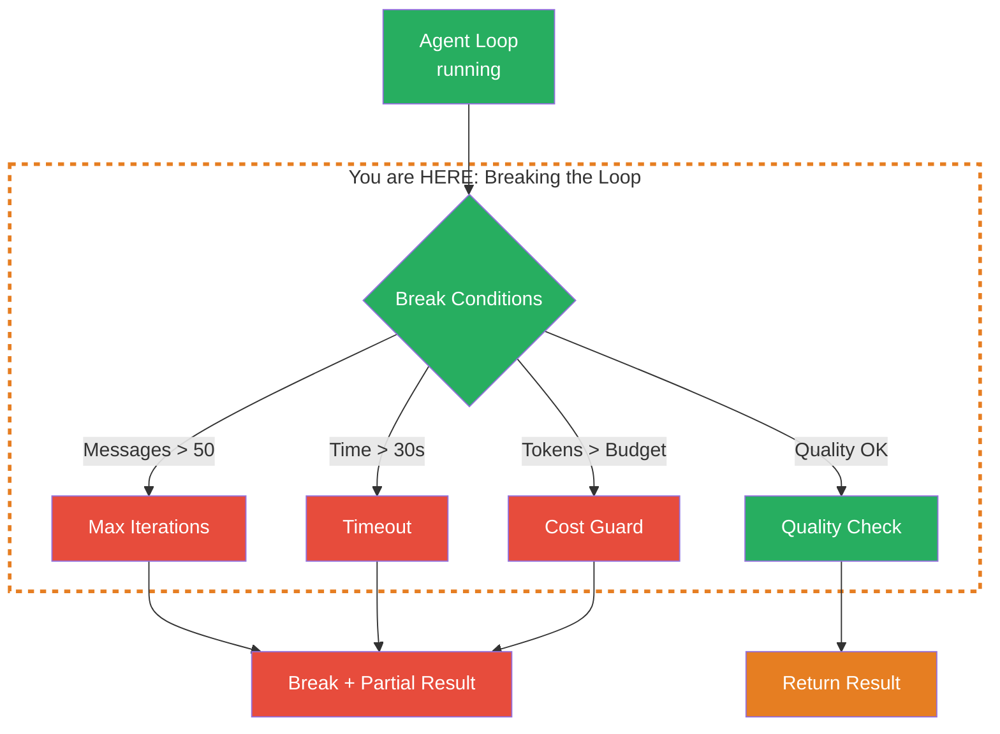
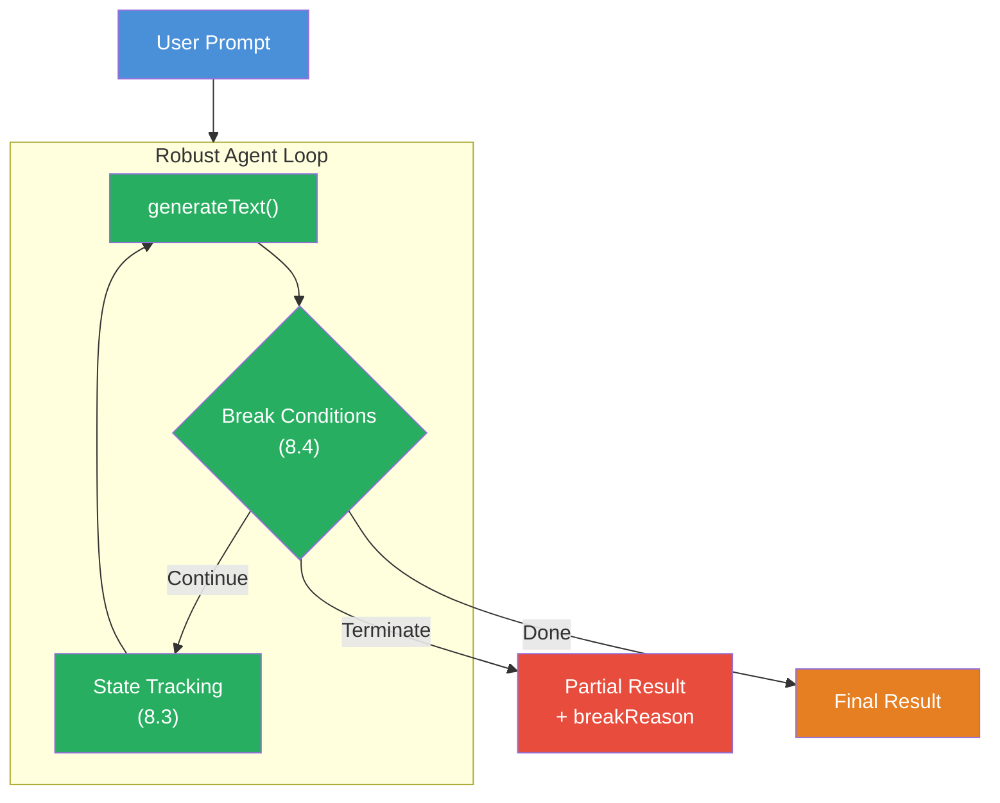

## THINK

What happens when your agent gets stuck in an infinite loop — e.g., because no tool returns the right result and the LLM keeps launching the same search over and over?

## OVERVIEW



Four break conditions protect your agent loop from uncontrolled behavior: Max Iterations prevents endless loops, Timeout stops after a defined time, Cost Guard limits token usage, and Quality Check ends the loop when the result is good enough.

## WHY

**Without break conditions:** Infinite loops, exploding costs, hanging app. The LLM calls the same tool over and over, consumes hundreds of tokens per iteration, and runs for minutes — while the user waits. Worst case: an API bill of hundreds of dollars for a single runaway loop.

**With break conditions:** Controlled termination. After at most 50 messages, 30 seconds, or 10,000 tokens it's over — no matter what the LLM does. You get the best result so far (partial result) instead of nothing. And your budget is protected.

## WALKTHROUGH

### Layer 1: Max Iterations

The simplest break condition — count messages or iterations:

```typescript
import { generateText, tool } from 'ai';
import { anthropic } from '@ai-sdk/anthropic';
import { z } from 'zod';

const model = anthropic('claude-sonnet-4-5-20250514');
const MAX_ITERATIONS = 10;
const MAX_MESSAGES = 50;

const searchTool = tool({
  description: 'Search for information',
  inputSchema: z.object({ query: z.string() }),
  execute: async ({ query }) => ({
    results: [`Results for "${query}"...`],
  }),
});

const messages: Array<any> = [
  { role: 'user', content: 'Recherchiere Edge Computing ausfuehrlich.' },
];

let done = false;
let iterations = 0;
let bestResult = '';

while (!done) {
  iterations++;

  const result = await generateText({
    model,
    tools: { search: searchTool },
    messages,
  });

  // Save best result so far
  if (result.text) {
    bestResult = result.text;
  }

  // Break Condition 1: Max Iterations
  if (iterations >= MAX_ITERATIONS) {
    console.log(`Max iterations (${MAX_ITERATIONS}) reached. Terminating.`);
    done = true;
    break;
  }

  // Break Condition 2: Max Messages (prevents context from growing too large)
  if (messages.length > MAX_MESSAGES) {
    console.log(`Max messages (${MAX_MESSAGES}) reached. Terminating.`);
    done = true;
    break;
  }

  if (result.finishReason === 'stop') {
    done = true;
    bestResult = result.text;
  } else {
    messages.push(...result.response.messages);
  }
}

// Return partial result
console.log('--- Result ---');
console.log(bestResult || 'No result generated.');
console.log(`Iterations: ${iterations}, Messages: ${messages.length}`);
```

Important: `bestResult` saves the best result so far. If the loop terminates due to max iterations, you still have an output — not an empty result.

### Layer 2: Timeout with AbortController

For time-critical applications — the loop must finish within a certain time:

```typescript
import { generateText, tool } from 'ai';
import { anthropic } from '@ai-sdk/anthropic';
import { z } from 'zod';

const model = anthropic('claude-sonnet-4-5-20250514');
const TIMEOUT_MS = 30_000; // 30 seconds

const searchTool = tool({
  description: 'Search for information',
  inputSchema: z.object({ query: z.string() }),
  execute: async ({ query }) => ({
    results: [`Results for "${query}"...`],
  }),
});

const messages: Array<any> = [
  { role: 'user', content: 'Recherchiere Edge Computing ausfuehrlich.' },
];

let done = false;
let bestResult = '';
const startTime = Date.now();

// AbortController for clean termination
const controller = new AbortController();
const timeout = setTimeout(() => {
  controller.abort();
}, TIMEOUT_MS);

try {
  while (!done) {
    // Check timeout before each call
    if (Date.now() - startTime > TIMEOUT_MS) {
      console.log(`Timeout (${TIMEOUT_MS}ms) reached. Terminating.`);
      break;
    }

    const result = await generateText({
      model,
      tools: { search: searchTool },
      messages,
      abortSignal: controller.signal,           // ← AbortSignal passed to generateText
    });

    if (result.text) {
      bestResult = result.text;
    }

    if (result.finishReason === 'stop') {
      done = true;
    } else {
      messages.push(...result.response.messages);
    }
  }
} catch (error) {
  if ((error as Error).name === 'AbortError') {
    console.log('Aborted by timeout.');
  } else {
    throw error;
  }
} finally {
  clearTimeout(timeout);                        // ← Clean up timeout
}

const duration = Date.now() - startTime;
console.log(`Result: ${bestResult.slice(0, 200)}...`);
console.log(`Duration: ${duration}ms`);
```

`abortSignal: controller.signal` passes the signal to `generateText`. When the timeout fires, the current API call is aborted. The try/catch catches the `AbortError`, and in the `finally` block we clean up the timeout.

### Layer 3: Cost Guard

Track token usage and stop when the budget is exhausted:

```typescript
import { generateText, tool } from 'ai';
import { anthropic } from '@ai-sdk/anthropic';
import { z } from 'zod';

const model = anthropic('claude-sonnet-4-5-20250514');
const MAX_TOKENS = 10_000;

const searchTool = tool({
  description: 'Search for information',
  inputSchema: z.object({ query: z.string() }),
  execute: async ({ query }) => ({
    results: [`Results for "${query}"...`],
  }),
});

const messages: Array<any> = [
  { role: 'user', content: 'Recherchiere Edge Computing.' },
];

let done = false;
let totalTokens = 0;
let bestResult = '';

while (!done) {
  const result = await generateText({
    model,
    tools: { search: searchTool },
    messages,
  });

  // Track tokens
  totalTokens += result.usage.totalTokens;

  if (result.text) {
    bestResult = result.text;
  }

  // Cost Guard: check token budget
  if (totalTokens > MAX_TOKENS) {
    console.log(`Token budget (${MAX_TOKENS}) exceeded: ${totalTokens} tokens. Terminating.`);
    done = true;
    break;
  }

  if (result.finishReason === 'stop') {
    done = true;
  } else {
    messages.push(...result.response.messages);
  }
}

console.log(`Result: ${bestResult.slice(0, 200)}...`);
console.log(`Tokens used: ${totalTokens} / ${MAX_TOKENS}`);
```

The cost guard is especially important in production. A single `generateText` call might consume 500 tokens. But a loop with 20 iterations? 10,000 tokens. Without a budget limit, that can get expensive.

### Layer 4: All Safeguards Combined

In production you combine all break conditions:

```typescript
import { generateText, tool } from 'ai';
import { anthropic } from '@ai-sdk/anthropic';
import { z } from 'zod';

const model = anthropic('claude-sonnet-4-5-20250514');

// Configurable limits
const LIMITS = {
  maxIterations: 10,
  maxMessages: 50,
  maxTokens: 10_000,
  timeoutMs: 30_000,
};

const searchTool = tool({
  description: 'Search for information',
  inputSchema: z.object({ query: z.string() }),
  execute: async ({ query }) => ({
    results: [`Results for "${query}"...`],
  }),
});

type BreakReason = 'complete' | 'max-iterations' | 'max-messages' | 'max-tokens' | 'timeout' | 'error';

async function robustAgentLoop(prompt: string) {
  const messages: Array<any> = [{ role: 'user', content: prompt }];
  let iterations = 0;
  let totalTokens = 0;
  let bestResult = '';
  let breakReason: BreakReason = 'complete';
  const startTime = Date.now();

  const controller = new AbortController();
  const timeout = setTimeout(() => controller.abort(), LIMITS.timeoutMs);

  try {
    while (true) {
      iterations++;

      // Pre-check: verify limits BEFORE the next call starts
      if (iterations > LIMITS.maxIterations) {
        breakReason = 'max-iterations';
        break;
      }
      if (messages.length > LIMITS.maxMessages) {
        breakReason = 'max-messages';
        break;
      }
      if (totalTokens > LIMITS.maxTokens) {
        breakReason = 'max-tokens';
        break;
      }
      if (Date.now() - startTime > LIMITS.timeoutMs) {
        breakReason = 'timeout';
        break;
      }

      const result = await generateText({
        model,
        tools: { search: searchTool },
        messages,
        abortSignal: controller.signal,
      });

      totalTokens += result.usage.totalTokens;

      if (result.text) {
        bestResult = result.text;
      }

      if (result.finishReason === 'stop') {
        breakReason = 'complete';
        break;
      }

      messages.push(...result.response.messages);
    }
  } catch (error) {
    if ((error as Error).name === 'AbortError') {
      breakReason = 'timeout';
    } else {
      breakReason = 'error';
      console.error('Unexpected error:', error);
    }
  } finally {
    clearTimeout(timeout);
  }

  return {
    result: bestResult,
    breakReason,
    stats: {
      iterations,
      totalTokens,
      durationMs: Date.now() - startTime,
      messageCount: messages.length,
    },
  };
}

// Execute
const output = await robustAgentLoop('Recherchiere Edge Computing ausfuehrlich.');

console.log('--- Result ---');
console.log(output.result.slice(0, 300));
console.log('\n--- Break Reason ---');
console.log(output.breakReason);
console.log('\n--- Statistics ---');
console.log(JSON.stringify(output.stats, null, 2));
```

The function always returns a result — including `breakReason`. The caller knows whether the agent finished (`complete`) or whether a limit kicked in. This is important for monitoring and debugging.

## TRY

**Task:** Extend the custom loop from Challenge 8.3 with a timeout and a max-iterations guard.

Create the file `guarded-loop.ts` and run it with `npx tsx guarded-loop.ts`.

```typescript
import { generateText, tool } from 'ai';
import { anthropic } from '@ai-sdk/anthropic';
import { z } from 'zod';

const model = anthropic('claude-sonnet-4-5-20250514');

// TODO 1: Define LIMITS (maxIterations: 5, timeoutMs: 30000)

// TODO 2: Define search tool and save tool

// TODO 3: Initialize messages, state, startTime, AbortController

// TODO 4: Implement the loop with ALL safeguards:
//   - Check max iterations
//   - Check timeout
//   - Pass abortSignal to generateText
//   - try/catch for AbortError
//   - Save bestResult

// TODO 5: Return the result with breakReason and statistics
```

**Checklist:**
- [ ] Max-iterations guard implemented (loop breaks after N iterations)
- [ ] Timeout with `AbortController` and `setTimeout` implemented
- [ ] `abortSignal` is passed to `generateText`
- [ ] `AbortError` is caught in the catch block
- [ ] `bestResult` is updated on every text result
- [ ] `breakReason` indicates why the loop terminated

<details>
<summary>Show solution</summary>

```typescript
import { generateText, tool } from 'ai';
import { anthropic } from '@ai-sdk/anthropic';
import { z } from 'zod';

const model = anthropic('claude-sonnet-4-5-20250514');

const LIMITS = {
  maxIterations: 5,
  timeoutMs: 30_000,
};

const searchTool = tool({
  description: 'Search for information on a topic',
  inputSchema: z.object({ query: z.string() }),
  execute: async ({ query }) => ({
    results: [`Facts about "${query}": Important developments...`],
  }),
});

const saveTool = tool({
  description: 'Save the final research result',
  inputSchema: z.object({ content: z.string() }),
  execute: async ({ content }) => ({ saved: true }),
});

type BreakReason = 'complete' | 'save-complete' | 'max-iterations' | 'timeout' | 'error';

async function guardedLoop(prompt: string) {
  const messages: Array<any> = [{ role: 'user', content: prompt }];
  let iterations = 0;
  let totalTokens = 0;
  let bestResult = '';
  let breakReason: BreakReason = 'complete';
  const startTime = Date.now();

  const controller = new AbortController();
  const timeout = setTimeout(() => controller.abort(), LIMITS.timeoutMs);

  try {
    while (true) {
      iterations++;

      // Guard: Max Iterations
      if (iterations > LIMITS.maxIterations) {
        breakReason = 'max-iterations';
        console.log(`Max iterations (${LIMITS.maxIterations}) reached.`);
        break;
      }

      // Guard: Timeout (in addition to AbortController)
      if (Date.now() - startTime > LIMITS.timeoutMs) {
        breakReason = 'timeout';
        console.log(`Timeout (${LIMITS.timeoutMs}ms) reached.`);
        break;
      }

      const result = await generateText({
        model,
        tools: { search: searchTool, save: saveTool },
        messages,
        abortSignal: controller.signal,
      });

      totalTokens += result.usage.totalTokens;

      if (result.text) {
        bestResult = result.text;
      }

      // Check if save tool was called
      for (const tr of result.toolResults) {
        if (tr.toolName === 'save' && tr.result.saved) {
          breakReason = 'save-complete';
          console.log('Save tool successful. Loop terminated.');
          break;
        }
      }
      if (breakReason === 'save-complete') break;

      if (result.finishReason === 'stop') {
        breakReason = 'complete';
        bestResult = result.text;
        break;
      }

      messages.push(...result.response.messages);
      console.log(`Iteration ${iterations}: ${totalTokens} tokens, ${messages.length} messages`);
    }
  } catch (error) {
    if ((error as Error).name === 'AbortError') {
      breakReason = 'timeout';
      console.log('Aborted by AbortController.');
    } else {
      breakReason = 'error';
      console.error('Error:', error);
    }
  } finally {
    clearTimeout(timeout);
  }

  return {
    result: bestResult,
    breakReason,
    stats: {
      iterations,
      totalTokens,
      durationMs: Date.now() - startTime,
    },
  };
}

const output = await guardedLoop(
  'Recherchiere Edge Computing. Nutze search fuer Recherche, dann save um das Ergebnis zu speichern.',
);

console.log('\n--- Result ---');
console.log(output.result || 'No result.');
console.log(`Break reason: ${output.breakReason}`);
console.log(`Stats: ${JSON.stringify(output.stats)}`);
```

**Expected output (approximate):**
```
Iteration 1: 487 tokens, 3 messages
Iteration 2: 974 tokens, 5 messages
Save tool successful. Loop terminated.

--- Result ---
[Research text appears here]
Break reason: save-complete
Stats: {"iterations":2,"totalTokens":974,"durationMs":4521}
```

**Explanation:** Two safeguards protect the loop: max iterations (pre-check before each call) and timeout (via `AbortController` + manual check). The loop always returns a result — even on termination. The `breakReason` indicates whether the agent finished or a limit kicked in.

</details>

## COMBINE



**Exercise:** Build a robust agent with ALL safeguards. Combine:

1. **Max Iterations** (8.4) — maximum 10 iterations
2. **Timeout** (8.4) — maximum 30 seconds
3. **Cost Guard** (8.4) — maximum 5,000 tokens
4. **Quality Check** (8.3) — a `checkQuality` tool that ends the loop when `score >= 70`
5. **Progress Streaming** (8.2) — after each iteration a Data Part with iteration, tokens, and current guard status

The agent should research, check the quality, and terminate as soon as one of the five conditions is met. The result always contains `breakReason` and `stats`.

**Optional Stretch Goal:** Add a "Budget Warning" Data Part that is sent when 80% of the token budget is consumed. The frontend can then display a yellow warning before the cost guard kicks in.

## Sources

- [Vercel AI SDK: Building Agents](https://ai-sdk.dev/docs/agents/building-agents)
- [Vercel AI SDK: generateText API Reference](https://ai-sdk.dev/docs/reference/ai-sdk-core/generate-text)
- [MDN: AbortController](https://developer.mozilla.org/en-US/docs/Web/API/AbortController)
- [ai-hero-dev Exercise 08.04](https://github.com/ai-hero-dev/ai-sdk-v6-crash-course/tree/main/exercises/08-workflows/08.04-breaking-the-loop)
