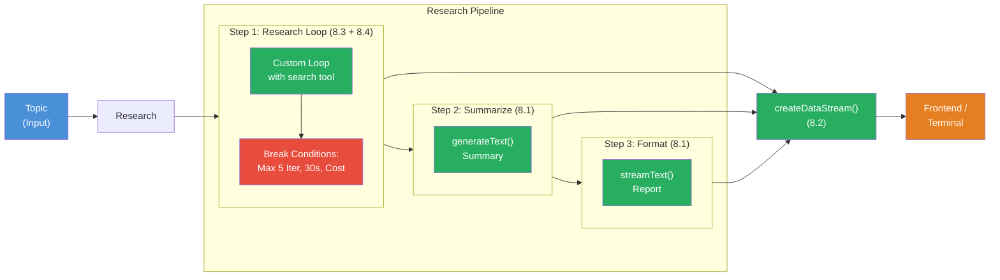

## The Scenario

You're building a **Multi-Step Research Pipeline** — a system that autonomously researches a topic, streams progress in real time, summarizes the results, and is protected with safeguards against uncontrolled behavior.

Your pipeline should feel like this:

```
[Step 1/3: Research] Researching...
  Iteration 1: search("Edge Computing advantages") — 342 Tokens
  Iteration 2: search("Edge Computing vs Cloud") — 289 Tokens
  Iteration 3: search("Edge Computing Use Cases 2026") — 311 Tokens
[Step 1/3: Research] Done. 3 iterations, 942 Tokens.

[Step 2/3: Summarize] Summarizing...
  5 key takeaways generated.
[Step 2/3: Summarize] Done. 187 Tokens.

[Step 3/3: Format] Formatting as report...
  Edge Computing has established itself as a key technology...
  The main advantages are: lower latency, data privacy...
[Step 3/3: Format] Done.

[Pipeline] Completed in 12.4s. Total: 1,547 Tokens. Break reason: complete.
```

This project connects all four building blocks:



## Requirements

1. **Research Loop** (Challenge 8.3 + 8.4) — Step 1 is a custom agent loop with a `search` tool. The LLM decides which search terms to use. The loop has three break conditions: maximum 5 iterations, 30-second timeout, 5,000 tokens cost limit. The loop returns partial results if a limit kicks in.

2. **Workflow** (Challenge 8.1) — Step 2 takes the research results from Step 1 and summarizes them into 5 key takeaways with `generateText`. Step 3 formats the summary as a report — using `streamText`, so the user sees the text in real time.

3. **Progress Streaming** (Challenge 8.2) — Each step sends Custom Data Parts:
   - Before start: `{ step: N, total: 3, label: '...' }`
   - Per research iteration: `{ step: 1, iteration: N, query: '...', tokens: N }`
   - After completion: `{ step: N, total: 3, status: 'done', tokens: N }`
   - At the end: `{ type: 'stats', totalTokens, durationMs, breakReason, iterations }`

4. **Safeguards** (Challenge 8.4) — The research loop has an `AbortController` with a 30-second timeout. `abortSignal` is passed to `generateText`. Token usage is tracked per iteration and checked against the budget. On termination, `breakReason` is set and the best result so far is processed further.

5. **Robustness** — The pipeline works even on termination: if Step 1 aborts due to timeout, Steps 2 and 3 still run with the partial result. The final output always contains the `breakReason` and statistics.

## Starter Code

```typescript
import { createDataStream, generateText, streamText, tool } from 'ai';
import { anthropic } from '@ai-sdk/anthropic';
import { z } from 'zod';

const model = anthropic('claude-sonnet-4-5-20250514');

const LIMITS = {
  maxIterations: 5,
  timeoutMs: 30_000,
  maxTokens: 5_000,
};

// TODO: Define search tool

// TODO: researchLoop(topic, dataStream) — Custom loop with break conditions

// TODO: summarize(researchResult, dataStream) — generateText for summary

// TODO: format(summary, dataStream) — streamText for report + mergeIntoDataStream

// TODO: createDataStream with execute function that runs all three steps

// TODO: Consume stream in terminal (see Challenge 8.2, Layer 3)
```

## Evaluation Criteria

Your Boss Fight is passed when:

- [ ] The research loop uses a custom while loop with a messages array
- [ ] At least one tool (search) is used in the loop
- [ ] Max-iterations guard is implemented (maximum 5 iterations)
- [ ] Timeout guard with `AbortController` is implemented (30 seconds)
- [ ] Cost guard tracks tokens and terminates on exceeding the limit
- [ ] Progress Data Parts are sent before, during, and after each step
- [ ] The summary (Step 2) uses the output from Step 1 as input
- [ ] The report (Step 3) is streamed with `streamText` + `mergeIntoDataStream`

## Hints

<details>
<summary>Hint 1: Research Loop Structure</summary>

Encapsulate the research loop in its own `async function researchLoop(topic: string, dataStream: DataStream)`. The function returns `{ result: string, breakReason: string, stats: {...} }`. Inside the function: `while (true)` with pre-checks for all three limits, then `generateText`, then check the result.

</details>

<details>
<summary>Hint 2: Passing DataStream to Sub-functions</summary>

The `execute` function of `createDataStream` receives the `dataStream` controller. Pass it to all three step functions so they can call `dataStream.writeData()`. Only Step 3 uses `mergeIntoDataStream` — the other steps use `generateText` and need the text as a string for the next step.

</details>

<details>
<summary>Hint 3: Processing Partial Results</summary>

When the research loop aborts due to timeout, it has still saved `bestResult` — the text from the last iteration. Return this as `result`. Step 2 (Summarize) then continues with the partial result. The pipeline always runs to completion — only Step 1 may be cut short.

</details>

<details>
<summary>Hint 4: AbortController Scope</summary>

Create the `AbortController` inside the `researchLoop` function, not globally. Each pipeline run gets its own controller. Don't forget `clearTimeout(timeout)` in the `finally` block, otherwise the timeout stays active and the process won't exit.

</details>

## Sources

- [Vercel AI SDK: Generating Text](https://ai-sdk.dev/docs/ai-sdk-core/generating-text)
- [Vercel AI SDK: Building Agents](https://ai-sdk.dev/docs/agents/building-agents)
- [Vercel AI SDK: Data Streams](https://ai-sdk.dev/docs/ai-sdk-core/data-streams)
- [MDN: AbortController](https://developer.mozilla.org/en-US/docs/Web/API/AbortController)
- [ai-hero-dev Exercises 08.01-08.04](https://github.com/ai-hero-dev/ai-sdk-v6-crash-course/tree/main/exercises/08-workflows)
