You now orchestrate production-grade AI workflows — sequential pipelines with progress streaming, custom agent loops with state tracking, and robust safeguards against uncontrolled behavior. From single calls to orchestrated pipelines, from prototype to robust application.

## What You Learned

- **Workflows:** Chain multiple `generateText` calls sequentially — output of Step N becomes input of Step N+1. Each step has its own system prompt, its own role. Individually testable, individually debuggable. Token tracking across the entire pipeline.
- **Streaming to Frontend:** Stream workflow progress to the frontend in real time with `createDataStream` and `writeData`. Custom Data Parts for step updates, `mergeIntoDataStream` for the final text stream. One channel for progress and text — synchronous and in the correct order.
- **Custom Loop:** Build your own agent loops with a while loop and messages array. Push `result.response.messages` back for context continuity. State tracking (tool call count, tools used), termination based on specific tool results instead of just step count.
- **Breaking the Loop:** Four safeguards against uncontrolled behavior — max iterations, timeout with `AbortController`, cost guard (token budget), and quality check. Partial results instead of empty results on termination. `breakReason` for monitoring and debugging.

## Updated Skill Tree

```mermaid
graph LR
  subgraph "Unlocked"
    L1["Level 1: AI SDK Basics"]
    L2["Level 2: LLM Fundamentals"]
    L3["Level 3: Agents & MCP"]
    L4["Level 4: Persistence"]
    L5["Level 5: Context Engineering"]
    L6["Level 6: Evals"]
    L7["Level 7: Streaming"]
    L8["Level 8: Workflows"]
  end
  subgraph NEXT["Next Level"]
    L9["Level 9: Advanced Patterns"]
  end
  L1 --> L2
  L2 --> L3
  L3 --> L4
  L4 --> L5
  L5 --> L6
  L6 --> L7
  L7 --> L8
  L8 --> L9
  style L1 fill:#27AE60,color:#fff
  style L2 fill:#27AE60,color:#fff
  style L3 fill:#27AE60,color:#fff
  style L4 fill:#27AE60,color:#fff
  style L5 fill:#27AE60,color:#fff
  style L6 fill:#27AE60,color:#fff
  style L7 fill:#27AE60,color:#fff
  style L8 fill:#27AE60,color:#fff
  style NEXT fill:none,stroke:#E67E22,stroke-width:3px,stroke-dasharray:5 5
  style L9 fill:#E67E22,color:#fff
```

## Boss Fight Recap

In the Boss Fight you built a **Multi-Step Research Pipeline** — a system with a custom agent loop, break conditions, sequential workflow, and real-time streaming. Your pipeline researches autonomously, summarizes, formats — and is protected against infinite loops, timeouts, and exploding costs. This is the pattern that separates production AI systems from prototypes.

## Next Level

**Level 9: Advanced Patterns** — The finale. Guardrails protect your app from harmful inputs and outputs. Model routing automatically selects the right model for each task. Multi-output compares results from different models. Production-ready patterns that make the difference between a prototype and a robust AI application.
