import { CardGrid, LinkCard } from '@astrojs/starlight/components';

## TL;DR

> Production patterns: Guardrails protect your app from harmful inputs and outputs. Model Routing optimizes costs by choosing the right model size for each task. Multi-Output compares quality across multiple models. The finale for production-ready AI.

## Skill Tree

```mermaid
graph LR
  subgraph "Unlocked"
    L1["Level 1: AI SDK Basics"]
    L2["Level 2: LLM Fundamentals"]
    L3["Level 3: Agents & MCP"]
    L4["Level 4: Persistence"]
    L5["Level 5: Context Engineering"]
    L6["Level 6: Evals"]
    L7["Level 7: Streaming"]
    L8["Level 8: Workflows"]
  end
  subgraph HIER["Current Level"]
    L9["Level 9: Advanced Patterns"]
  end
  L1 --> L2
  L2 --> L3
  L3 --> L4
  L4 --> L5
  L5 --> L6
  L6 --> L7
  L7 --> L8
  L8 --> L9
  style L1 fill:#27AE60,color:#fff
  style L2 fill:#27AE60,color:#fff
  style L3 fill:#27AE60,color:#fff
  style L4 fill:#27AE60,color:#fff
  style L5 fill:#27AE60,color:#fff
  style L6 fill:#27AE60,color:#fff
  style L7 fill:#27AE60,color:#fff
  style L8 fill:#27AE60,color:#fff
  style HIER fill:none,stroke:#E67E22,stroke-width:3px,stroke-dasharray:5 5
  style L9 fill:#E67E22,color:#fff
```

## What You'll Learn

- **Guardrails** — Input and output checks that prevent prompt injection, PII leaks, and toxic outputs
- **Model Router** — Automatically choose the right model for each task: cheap for simple tasks, powerful for complex ones
- **Comparing Outputs** — Query multiple models in parallel and systematically compare results
- **Research Workflow** — An end-to-end pipeline that combines all concepts from 9 levels

## Why This Matters

You've spent 8 levels learning to build AI systems — generating text, using tools, orchestrating workflows. But a prototype is not a production app. What happens when a user tells your LLM "Ignore all instructions"? What if you use the most expensive model for every simple question? What if you don't know which model gives the best answer?

The concrete problem: You want an AI system that is secure, cost-efficient, and quality-tested. Guardrails protect, Model Routing optimizes, Comparing Outputs proves quality. In the Boss Fight you'll build a system that combines everything.

## Prerequisites

- **Level 1: AI SDK Basics** — `generateText`, `streamText`, `Output.object` (Challenge 1.3-1.6)
- **Level 3: Agents & MCP** — Tool Calling, Multi-Step Agents (Challenge 3.1-3.3)
- **Level 5: Context Engineering** — XML-structured prompts, Rules Section (Challenge 5.1-5.3)
- **Level 8: Workflows** — Sequential pipelines, Custom Loops, Break Conditions (Challenge 8.1-8.4)
- Recommended: **Level 2** (Token costs), **Level 6** (Evals), **Level 7** (Streaming)

> **Project directory:** Create a new folder `level-9-advanced/` and work there.

> **Skip note:** You're already implementing guardrails, automatically routing between models, and using LLM-as-a-Judge for quality comparisons? Jump straight to the [Boss Fight](/en/level-9-advanced/06-boss-fight/) and build a production-ready AI system.

## Challenges

<CardGrid>
  <LinkCard title="9.1 — Guardrails" description="Input checks (injection, PII), output checks (toxicity, format), middleware pattern" href="/en/level-9-advanced/02-guardrails/" />
  <LinkCard title="9.2 — Model Router" description="Task classification, dynamic routing, cost optimization" href="/en/level-9-advanced/03-model-router/" />
  <LinkCard title="9.3 — Comparing Outputs" description="Parallel model calls, LLM-as-a-Judge, systematic comparison" href="/en/level-9-advanced/04-comparing-outputs/" />
  <LinkCard title="9.4 — Research Workflow" description="End-to-end pipeline, all concepts combined, production-ready" href="/en/level-9-advanced/05-research-workflow/" />
</CardGrid>

## Boss Fight

Build a **production-ready AI system** — the ultimate project that combines all 9 levels. Guardrails protect input and output. A Model Router selects the optimal model. Comparing Outputs ensures quality. A multi-step research pipeline orchestrates everything. Tools, streaming, cost tracking, and eval coverage included.

## Sources for This Level

- [Vercel AI SDK: Generating Text](https://ai-sdk.dev/docs/ai-sdk-core/generating-text)
- [Vercel AI SDK: Building Agents](https://ai-sdk.dev/docs/agents/building-agents)
- [Anthropic: Prompt Engineering](https://docs.anthropic.com/en/docs/build-with-claude/prompt-engineering/overview)
- [ai-hero-dev Exercises 09.01-09.04](https://github.com/ai-hero-dev/ai-sdk-v6-crash-course/tree/main/exercises/09-production-patterns)
