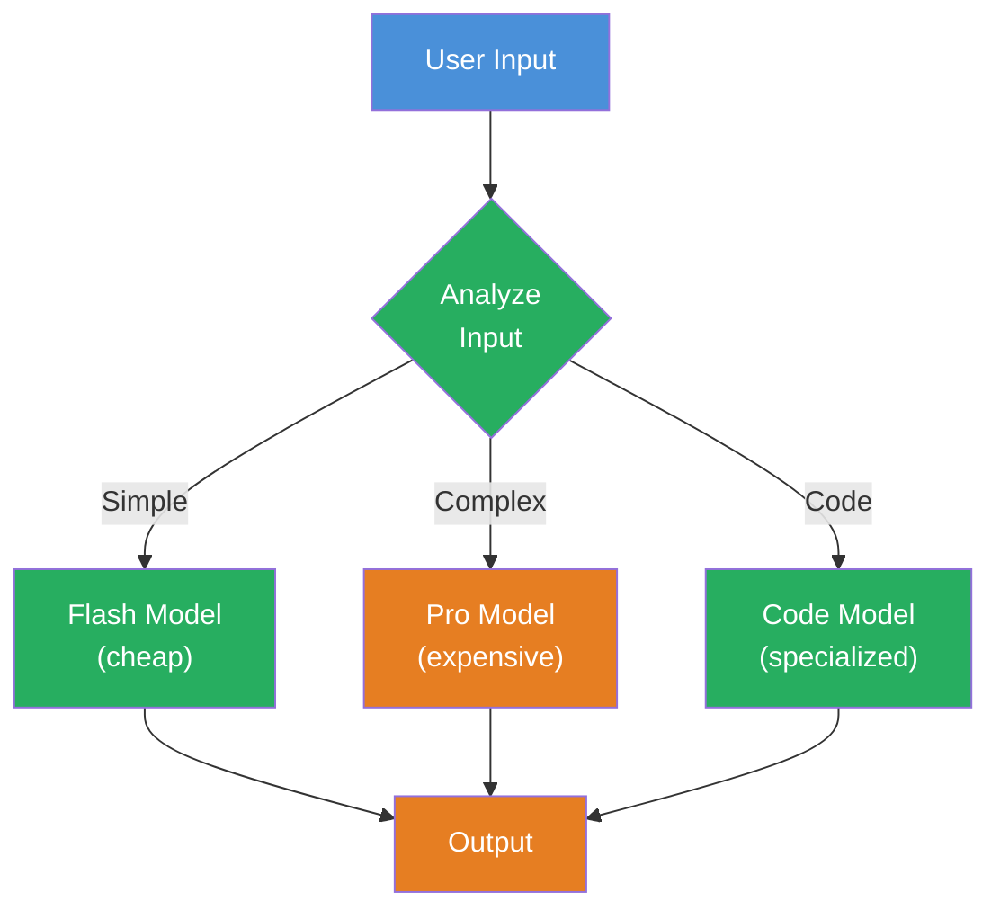

## THINK

Would you use the same model for the question "What time is it?" as for "Analyze this 500-line code and find the performance bug"? What does it cost if you always use the most expensive model?

## OVERVIEW



The input is analyzed and classified. Simple tasks go to a fast, cheap flash model. Complex tasks to a powerful pro model. Code tasks to a specialized code model. Result: optimal price-performance ratio.

## WHY

**Without Model Routing:** You use an expensive model for everything. Simple questions like "What is TypeScript?" cost as much as complex analyses. At 10,000 requests per day, costs add up quickly. Or you use a cheap model for everything — then quality suffers on complex tasks.

**With Model Routing:** Each task gets the right model. 80% of requests are simple and go to the flash model (10-50x cheaper). 20% are complex and get the pro model. Result: same quality, drastically lower costs.

## WALKTHROUGH

### Layer 1: Simple Router by Task Type

The simplest variant — a function that selects the model based on task type:

```typescript
import { anthropic } from '@ai-sdk/anthropic';
import { google } from '@ai-sdk/google';
import { generateText } from 'ai';

function selectModel(task: 'simple' | 'complex' | 'code') {
  switch (task) {
    case 'simple':
      return google('gemini-2.5-flash-lite');          // ← Cheap + fast
    case 'complex':
      return anthropic('claude-opus-4-6');              // ← Expensive + powerful
    case 'code':
      return anthropic('claude-sonnet-4-5-20250514');   // ← Good price-performance ratio for code
  }
}

// Usage
const result = await generateText({
  model: selectModel('simple'),
  prompt: 'Was ist TypeScript?',
});
console.log(result.text);
```

The caller explicitly decides which type applies. Simple, but limited — the human has to classify.

### Layer 2: Dynamic Routing by Input Length

Instead of manual classification: automatically decide based on token count:

```typescript
import { anthropic } from '@ai-sdk/anthropic';
import { google } from '@ai-sdk/google';
import { generateText } from 'ai';

function estimateTokens(text: string): number {
  return Math.ceil(text.split(/\s+/).length * 1.3);    // ← Rough estimate: words * 1.3
}

function selectByComplexity(input: string) {
  const tokens = estimateTokens(input);
  console.log(`Estimated tokens: ${tokens}`);

  if (tokens < 50) {
    console.log('Route: Flash (simple request)');
    return google('gemini-2.5-flash-lite');             // ← Short requests = simple
  }
  if (tokens < 200) {
    console.log('Route: Sonnet (medium request)');
    return anthropic('claude-sonnet-4-5-20250514');     // ← Medium requests = standard
  }
  console.log('Route: Opus (complex request)');
  return anthropic('claude-opus-4-6');                  // ← Long requests = complex
}

// Test
const simpleResult = await generateText({
  model: selectByComplexity('Was ist TypeScript?'),
  prompt: 'Was ist TypeScript?',
});
console.log(simpleResult.text);
```

Token-based routing is a good first step — long prompts often indicate complex tasks. But length alone is not a perfect proxy for complexity.

### Layer 3: LLM-Based Routing

The cleverest variant — a small, fast model classifies the task, and the result determines the model:

```typescript
import { anthropic } from '@ai-sdk/anthropic';
import { google } from '@ai-sdk/google';
import { generateText, Output } from 'ai';
import { z } from 'zod';

// Step 1: Classification with a small model
async function classifyTask(input: string) {
  const result = await generateText({
    model: google('gemini-2.5-flash-lite'),             // ← Small model for classification
    system: `Klassifiziere die folgende Aufgabe in eine Kategorie.
- "simple": Einfache Fragen, Definitionen, kurze Antworten
- "complex": Analyse, Vergleich, Argumentation, kreatives Schreiben
- "code": Code schreiben, debuggen, reviewen, erklaeren`,
    prompt: input,
    experimental_output: Output.enum(['simple', 'complex', 'code']),  // ← From Level 1.5
  });
  return result.experimental_output;
}

// Step 2: Select model based on classification
function selectByClassification(classification: 'simple' | 'complex' | 'code') {
  switch (classification) {
    case 'simple':  return google('gemini-2.5-flash-lite');
    case 'complex': return anthropic('claude-opus-4-6');
    case 'code':    return anthropic('claude-sonnet-4-5-20250514');
  }
}

// Step 3: Routing pipeline
async function routedGenerate(input: string) {
  const taskType = await classifyTask(input);           // ← LLM classifies
  console.log(`Classification: ${taskType}`);

  const model = selectByClassification(taskType);       // ← Model is selected
  const result = await generateText({ model, prompt: input });

  console.log(`Tokens: ${result.usage.totalTokens}`);
  return result.text;
}

// Test
const answer = await routedGenerate(
  'Vergleiche die Vor- und Nachteile von REST vs. GraphQL fuer eine Microservices-Architektur.',
);
console.log(answer);
```

Two LLM calls instead of one — but the first (classification) is extremely cheap and fast. The cost of classification is negligible compared to the savings when 80% of requests go to the flash model.

### Layer 4: Cost Comparison

What does Model Routing actually save? An overview of model costs (as of early 2026):

| Model | Input (per 1M Tokens) | Output (per 1M Tokens) | Strength |
|-------|----------------------|------------------------|----------|
| Gemini 2.5 Flash Lite | ~$0.075 | ~$0.30 | Simple tasks |
| Claude Sonnet 4.5 | ~$3.00 | ~$15.00 | All-rounder |
| Claude Opus 4.6 | ~$15.00 | ~$75.00 | Complex analysis |

**Example calculation:** 10,000 requests per day, averaging 500 input + 1,000 output tokens.

- **Without routing** (all Opus): ~$900/day
- **With routing** (80% Flash, 15% Sonnet, 5% Opus): ~$55/day

That's a savings of over 90% — with comparable quality, because simple requests don't need Opus.

## TRY

**Task:** Build a model router that classifies input and routes to the appropriate model.

```typescript
import { anthropic } from '@ai-sdk/anthropic';
import { google } from '@ai-sdk/google';
import { generateText, Output } from 'ai';
import { z } from 'zod';

// TODO 1: Implement classifyTask(input: string)
//   - Use a small model (gemini-2.5-flash-lite)
//   - Classify into 'simple', 'complex', or 'code'
//   - Use Output.enum for type-safe output

// TODO 2: Implement selectModel(classification)
//   - 'simple'  → google('gemini-2.5-flash-lite')
//   - 'complex' → anthropic('claude-opus-4-6')
//   - 'code'    → anthropic('claude-sonnet-4-5-20250514')

// TODO 3: Build a routedGenerate function that:
//   - First classifies
//   - Then calls the appropriate model
//   - Logs the token usage

// TODO 4: Test with these inputs:
//   - 'Was ist eine Variable?'                    (→ simple)
//   - 'Vergleiche SQL vs. NoSQL Datenbanken'      (→ complex)
//   - 'Schreibe eine Funktion die Arrays sortiert' (→ code)
```

**Checklist:**
- [ ] Classification with a small model implemented
- [ ] `Output.enum` used for type-safe classification
- [ ] Three different models depending on task type
- [ ] Token usage is logged
- [ ] Correct assignment for the three test inputs

<details>
<summary>Show solution</summary>

```typescript
import { anthropic } from '@ai-sdk/anthropic';
import { google } from '@ai-sdk/google';
import { generateText, Output } from 'ai';
import { z } from 'zod';

async function classifyTask(input: string) {
  const result = await generateText({
    model: google('gemini-2.5-flash-lite'),
    system: `Klassifiziere die Aufgabe:
- "simple": Definitionen, kurze Fragen, Fakten
- "complex": Analyse, Vergleich, Argumentation
- "code": Code schreiben, debuggen, erklaeren`,
    prompt: input,
    experimental_output: Output.enum(['simple', 'complex', 'code']),
  });
  return result.experimental_output;
}

function selectModel(classification: 'simple' | 'complex' | 'code') {
  const models = {
    simple: google('gemini-2.5-flash-lite'),
    complex: anthropic('claude-opus-4-6'),
    code: anthropic('claude-sonnet-4-5-20250514'),
  };
  return models[classification];
}

async function routedGenerate(input: string) {
  // Classification
  const taskType = await classifyTask(input);
  console.log(`Classification: ${taskType}`);

  // Routing
  const model = selectModel(taskType);
  const result = await generateText({ model, prompt: input });

  console.log(`Tokens: ${result.usage.totalTokens}`);
  return { text: result.text, taskType, tokens: result.usage.totalTokens };
}

// Tests
const testInputs = [
  'Was ist eine Variable?',
  'Vergleiche SQL vs. NoSQL Datenbanken fuer eine E-Commerce-Plattform',
  'Schreibe eine TypeScript-Funktion die ein Array von Zahlen sortiert',
];

for (const input of testInputs) {
  console.log(`\n--- Input: "${input}" ---`);
  const result = await routedGenerate(input);
  console.log(`Response: ${result.text.slice(0, 100)}...`);
}
```

**Explanation:** Two LLM calls per request — the first (classification) costs almost nothing with Flash Lite. The second call goes to the appropriate model. The `Output.enum` function from Level 1.5 guarantees that the classification is always one of the three allowed values.

</details>

## COMBINE


**Exercise:** Combine the Model Router with Usage Tracking from Level 2.2. Build a system that:

1. **Classifies** — every request is categorized as `simple`, `complex`, or `code`
2. **Routes** — the appropriate model is selected
3. **Tracks** — token usage and estimated costs are logged per request
4. **Compares** — after 10 requests: How much would you have paid with "all Opus" vs. with routing?

Calculate estimated costs with these rates (simplified):
- Flash Lite: $0.0004 per 1K Tokens
- Sonnet: $0.009 per 1K Tokens
- Opus: $0.045 per 1K Tokens

**Optional Stretch Goal:** Add a fallback — if the selected model returns an error (e.g., rate limit), automatically escalate to the next larger model.

## Sources

- [Vercel AI SDK: Providers and Models](https://ai-sdk.dev/docs/foundations/providers-and-models)
- [Anthropic: Models Overview](https://docs.anthropic.com/en/docs/about-claude/models)
- [Google AI: Gemini Models](https://ai.google.dev/gemini-api/docs/models)
- [ai-hero-dev Exercise 09.02](https://github.com/ai-hero-dev/ai-sdk-v6-crash-course/tree/main/exercises/09-production-patterns/09.02-model-router)
