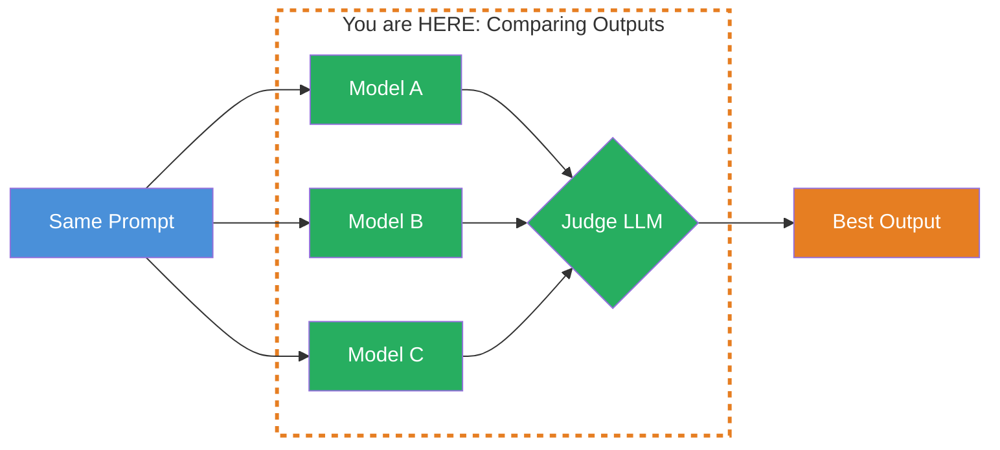
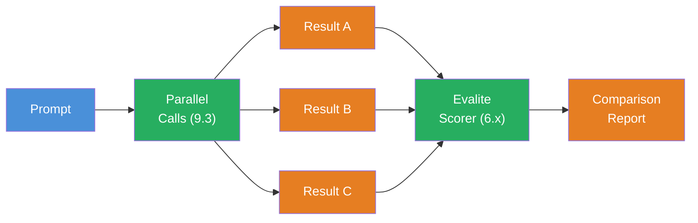

## THINK

How do you find out which model gives the best answer — without reading every answer yourself? And what if the "best" answer depends on the task?

## OVERVIEW



The same prompt goes to multiple models in parallel. All results are collected and evaluated by a judge LLM. The best result is returned.

## WHY

**Without systematic comparison:** You choose a model based on gut feeling or marketing. "Claude is better" or "GPT-4o is faster" — without data. You don't know whether a cheaper model would be sufficient for your use case.

**With systematic comparison:** You objectively test which model delivers the best answer for your specific task. You make data-driven model decisions. You find out where a flash model is sufficient and where you need a pro model.

## WALKTHROUGH

### Layer 1: Parallel Calls with Promise.all

The first step — send the same prompt to multiple models and collect all results:

```typescript
import { generateText } from 'ai';
import { anthropic } from '@ai-sdk/anthropic';
import { openai } from '@ai-sdk/openai';
import { google } from '@ai-sdk/google';

const prompt = 'Erklaere den Unterschied zwischen REST und GraphQL in 3 Saetzen.';

const models = [
  { name: 'Claude Sonnet', model: anthropic('claude-sonnet-4-5-20250514') },
  { name: 'GPT-4o', model: openai('gpt-4o') },
  { name: 'Gemini Flash', model: google('gemini-2.5-flash') },
];

// Call all models in parallel
const results = await Promise.all(
  models.map(async ({ name, model }) => {
    const start = Date.now();
    const result = await generateText({ model, prompt });
    return {
      name,
      text: result.text,
      tokens: result.usage.totalTokens,
      durationMs: Date.now() - start,
    };
  }),
);

// Output results
for (const r of results) {
  console.log(`\n--- ${r.name} (${r.tokens} Tokens, ${r.durationMs}ms) ---`);
  console.log(r.text);
}
```

`Promise.all` sends all requests simultaneously. The total duration is that of the slowest model, not the sum of all. You get text, token usage, and duration for each call.

### Layer 2: Simple Comparison — Metrics

Before using an LLM as judge, you can automatically compare simple metrics:

```typescript
function compareBasicMetrics(
  results: Array<{ name: string; text: string; tokens: number; durationMs: number }>
) {
  console.log('\n=== Comparison ===\n');
  console.log('| Model | Characters | Tokens | Duration | Tokens/Sec |');
  console.log('|-------|------------|--------|----------|------------|');

  for (const r of results) {
    const tokensPerSec = Math.round(r.tokens / (r.durationMs / 1000));
    console.log(
      `| ${r.name} | ${r.text.length} | ${r.tokens} | ${r.durationMs}ms | ${tokensPerSec} |`,
    );
  }

  // Shortest response (often more precise)
  const shortest = results.reduce((a, b) => (a.text.length < b.text.length ? a : b));
  console.log(`\nShortest response: ${shortest.name}`);

  // Fastest response
  const fastest = results.reduce((a, b) => (a.durationMs < b.durationMs ? a : b));
  console.log(`Fastest response: ${fastest.name}`);

  // Cheapest response
  const cheapest = results.reduce((a, b) => (a.tokens < b.tokens ? a : b));
  console.log(`Cheapest response: ${cheapest.name}`);
}

compareBasicMetrics(results);
```

Simple metrics — length, speed, token usage — give an initial overview. But they say nothing about the quality of the response.

### Layer 3: LLM-as-a-Judge

For quality evaluation: A strong LLM evaluates the responses of the others. You know this pattern from Level 6.3:

```typescript
import { generateText, Output } from 'ai';
import { anthropic } from '@ai-sdk/anthropic';
import { z } from 'zod';

const JudgmentSchema = z.object({
  rankings: z.array(z.object({
    model: z.string(),
    score: z.number().min(1).max(10),
    reasoning: z.string(),
  })),
  winner: z.string(),
  summary: z.string(),
});

async function judgeOutputs(
  prompt: string,
  results: Array<{ name: string; text: string }>,
) {
  const formattedOutputs = results
    .map((r, i) => `<output model="${r.name}">\n${r.text}\n</output>`)
    .join('\n\n');

  const judgment = await generateText({
    model: anthropic('claude-sonnet-4-5-20250514'),     // ← Strong model as judge
    system: `Du bist ein objektiver Qualitaets-Reviewer.
Bewerte die folgenden LLM-Outputs nach:
1. Korrektheit — Sind die Fakten richtig?
2. Praezision — Ist die Antwort auf den Punkt?
3. Verstaendlichkeit — Ist die Erklaerung klar?
Vergib Scores von 1-10 und begruende Deine Bewertung.`,
    prompt: `<task>${prompt}</task>\n\n${formattedOutputs}`,
    output: Output.object({ schema: JudgmentSchema }),
  });

  return judgment.output;
}

// Usage
const judgment = await judgeOutputs(prompt, results);
console.log('\n=== LLM-as-a-Judge ===\n');
console.log(`Winner: ${judgment.winner}`);
console.log(`Summary: ${judgment.summary}`);
for (const r of judgment.rankings) {
  console.log(`\n${r.model}: ${r.score}/10`);
  console.log(`  ${r.reasoning}`);
}
```

The judge receives the original task and all outputs. Through the Zod schema, the evaluation is structured — score, reasoning, and winner. Important: The judge should be a strong model, ideally not one of the models being evaluated.

> **Note:** In this example we use Sonnet as both judge and one of the evaluated models — in production you'd use a stronger model (e.g., Opus) as judge that isn't being evaluated itself.

### Layer 4: Systematic Comparison with Evals

For repeatable comparisons, use an eval framework like Evalite from Level 6:

```typescript
import { evalite } from 'evalite';
import { generateText } from 'ai';
import { anthropic } from '@ai-sdk/anthropic';
import { openai } from '@ai-sdk/openai';
import { google } from '@ai-sdk/google';

// Run eval for each model separately
const modelsToCompare = [
  { name: 'claude-sonnet', model: anthropic('claude-sonnet-4-5-20250514') },
  { name: 'gpt-4o', model: openai('gpt-4o') },
  { name: 'gemini-flash', model: google('gemini-2.5-flash') },
];

for (const { name, model } of modelsToCompare) {
  evalite(`compare-${name}`, {
    data: async () => [
      { input: 'Erklaere Promises in 2 Saetzen.', expected: 'Promise' },
      { input: 'Was ist der Unterschied zwischen let und const?', expected: 'const' },
      { input: 'Erklaere async/await.', expected: 'await' },
    ],
    task: async (input) => {
      const result = await generateText({ model, prompt: input });
      return result.text;
    },
    scorers: [
      // Check if the expected term appears
      (output, expected) => {
        const contains = output.toLowerCase().includes(expected.toLowerCase());
        return { score: contains ? 1 : 0, name: 'contains-keyword' };
      },
      // Check conciseness (shorter responses = higher)
      (output) => {
        const score = Math.max(0, 1 - output.length / 2000);
        return { score, name: 'conciseness' };
      },
    ],
  });
}
```

With Evalite you get reproducible results across multiple test cases. You can systematically benchmark models for your specific use case — not by general benchmarks, but by your requirements.

## TRY

**Task:** Call 3 models in parallel, compare the results by length and a simple keyword scorer.

Create **compare-outputs.ts** and run with **npx tsx compare-outputs.ts**.

```typescript
import { generateText } from 'ai';
import { anthropic } from '@ai-sdk/anthropic';
import { openai } from '@ai-sdk/openai';
import { google } from '@ai-sdk/google';

const prompt = 'Erklaere den Unterschied zwischen var, let und const in JavaScript in maximal 3 Saetzen.';
const expectedKeywords = ['var', 'let', 'const', 'scope', 'block'];

// TODO 1: Define an array with 3 models (name + model)

// TODO 2: Call all 3 in parallel with Promise.all

// TODO 3: Compare the results:
//   - How many expectedKeywords appear in each response?
//   - How long is each response (characters)?
//   - How many tokens did each response use?

// TODO 4: Determine the "winner" based on:
//   - Most keywords = highest quality
//   - On tie: shorter response wins
```

**Checklist:**
- [ ] 3 models called in parallel with `Promise.all`
- [ ] Keyword count calculated for each response
- [ ] Length and token usage compared
- [ ] Winner determined and justified
- [ ] Results displayed in a clear format

<details>
<summary>Show solution</summary>

```typescript
import { generateText } from 'ai';
import { anthropic } from '@ai-sdk/anthropic';
import { openai } from '@ai-sdk/openai';
import { google } from '@ai-sdk/google';

const prompt =
  'Erklaere den Unterschied zwischen var, let und const in JavaScript in maximal 3 Saetzen.';
const expectedKeywords = ['var', 'let', 'const', 'scope', 'block'];

const models = [
  { name: 'Claude Sonnet', model: anthropic('claude-sonnet-4-5-20250514') },
  { name: 'GPT-4o', model: openai('gpt-4o') },
  { name: 'Gemini Flash', model: google('gemini-2.5-flash') },
];

// Call in parallel
const results = await Promise.all(
  models.map(async ({ name, model }) => {
    const start = Date.now();
    const result = await generateText({ model, prompt });
    const text = result.text;

    // Keyword scoring
    const keywordCount = expectedKeywords.filter(kw =>
      text.toLowerCase().includes(kw.toLowerCase()),
    ).length;

    return {
      name,
      text,
      tokens: result.usage.totalTokens,
      durationMs: Date.now() - start,
      keywordCount,
      charCount: text.length,
    };
  }),
);

// Output results
console.log('=== Comparison ===\n');
console.log('| Model | Keywords | Characters | Tokens | Duration |');
console.log('|-------|----------|------------|--------|----------|');

for (const r of results) {
  console.log(
    `| ${r.name} | ${r.keywordCount}/${expectedKeywords.length} | ${r.charCount} | ${r.tokens} | ${r.durationMs}ms |`,
  );
}

// Determine winner
const sorted = [...results].sort((a, b) => {
  if (b.keywordCount !== a.keywordCount) return b.keywordCount - a.keywordCount;
  return a.charCount - b.charCount; // On tie: shorter response wins
});

console.log(`\nWinner: ${sorted[0].name} (${sorted[0].keywordCount} keywords, ${sorted[0].charCount} characters)`);

// Show responses
for (const r of results) {
  console.log(`\n--- ${r.name} ---`);
  console.log(r.text);
}
```

**Explanation:** `Promise.all` sends all requests in parallel — the total duration is that of the slowest model. The keyword scorer counts how many expected terms appear in the response. On a tie, the shorter response wins, because conciseness was required in the task ("maximum 3 sentences").

```
Expected output (approximate):
=== Comparison ===

| Model | Keywords | Characters | Tokens | Duration |
|-------|----------|------------|--------|----------|
| Claude Sonnet | 5/5 | 312 | 198 | 1.2s |
| GPT-4o | 4/5 | 287 | 176 | 0.9s |
| Gemini Flash | 5/5 | 256 | 143 | 0.6s |

Winner: Gemini Flash (5 keywords, 256 characters)
```

</details>

## COMBINE



**Exercise:** Combine Comparing Outputs with the eval framework from Level 6. Instead of a one-time comparison:

1. **Define 5 test prompts** for your use case (e.g., TypeScript explanations)
2. **Define 2 scorers** — a keyword scorer and a length scorer
3. **Run all 3 models** across all 5 prompts with Evalite
4. **Compare the results** — which model wins on average?

The result is a data-driven report that tells you: "For TypeScript explanations, Model X is the best." This is the foundation for the Model Router from Challenge 9.2.

**Optional Stretch Goal:** Implement LLM-as-a-Judge as an Evalite scorer. Use a strong model that rates the outputs on a scale of 1-10 and provides reasoning.

## Sources

- [Vercel AI SDK: Generating Text](https://ai-sdk.dev/docs/ai-sdk-core/generating-text)
- [Vercel AI SDK: Providers and Models](https://ai-sdk.dev/docs/foundations/providers-and-models)
- [Evalite Documentation](https://www.evalite.dev/)
- [ai-hero-dev Exercise 09.03](https://github.com/ai-hero-dev/ai-sdk-v6-crash-course/tree/main/exercises/09-production-patterns/09.03-comparing-outputs)
