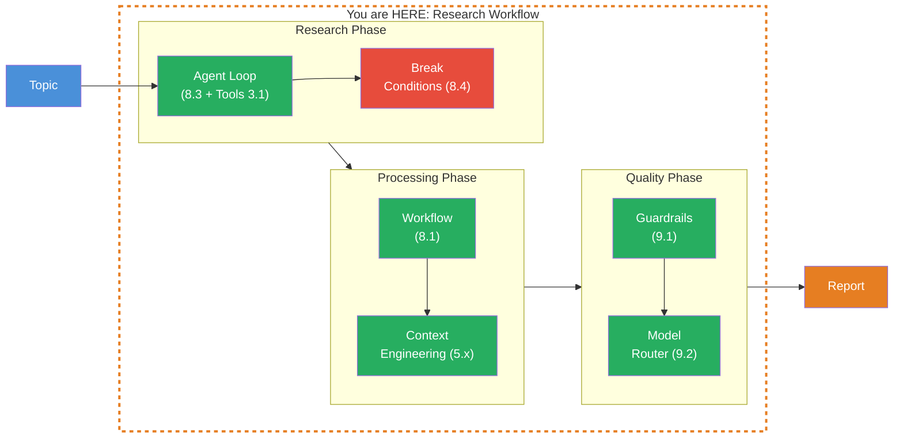
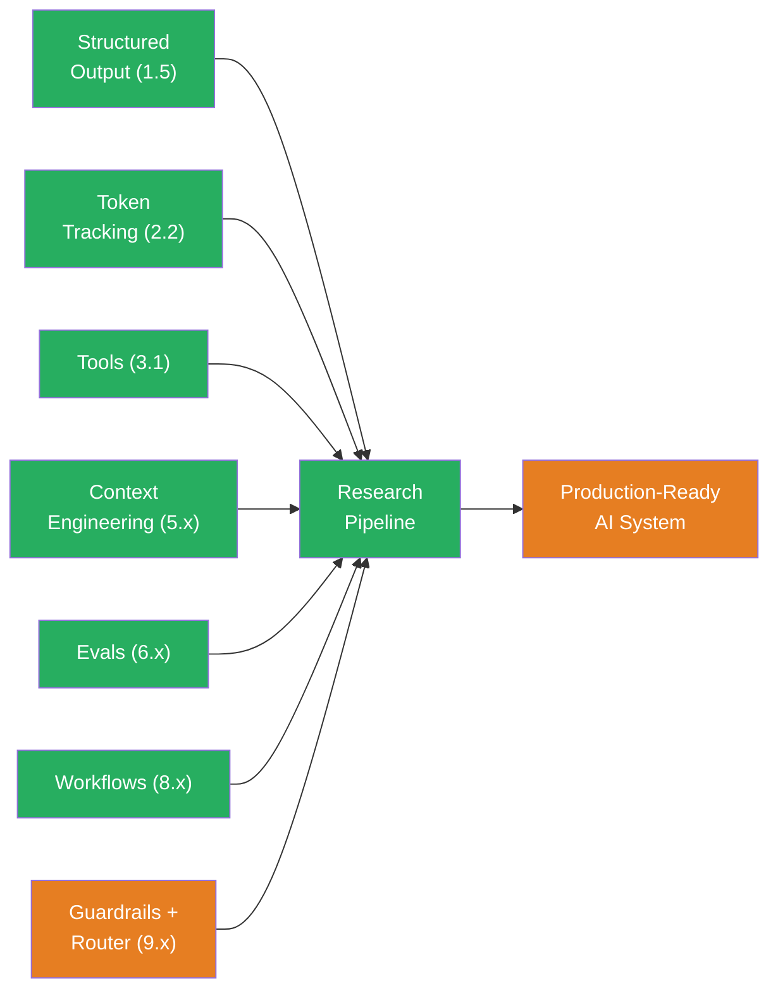

## THINK

How do you build an end-to-end AI system that autonomously researches, summarizes, and produces a quality-assured report — using guardrails, model routing, and all previously learned concepts?

## OVERVIEW



Three phases: Research (Agent Loop with tools and break conditions), Processing (Workflow with Context Engineering), and Quality (Guardrails and Model Router). Concepts from 8 different levels come together.

## WHY

**Without orchestration:** Individual building blocks that don't work together. You have guardrails, but they're not integrated into the pipeline. You have a model router, but it's not being used. You have workflows, but without quality assurance. The result: a fragile system that fails in production.

**With orchestration:** A continuous pipeline where each phase builds on the previous one. Research collects data with safeguards. Processing structures the results with Context Engineering. Quality ensures guardrails and optimizes costs with Model Routing. The result: a production-ready system.

## WALKTHROUGH

### Layer 1: The Pipeline Architecture

This pipeline connects concepts from the entire learning path. Here's an overview of which level is used where:

| Phase | Concept | Level | Function |
|-------|---------|-------|----------|
| Research | Tool Calling | 3.1 | `search` tool for data collection |
| Research | Custom Loop | 8.3 | Agent decides on its own when enough research is done |
| Research | Break Conditions | 8.4 | Max iterations, timeout, cost guard |
| Processing | Workflow | 8.1 | Sequential steps: summarize, structure |
| Processing | Context Engineering | 5.x | XML-structured prompts for precise outputs |
| Processing | Structured Output | 1.5 | Zod schema for typed metadata |
| Quality | Guardrails | 9.1 | Input/output validation |
| Quality | Model Router | 9.2 | Optimal model per phase |
| Quality | Usage Tracking | 2.2 | Token costs across the entire pipeline |

### Layer 2: Research Phase

The research phase is a custom agent loop with tools — the pattern from Level 8.3 and 8.4:

```typescript
import { generateText, tool } from 'ai';
import { anthropic } from '@ai-sdk/anthropic';
import { google } from '@ai-sdk/google';
import { z } from 'zod';

// search tool — simulates web search (in production: real API)
const searchTool = tool({
  description: 'Suche nach Informationen zu einem Thema',
  inputSchema: z.object({
    query: z.string().describe('Der Suchbegriff'),
  }),
  execute: async ({ query }) => {
    console.log(`  Suche: "${query}"`);
    // In production: Web Search API, database, etc.
    return `Ergebnisse fuer "${query}": [Hier wuerden echte Suchergebnisse stehen]`;
  },
});

async function researchPhase(topic: string) {
  const LIMITS = { maxIterations: 5, timeoutMs: 30_000, maxTokens: 5_000 };
  let totalTokens = 0;
  let iterations = 0;
  let breakReason = 'complete';

  const messages: any[] = [ // ← any[] because AI SDK Messages have various content types
    {
      role: 'user',
      content: `Recherchiere gruendlich zum Thema: ${topic}.
Nutze das search-Tool um Informationen zu sammeln.
Wenn Du genug Informationen hast, fasse die Ergebnisse zusammen.`,
    },
  ];

  const controller = new AbortController();
  const timeout = setTimeout(() => controller.abort(), LIMITS.timeoutMs);

  try {
    while (true) {
      // Break Condition: Max Iterations
      if (iterations >= LIMITS.maxIterations) {
        breakReason = 'max-iterations';
        break;
      }
      // Break Condition: Cost Guard
      if (totalTokens >= LIMITS.maxTokens) {
        breakReason = 'cost-limit';
        break;
      }

      iterations++;
      const result = await generateText({
        model: google('gemini-2.5-flash'),              // ← Cheap model for research
        tools: { search: searchTool },
        messages,
        abortSignal: controller.signal,
      });

      totalTokens += result.usage.totalTokens;
      messages.push(...result.response.messages);

      // Break Condition: LLM is done (no more tool calls)
      if (result.finishReason === 'stop') break;
    }
  } catch (error) {
    if (error.name === 'AbortError') {
      breakReason = 'timeout';
    } else {
      throw error;
    }
  } finally {
    clearTimeout(timeout);
  }

  // Extract last text output
  const lastAssistant = messages.filter(m => m.role === 'assistant').pop();
  const researchResult = typeof lastAssistant?.content === 'string'
    ? lastAssistant.content
    : 'Keine Ergebnisse gefunden.';

  console.log(`Research: ${iterations} iterations, ${totalTokens} tokens, reason: ${breakReason}`);
  return { result: researchResult, iterations, totalTokens, breakReason };
}
```

Three break conditions protect the loop: Max Iterations (5), Timeout (30s), Cost Guard (5,000 tokens). The `search` tool is used autonomously by the LLM — it decides which search terms to use. When the LLM returns `finishReason: 'stop'`, it has finished researching.

### Layer 3: Processing Phase

The processing phase uses the workflow pattern from Level 8.1 with Context Engineering from Level 5:

```typescript
import { generateText, Output } from 'ai';
import { anthropic } from '@ai-sdk/anthropic';
import { z } from 'zod';

const ReportSchema = z.object({
  title: z.string(),
  summary: z.string(),
  keyFindings: z.array(z.string()).min(3).max(7),
  conclusion: z.string(),
});

async function processingPhase(researchResult: string, topic: string) {
  // Step 1: Summarize (Context Engineering — XML-structured prompt)
  const summary = await generateText({
    model: anthropic('claude-sonnet-4-5-20250514'),
    system: `<role>Du bist ein Research-Analyst.</role>
<task>Fasse die Recherche-Ergebnisse in 5-7 Kernaussagen zusammen.</task>
<rules>
- Jede Aussage in maximal 2 Saetzen
- Nur Fakten, keine Spekulationen
- Wenn Informationen fehlen, sage es explizit
</rules>`,
    prompt: `<topic>${topic}</topic>\n<research>\n${researchResult}\n</research>`,
  });

  console.log(`Summary: ${summary.usage.totalTokens} tokens`);

  // Step 2: Structure (Structured Output — Zod Schema)
  const structured = await generateText({
    model: anthropic('claude-sonnet-4-5-20250514'),
    system: `Erstelle einen strukturierten Report aus der folgenden Zusammenfassung.`,
    prompt: summary.text,
    output: Output.object({ schema: ReportSchema }),
  });

  console.log(`Structuring: ${structured.usage.totalTokens} tokens`);

  return {
    report: structured.output,
    totalTokens: summary.usage.totalTokens + structured.usage.totalTokens,
  };
}
```

Two sequential steps: First summarize with an XML-structured prompt (Context Engineering from Level 5), then convert to a typed schema (Structured Output from Level 1.5). Each step has its own system prompt with a clear role.

### Layer 4: Quality Phase

The quality phase applies guardrails from Challenge 9.1 and Model Routing from Challenge 9.2:

```typescript
import { generateText } from 'ai';
import { anthropic } from '@ai-sdk/anthropic';

type Guardrail = (text: string) => { ok: boolean; reason?: string };

// Output Guardrails
const notEmpty: Guardrail = (text) =>
  text.length > 0 ? { ok: true } : { ok: false, reason: 'Output is empty' };

const maxLength: Guardrail = (text) =>
  text.length <= 15_000 ? { ok: true } : { ok: false, reason: `Too long: ${text.length}` };

const noHallucination: Guardrail = (text) => {
  const markers = ['ich bin nicht sicher', 'ich weiss nicht', 'keine informationen'];
  const hasUncertainty = markers.some(m => text.toLowerCase().includes(m));
  if (hasUncertainty) {
    console.warn('Warning: Output contains uncertainty markers');
  }
  return { ok: true }; // Warn, don't block
};

function runGuardrails(text: string, guardrails: Guardrail[]): void {
  for (const guard of guardrails) {
    const result = guard(text);
    if (!result.ok) throw new Error(`Quality check failed: ${result.reason}`);
  }
}

// Complete pipeline
async function researchPipeline(topic: string) {
  console.log(`\n=== Research Pipeline: "${topic}" ===\n`);
  const pipelineStart = Date.now();

  // Phase 1: Research
  console.log('[Phase 1: Research]');
  const research = await researchPhase(topic);

  // Phase 2: Processing
  console.log('\n[Phase 2: Processing]');
  const processing = await processingPhase(research.result, topic);

  // Phase 3: Quality
  console.log('\n[Phase 3: Quality]');
  const report = processing.report;
  const reportText = `${report.title}\n\n${report.summary}\n\n${report.keyFindings.join('\n')}\n\n${report.conclusion}`;
  runGuardrails(reportText, [notEmpty, maxLength, noHallucination]);
  console.log('All quality checks passed.');

  // Statistics
  const totalTokens = research.totalTokens + processing.totalTokens;
  const durationMs = Date.now() - pipelineStart;

  console.log(`\n=== Pipeline complete ===`);
  console.log(`Duration: ${durationMs}ms`);
  console.log(`Total tokens: ${totalTokens}`);
  console.log(`Research iterations: ${research.iterations}`);
  console.log(`Break reason: ${research.breakReason}`);

  return { report, totalTokens, durationMs, breakReason: research.breakReason };
}

// Execute
const result = await researchPipeline('Edge Computing Trends 2026');
console.log('\n--- Report ---');
console.log(`Title: ${result.report.title}`);
console.log(`Summary: ${result.report.summary}`);
console.log(`Key Findings:`);
for (const finding of result.report.keyFindings) {
  console.log(`  - ${finding}`);
}
console.log(`Conclusion: ${result.report.conclusion}`);
```

The quality phase is the last line of defense. Guardrails check the final output for length, content, and quality. The entire pipeline tracks tokens and duration — important for production monitoring.

## TRY

**Task:** Build a mini research pipeline: search, summarization, formatting with guardrails.

Create **research-pipeline.ts** and run with **npx tsx research-pipeline.ts**.

```typescript
import { generateText, tool } from 'ai';
import { anthropic } from '@ai-sdk/anthropic';
import { z } from 'zod';

const model = anthropic('claude-sonnet-4-5-20250514');

// TODO 1: Define a search tool (simulated, returns fixed text)

// TODO 2: Build Phase 1 — Research
//   - generateText with search tool
//   - Maximum 3 iterations

// TODO 3: Build Phase 2 — Summarize
//   - generateText that summarizes the research into 3 key findings

// TODO 4: Build Phase 3 — Format + Guardrails
//   - Format as a short report
//   - Check: not empty, max 5,000 characters

// TODO 5: Log token usage per phase and total
```

**Checklist:**
- [ ] Search tool defined and used
- [ ] Research phase with iteration limit
- [ ] Summary uses research output as input
- [ ] Output guardrails check the final report
- [ ] Token usage logged per phase and total

<details>
<summary>Show solution</summary>

```typescript
import { generateText, tool } from 'ai';
import { anthropic } from '@ai-sdk/anthropic';
import { z } from 'zod';

const model = anthropic('claude-sonnet-4-5-20250514');

// search tool (simulated)
const searchTool = tool({
  description: 'Suche nach Informationen',
  inputSchema: z.object({ query: z.string() }),
  execute: async ({ query }) => {
    console.log(`  Suche: "${query}"`);
    return `Suchergebnisse fuer "${query}": AI wird in der Medizin fuer Diagnostik, Medikamentenentwicklung und personalisierte Therapie eingesetzt. Aktuelle Studien zeigen 30% schnellere Diagnosen durch AI-Unterstuetzung.`;
  },
});

async function miniResearchPipeline(topic: string) {
  let totalTokens = 0;
  console.log(`\n=== Mini Research Pipeline: "${topic}" ===\n`);

  // Phase 1: Research (max 3 iterations)
  console.log('[Phase 1: Research]');
  const messages: any[] = [ // ← any[] because AI SDK Messages have various content types
    { role: 'user', content: `Recherchiere zum Thema: ${topic}. Nutze das search-Tool.` },
  ];

  let iterations = 0;
  while (iterations < 3) {
    iterations++;
    const result = await generateText({
      model,
      tools: { search: searchTool },
      messages,
    });
    totalTokens += result.usage.totalTokens;
    messages.push(...result.response.messages);
    if (result.finishReason === 'stop') break;
  }

  const researchText = messages
    .filter(m => m.role === 'assistant' && typeof m.content === 'string')
    .map(m => m.content)
    .join('\n');

  console.log(`  ${iterations} iterations, ${totalTokens} tokens\n`);

  // Phase 2: Summarize
  console.log('[Phase 2: Summarize]');
  const summary = await generateText({
    model,
    system: 'Fasse die Informationen in exakt 3 Kernaussagen zusammen. Jede in einem Satz.',
    prompt: researchText,
  });
  totalTokens += summary.usage.totalTokens;
  console.log(`  ${summary.usage.totalTokens} tokens\n`);

  // Phase 3: Format + Guardrails
  console.log('[Phase 3: Format + Quality]');
  const report = await generateText({
    model,
    system: 'Formatiere als kurzen Report mit Titel, Kernaussagen und Fazit.',
    prompt: summary.text,
  });
  totalTokens += report.usage.totalTokens;

  // Guardrails
  if (report.text.length === 0) throw new Error('Report is empty');
  if (report.text.length > 5_000) throw new Error('Report too long');
  console.log('  Quality checks passed.');

  console.log(`\n=== Done. Total: ${totalTokens} tokens ===\n`);
  console.log(report.text);

  return { report: report.text, totalTokens };
}

await miniResearchPipeline('AI in der Medizin');
```

**Explanation:** Three phases — Research with tool loop (max 3 iterations), Summarize with its own system prompt, Format with guardrails. Token usage is accumulated across all phases. The pipeline runs from start to finish, even if the research loop exits early.

```
Expected output (approximate):
=== Mini Research Pipeline: "AI in der Medizin" ===

[Phase 1: Research]
  Suche: "AI in der Medizin"
  1 iterations, 342 tokens

[Phase 2: Summarize]
  187 tokens

[Phase 3: Format + Quality]
  Quality checks passed.

=== Done. Total: 891 tokens ===

AI in der Medizin — Report
...
```

</details>

## COMBINE



This is the big picture. You now have all the building blocks to create production-ready AI systems:

- **Level 1:** Generate text, stream, structure — the fundamentals
- **Level 2:** Understand and track token usage — costs under control
- **Level 3:** Tools and agents — AI that can take action
- **Level 5:** Context Engineering — precise prompts that deliver consistent results
- **Level 6:** Evals — measure quality instead of guessing
- **Level 8:** Workflows — orchestrate complex tasks
- **Level 9:** Guardrails, routing, comparing — production patterns

In the Boss Fight you'll build a system that combines everything.

## Sources

- [Vercel AI SDK: Generating Text](https://ai-sdk.dev/docs/ai-sdk-core/generating-text)
- [Vercel AI SDK: Building Agents](https://ai-sdk.dev/docs/agents/building-agents)
- [Anthropic: Prompt Engineering](https://docs.anthropic.com/en/docs/build-with-claude/prompt-engineering/overview)
- [ai-hero-dev Exercise 09.04](https://github.com/ai-hero-dev/ai-sdk-v6-crash-course/tree/main/exercises/09-production-patterns/09.04-research-workflow)
