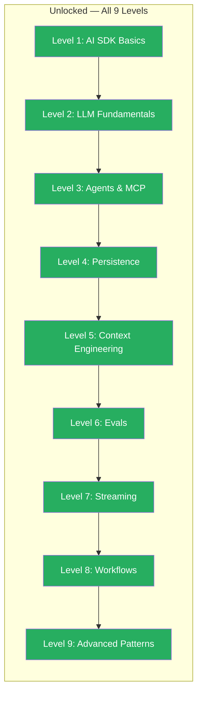

## What You Learned

- **Guardrails:** Input and output checks that prevent prompt injection, PII leaks, and uncontrolled outputs. The middleware pattern makes guardrails composable and reusable. Double protection: code guardrails catch technically detectable problems, prompt guardrails give the LLM behavioral rules.
- **Model Router:** Automatically choose the right model for each task — from simple switch logic to token-based routing to LLM-based classification. The result: same quality at up to 90% lower costs.
- **Comparing Outputs:** Query multiple models in parallel with `Promise.all`, compare results with simple metrics and LLM-as-a-Judge, make data-driven model decisions instead of trusting gut feeling.
- **Research Workflow:** An end-to-end pipeline that combines concepts from all 9 levels — agent loop with tools, sequential workflows, Context Engineering, Structured Output, guardrails, Model Routing, and Usage Tracking. The big picture.

## The Complete Skill Tree

All 9 levels unlocked. 37 challenges mastered. 9 Boss Fights passed.

## You're No Longer a Vibe Coder

You started as someone who uses ChatGPT and pastes AI-generated code into projects. Now you're an **AI Engineer** — someone who understands how AI systems work from the inside and builds them deliberately, securely, and cost-efficiently.

This is the difference:

| Vibe Coder | AI Engineer |
|------------|-------------|
| Copies code from ChatGPT | Builds systems with the AI SDK |
| One model for everything | Routes to the optimal model |
| "Works somehow" | Evals prove the quality |
| No idea about costs | Token tracking and cost optimization |
| Copy-paste prompts | Context Engineering with XML structure |
| No security | Input/output guardrails |
| Individual API calls | Orchestrated workflows and agent loops |
| Hopes for good answers | Compares models systematically |

**From Vibe Coder to AI Engineer.** You've completed the learning path.

## What You Can Build Now

Here's what you can build with the knowledge from all 9 levels:

- **AI-powered products** — Chatbots, research assistants, content pipelines, code review tools
- **Production-ready systems** — with guardrails, error handling, cost management, eval coverage
- **Multi-model architectures** — Model routing, comparing outputs, provider-agnostic systems
- **Autonomous agents** — Tool calling, custom loops, break conditions, multi-step workflows

## Next Steps

No next level — but the learning path doesn't end here. Here are the best resources to keep going:

### Official Documentation

- **[ai-sdk.dev](https://ai-sdk.dev)** — The official AI SDK documentation. Your first stop for new features, API references, and guides.
- **[docs.anthropic.com](https://docs.anthropic.com)** — Anthropic's documentation for Claude. Prompt engineering, best practices, API reference.
- **[platform.openai.com](https://platform.openai.com/docs)** — OpenAI's platform documentation. Models, API, best practices.
- **[ai.google.dev](https://ai.google.dev)** — Google AI documentation for Gemini. Models, API, tutorials.

### Tools and Frameworks

- **[Evalite](https://www.evalite.dev)** — The eval framework you learned in Level 6. For systematic quality assurance.
- **[Zod](https://zod.dev)** — Schema validation for TypeScript. The foundation for Structured Output and Tool Parameters.
- **[MCP (Model Context Protocol)](https://modelcontextprotocol.io)** — The standard for tool integration that you learned about in Level 3.

### Build Your Own Projects

The most important thing: **Build something.** Take a problem you have and solve it with what you've learned. Ideas:

1. **Personal Research Assistant** — A CLI tool that researches a topic, summarizes it, and saves it as a Markdown report. Use the Research Pipeline from Level 9.
2. **Code Review Bot** — An agent that analyzes pull requests, finds issues, and suggests improvements. Use Tools (Level 3), Context Engineering (Level 5), and Guardrails (Level 9).
3. **Multi-Model Chat** — A chat that compares responses from multiple models and shows the user the best one. Use Comparing Outputs (Level 9), Streaming (Level 7), and Persistence (Level 4).
4. **Content Pipeline** — A system that generates blog posts: Research, Outline, Draft, Edit, Format. Use Workflows (Level 8) with Evals (Level 6) for quality assurance.

### Community

- **[GitHub: Vercel AI SDK](https://github.com/vercel/ai)** — Issues, Discussions, Contributions
- **[GitHub: ai-hero-dev](https://github.com/ai-hero-dev)** — The exercises this learning path is built on

## Thank You

This learning path is open source and free. If it helped you, share it with others who want to make the journey from Vibe Coder to AI Engineer.
