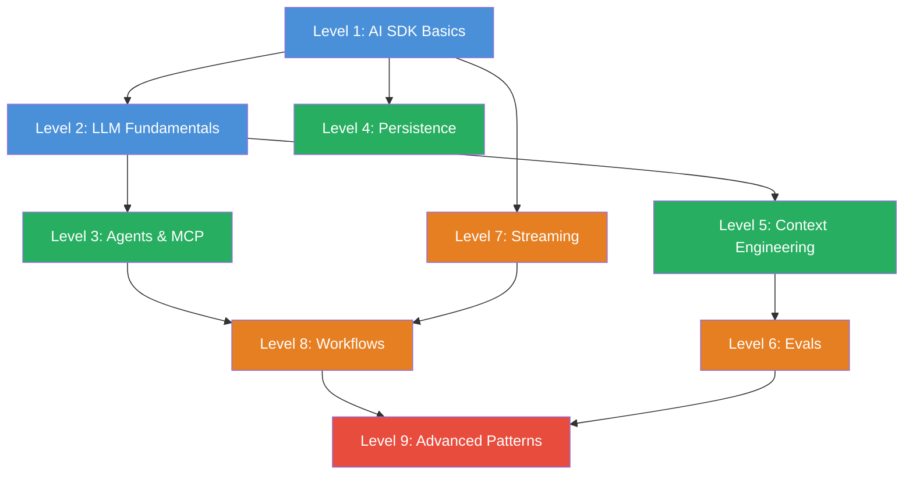

import { CardGrid, LinkCard } from '@astrojs/starlight/components';

# Roadmap

## The Skill Tree

**Legend:** Blue = Fundamentals | Green = Intermediate | Orange = Advanced | Red = Expert

## Recommended Learning Paths

### Beginner (recommended)

Level 1 → 2 → 3 → 4 → 5 → 6 → 7 → 8 → 9

Follow the levels in order. Each level builds on the previous ones.

### Advanced (already have AI SDK experience)

Level 3 → 5 → 6 → 8 → 9

Skip the fundamentals and jump straight into Agents or Context Engineering.

### Focus: Agents & MCP

Level 1 → 3 → 4 → 8 → 9

Go directly to Agents, Tools, and Workflows — you'll need Persistence for robust Agents.

### Focus: Quality & Production

Level 1 → 5 → 6 → 7 → 9

Context Engineering, Evals, and Streaming — everything that makes production-ready AI.

## Level Details

<CardGrid>
  <LinkCard title="Level 1 — AI SDK Basics" description="6 Challenges · Generate text, stream, structured output and system prompts" href="/en/level-1-ai-sdk-basics/01-briefing/" />
  <LinkCard title="Level 2 — LLM Fundamentals" description="4 Challenges · Tokens, Context Windows, Usage Tracking and Prompt Caching" href="/en/level-2-llm-fundamentals/01-briefing/" />
  <LinkCard title="Level 3 — Agents & MCP" description="5 Challenges · Tool Calling, MCP via stdio/HTTP, Tool Loop Agent" href="/en/level-3-agents/01-briefing/" />
  <LinkCard title="Level 4 — Persistence" description="4 Challenges · Callbacks, Chat IDs, Database Persistence, Message Validation" href="/en/level-4-persistence/01-briefing/" />
  <LinkCard title="Level 5 — Context Engineering" description="5 Challenges · Prompt Templates, Exemplars, RAG, Chain of Thought" href="/en/level-5-context-engineering/01-briefing/" />
  <LinkCard title="Level 6 — Evals" description="5 Challenges · Evalite, Deterministic Evals, LLM-as-Judge, Langfuse" href="/en/level-6-evals/01-briefing/" />
  <LinkCard title="Level 7 — Streaming" description="4 Challenges · Custom Data Parts, Message Metadata, Error Handling" href="/en/level-7-streaming/01-briefing/" />
  <LinkCard title="Level 8 — Workflows" description="4 Challenges · Multi-Step Workflows, Custom Loops, Frontend Streaming" href="/en/level-8-workflows/01-briefing/" />
  <LinkCard title="Level 9 — Advanced Patterns" description="4 Challenges · Guardrails, Model Router, Output Comparison, Research Workflow" href="/en/level-9-advanced/01-briefing/" />
</CardGrid>
